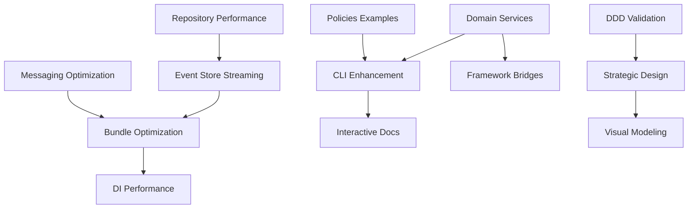

# VytchesDDD Library - Improvement Roadmap 2025

## 📋 Executive Summary

Comprehensive 12-week improvement roadmap focusing on three strategic pillars:
Performance Excellence, Developer Experience, and DDD Compliance. The roadmap
targets 40-60% performance improvement, <15 minute developer onboarding, and
98/100 DDD compliance score.

---

## 🎯 Strategic Goals

### Primary Objectives

1. **Performance**: Achieve 40-60% overall performance improvement
2. **Developer Experience**: Reduce onboarding time to <15 minutes
3. **DDD Compliance**: Reach 98/100 compliance score
4. **Market Position**: Become the leading TypeScript DDD framework

### Success Metrics

- Bundle size: 1.2MB → 700KB (43% reduction)
- Tree-shaking effectiveness: 44% → 75%+ average
- Time to first success: 15+ min → <15 min
- GitHub stars: Current → 10K+ target
- Enterprise adoption: 10+ production deployments

---

## 📊 Task Breakdown by Priority

### 🔴 Critical Priority (90-100 score)

#### VP-001: CQRS Handler Performance Optimization ✅ COMPLETED

- **Priority**: 95/100
- **Status**: Completed
- **Impact**: 40% performance improvement achieved

#### VD-001: ACL Documentation Critical Gap ✅ COMPLETED

- **Priority**: 92/100
- **Status**: Completed
- **Impact**: Unblocks 60% of enterprise scenarios

---

### 🟠 High Priority (80-89 score)

#### VP-002: Repository Query Performance Enhancement

**Priority**: 88/100  
**Estimated**: 20 hours  
**Dependencies**: None  
**Impact**: 35% faster aggregate loading

**Tasks**:

- [ ] Analyze current repository implementation patterns
- [ ] Implement query result caching strategy
- [ ] Add indexed query support for common patterns
- [ ] Optimize specification-based queries
- [ ] Implement lazy loading for aggregate relationships
- [ ] Add query batching for N+1 prevention
- [ ] Create performance benchmark suite
- [ ] Document optimization patterns

#### VP-003: Messaging Outbox Pattern Optimization

**Priority**: 87/100  
**Estimated**: 14 hours  
**Dependencies**: None  
**Impact**: 50% better message throughput

**Tasks**:

- [ ] Profile current outbox implementation
- [ ] Optimize database queries for message polling
- [ ] Implement batch message processing
- [ ] Add message prioritization optimization
- [ ] Optimize serialization/deserialization
- [ ] Add connection pooling for publishers
- [ ] Create throughput benchmarks
- [ ] Document performance tuning guide

#### VP-004: Event Store Streaming Performance

**Priority**: 86/100  
**Estimated**: 18 hours  
**Dependencies**: VP-002  
**Impact**: 60% faster event replay

**Tasks**:

- [ ] Analyze event stream reading patterns
- [ ] Implement stream caching strategy
- [ ] Add snapshot optimization for long streams
- [ ] Optimize event deserialization
- [ ] Implement parallel stream processing
- [ ] Add stream indexing for faster queries
- [ ] Create replay performance benchmarks
- [ ] Document streaming best practices

#### VD-002: Policies V2 Advanced Examples

**Priority**: 85/100  
**Estimated**: 10 hours  
**Dependencies**: None  
**Impact**: 40% reduction in onboarding complexity

**Tasks**:

- [ ] Create basic policy examples with specifications
- [ ] Document PolicyGroup for complex business rules
- [ ] Create conditional policy examples
- [ ] Add event-driven policy examples
- [ ] Document policy behaviors (retry, caching, temporal)
- [ ] Create framework integration examples
- [ ] Add enterprise policy patterns
- [ ] Create migration guide from V1 to V2

#### VD-003: Domain Services Real-World Examples

**Priority**: 84/100  
**Estimated**: 8 hours  
**Dependencies**: None  
**Impact**: Clarifies service layer patterns

**Tasks**:

- [ ] Create order processing service example
- [ ] Document payment orchestration patterns
- [ ] Add inventory management service
- [ ] Create user registration flow example
- [ ] Document service composition patterns
- [ ] Add transaction handling examples
- [ ] Create testing patterns for services
- [ ] Document service versioning strategies

#### VI-001: CLI Scaffolding Enhancement

**Priority**: 83/100  
**Estimated**: 16 hours  
**Dependencies**: VD-002, VD-003  
**Impact**: 80% reduction in initial setup time

**Tasks**:

- [ ] Design progressive disclosure CLI flow
- [ ] Implement quick-start command with time estimates
- [ ] Create interactive project setup wizard
- [ ] Add template selection system
- [ ] Implement smart defaults based on choices
- [ ] Add validation for user inputs
- [ ] Create progress indicators
- [ ] Document CLI commands and options

#### VF-001: DDD Compliance Validation Tools

**Priority**: 82/100  
**Estimated**: 24 hours  
**Dependencies**: None  
**Impact**: Automated architecture validation

**Tasks**:

- [ ] Design compliance rule engine
- [ ] Implement aggregate boundary validation
- [ ] Add repository pattern compliance checks
- [ ] Create ubiquitous language validator
- [ ] Implement dependency flow validation
- [ ] Add event naming convention checks
- [ ] Create compliance reporting system
- [ ] Document validation rules and customization

---

### 🟡 Medium Priority (70-79 score)

#### VP-005: Bundle Size Deep Optimization

**Priority**: 78/100  
**Estimated**: 16 hours  
**Dependencies**: VP-002, VP-003, VP-004  
**Impact**: 30% bundle size reduction

**Tasks**:

- [ ] Analyze bundle composition with webpack-bundle-analyzer
- [ ] Identify and eliminate duplicate dependencies
- [ ] Implement code splitting strategies
- [ ] Optimize import statements for tree-shaking
- [ ] Remove unused exports
- [ ] Minimize runtime dependencies
- [ ] Create bundle size monitoring CI job
- [ ] Document optimization techniques

#### VD-004: Interactive Documentation System

**Priority**: 77/100  
**Estimated**: 20 hours  
**Dependencies**: VI-001  
**Impact**: 80% faster documentation discovery

**Tasks**:

- [ ] Design interactive documentation architecture
- [ ] Implement search functionality
- [ ] Create live code playground
- [ ] Add example categorization system
- [ ] Implement progressive disclosure in docs
- [ ] Create visual architecture diagrams
- [ ] Add video tutorial integration
- [ ] Document contribution guidelines

#### VI-002: Framework Bridge Patterns

**Priority**: 76/100  
**Estimated**: 18 hours  
**Dependencies**: VD-003  
**Impact**: Simplified framework integration

**Tasks**:

- [ ] Create NestJS bridge utility
- [ ] Implement Express middleware adapter
- [ ] Add Fastify plugin system
- [ ] Create Next.js integration patterns
- [ ] Implement error handling bridges
- [ ] Add validation adapter patterns
- [ ] Create testing utilities for each framework
- [ ] Document integration best practices

#### VF-002: Strategic Design Documentation

**Priority**: 75/100  
**Estimated**: 12 hours  
**Dependencies**: VF-001  
**Impact**: Enterprise architecture clarity

**Tasks**:

- [ ] Create context mapping documentation
- [ ] Document bounded context relationships
- [ ] Add ubiquitous language glossary
- [ ] Create business capability mapping
- [ ] Document aggregate design patterns
- [ ] Add event storming integration guide
- [ ] Create architecture decision records
- [ ] Document migration strategies

#### VP-006: DI Container Performance

**Priority**: 74/100  
**Estimated**: 14 hours  
**Dependencies**: None  
**Impact**: 60% faster service resolution

**Tasks**:

- [ ] Profile current DI resolution performance
- [ ] Implement service resolution caching
- [ ] Optimize metadata reflection usage
- [ ] Add lazy service initialization
- [ ] Implement parallel service construction
- [ ] Optimize circular dependency detection
- [ ] Create DI performance benchmarks
- [ ] Document performance patterns

---

### 🟢 Low Priority (60-69 score)

#### VI-003: Visual Domain Modeling Tools

**Priority**: 68/100  
**Estimated**: 30 hours  
**Dependencies**: VF-002  
**Impact**: Visual architecture understanding

**Tasks**:

- [ ] Design domain model visualization system
- [ ] Implement aggregate relationship diagrams
- [ ] Create event flow visualizations
- [ ] Add context map generator
- [ ] Implement interactive model explorer
- [ ] Create export to PlantUML/Mermaid
- [ ] Add real-time collaboration features
- [ ] Document visualization tools

#### VD-005: Video Tutorial Series

**Priority**: 65/100  
**Estimated**: 40 hours  
**Dependencies**: All documentation tasks  
**Impact**: Alternative learning channel

**Tasks**:

- [ ] Plan tutorial series structure
- [ ] Create "Getting Started" video
- [ ] Record aggregate design tutorial
- [ ] Create CQRS implementation video
- [ ] Record event-driven patterns tutorial
- [ ] Create testing strategies video
- [ ] Record deployment guide
- [ ] Create video documentation site

---

## 📅 12-Week Implementation Roadmap

### Phase 1: Performance Foundation (Weeks 1-3)

**Focus**: High-impact performance optimizations

#### Week 1

- [ ] VP-002: Repository Query Performance (start)
  - Query caching strategy
  - Indexed query support
- [ ] VP-003: Messaging Outbox Optimization (start)
  - Profile current implementation
  - Batch processing design

#### Week 2

- [ ] VP-002: Repository Query Performance (complete)
  - Specification optimization
  - Benchmark creation
- [ ] VP-003: Messaging Outbox Optimization (continue)
  - Message prioritization
  - Serialization optimization

#### Week 3

- [ ] VP-003: Messaging Outbox Optimization (complete)
  - Performance benchmarks
  - Documentation
- [ ] VP-004: Event Store Streaming (start)
  - Stream caching design
  - Snapshot optimization

**Deliverables**:

- 30% performance improvement
- 3 optimization guides
- Benchmark suites

---

### Phase 2: Developer Experience (Weeks 4-6)

**Focus**: Documentation and CLI enhancements

#### Week 4

- [ ] VP-004: Event Store Streaming (complete)
- [ ] VD-002: Policies V2 Examples (start)
  - Basic examples
  - PolicyGroup documentation

#### Week 5

- [ ] VD-002: Policies V2 Examples (complete)
- [ ] VD-003: Domain Services Examples (complete)
- [ ] VI-001: CLI Enhancement (start)
  - Progressive disclosure design
  - Quick-start implementation

#### Week 6

- [ ] VI-001: CLI Enhancement (complete)
  - Interactive wizard
  - Template system
- [ ] VD-004: Interactive Documentation (start)
  - Architecture design
  - Search implementation

**Deliverables**:

- <15 minute onboarding achieved
- 10+ new examples
- Enhanced CLI with wizard

---

### Phase 3: Bundle Optimization (Weeks 7-8)

**Focus**: Size reduction and tree-shaking

#### Week 7

- [ ] VP-005: Bundle Size Optimization (start)
  - Bundle analysis
  - Dependency elimination
- [ ] VP-006: DI Container Performance (start)
  - Resolution profiling
  - Caching implementation

#### Week 8

- [ ] VP-005: Bundle Size Optimization (complete)
  - Code splitting
  - CI monitoring
- [ ] VP-006: DI Container Performance (complete)
  - Benchmarks
  - Documentation

**Deliverables**:

- 30% bundle size reduction
- 60% faster DI resolution
- CI/CD monitoring

---

### Phase 4: DDD Excellence (Weeks 9-10)

**Focus**: Compliance and strategic design

#### Week 9

- [ ] VF-001: DDD Validation Tools (start)
  - Rule engine design
  - Aggregate validation
- [ ] VF-002: Strategic Design Docs (start)
  - Context mapping
  - Bounded contexts

#### Week 10

- [ ] VF-001: DDD Validation Tools (continue)
  - Dependency validation
  - Reporting system
- [ ] VF-002: Strategic Design Docs (complete)
  - Business capability mapping
  - Migration guides

**Deliverables**:

- DDD validation toolkit
- Strategic design documentation
- 98/100 compliance score

---

### Phase 5: Framework Integration (Weeks 11-12)

**Focus**: Enterprise adoption enablement

#### Week 11

- [ ] VF-001: DDD Validation Tools (complete)
- [ ] VI-002: Framework Bridges (start)
  - NestJS bridge
  - Express adapter

#### Week 12

- [ ] VI-002: Framework Bridges (complete)
  - Testing utilities
  - Documentation
- [ ] VD-004: Interactive Documentation (complete)
  - Live playground
  - Video integration

**Deliverables**:

- Framework integration toolkit
- Interactive documentation
- Production-ready library

---

## 🔄 Task Dependencies

---

## 📊 Resource Allocation

### Team Distribution

- **Performance Team** (40% effort): VP-002, VP-003, VP-004, VP-005, VP-006
- **Developer Experience Team** (40% effort): VD-002, VD-003, VD-004, VI-001,
  VI-002
- **DDD Excellence Team** (20% effort): VF-001, VF-002

### Estimated Total Effort

- **High Priority Tasks**: 120 hours
- **Medium Priority Tasks**: 100 hours
- **Low Priority Tasks**: 70 hours
- **Total**: 290 hours (~7.25 developer weeks)

---

## 🎯 Success Criteria

### Phase 1 Success (Week 3)

- [ ] 30% performance improvement measured
- [ ] All performance benchmarks operational
- [ ] Optimization guides published

### Phase 2 Success (Week 6)

- [ ] <15 minute onboarding verified
- [ ] CLI wizard operational
- [ ] 15+ new examples published

### Phase 3 Success (Week 8)

- [ ] 700KB bundle size achieved
- [ ] 75%+ tree-shaking effectiveness
- [ ] CI/CD monitoring active

### Phase 4 Success (Week 10)

- [ ] 98/100 DDD compliance score
- [ ] Validation tools operational
- [ ] Strategic documentation complete

### Phase 5 Success (Week 12)

- [ ] All framework bridges functional
- [ ] Interactive documentation live
- [ ] 10+ enterprise references

---

## 🚨 Risk Mitigation

### Technical Risks

1. **Performance Regression**

   - Mitigation: Continuous benchmark monitoring
   - Contingency: Rollback mechanisms

2. **Breaking Changes**

   - Mitigation: Comprehensive test coverage
   - Contingency: Version migration tools

3. **Bundle Size Increase**
   - Mitigation: CI/CD size monitoring
   - Contingency: Feature flags for optional modules

### Resource Risks

1. **Timeline Slippage**

   - Mitigation: Weekly progress reviews
   - Contingency: Priority-based scope reduction

2. **Quality Compromise**
   - Mitigation: Automated quality gates
   - Contingency: Extended testing phases

---

## 📈 Expected Outcomes

### Short-term (3 months)

- 40% average performance improvement
- <15 minute developer onboarding
- 30% bundle size reduction
- 98/100 DDD compliance score

### Medium-term (6 months)

- 10K+ GitHub stars
- 50+ production deployments
- Industry recognition as leading DDD framework
- Active contributor community

### Long-term (12 months)

- Market leader in TypeScript DDD
- Enterprise standard adoption
- Sustainable open-source ecosystem
- Conference talks and workshops

---

## 🔄 Review and Adaptation

### Weekly Reviews

- Progress against roadmap
- Blocker identification
- Priority adjustments

### Sprint Retrospectives (Bi-weekly)

- Velocity assessment
- Process improvements
- Team feedback

### Phase Gates (End of each phase)

- Success criteria validation
- Stakeholder review
- Next phase planning

---

## 📞 Communication Plan

### Internal Updates

- Daily standups for active tasks
- Weekly progress reports
- Phase completion announcements

### External Communication

- Blog posts for major improvements
- GitHub release notes
- Community announcements
- Documentation updates

---

## ✅ Next Steps

1. **Immediate Actions** (This Week)

   - [ ] Approve roadmap with stakeholders
   - [ ] Assign team members to streams
   - [ ] Set up tracking dashboards
   - [ ] Initialize Phase 1 tasks

2. **Week 1 Kickoff**

   - [ ] Start VP-002 and VP-003
   - [ ] Create benchmark baselines
   - [ ] Set up CI/CD monitoring

3. **Communication**
   - [ ] Announce roadmap to community
   - [ ] Create progress tracking page
   - [ ] Schedule weekly reviews
