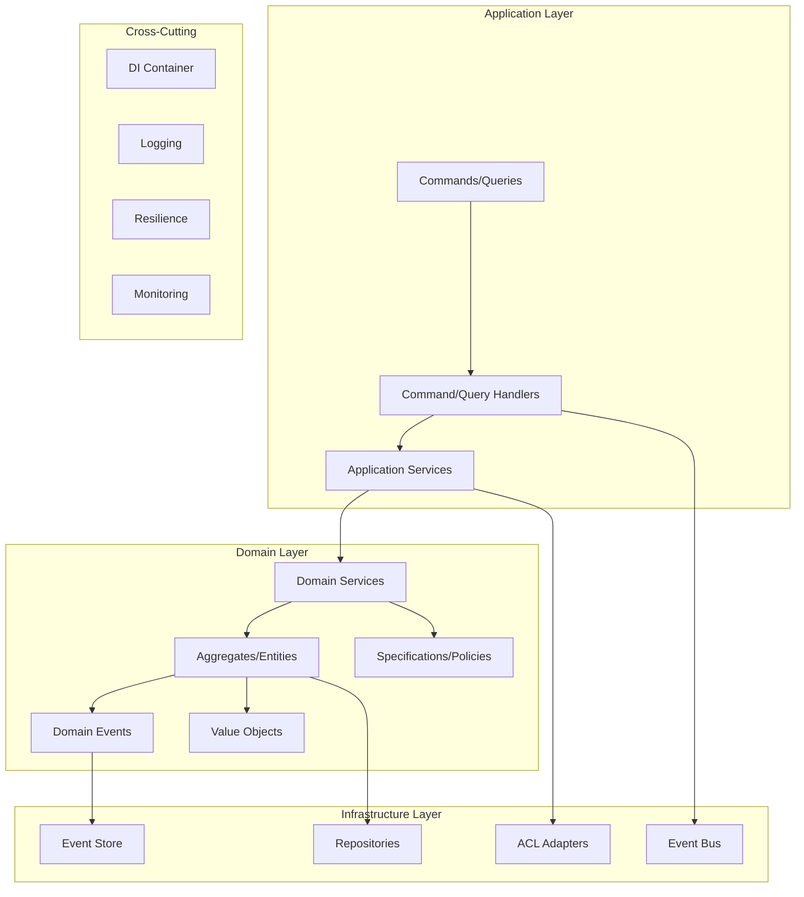

# VytchesDDD

<div align="center">


**Enterprise-Grade TypeScript Domain-Driven Design Framework**

[](https://github.com/vytches/ddd/actions/workflows/ci.yml)
[](https://github.com/vytches/ddd/actions/workflows/release.yml)
[](https://codecov.io/gh/vytches/ddd)
[](https://www.npmjs.com/org/vytches)
[](https://www.typescriptlang.org/)
[](https://opensource.org/licenses/MIT)

[Documentation](./docs) • [Examples](./examples) • [API Reference](./docs/api) •
[Contributing](./CONTRIBUTING.md)

</div>

## 📋 Table of Contents

- [Overview](#-overview)
- [Key Features](#-key-features)
- [Architecture](#-architecture)
- [Package Ecosystem](#-package-ecosystem)
- [Quick Start](#-quick-start)
- [Core Concepts](#-core-concepts)
- [Advanced Patterns](#-advanced-patterns)
- [LLM Integration Guide](#-llm-integration-guide)
- [Development](#-development)
- [Documentation](#-documentation)
- [Contributing](#-contributing)

## 🎯 Overview

VytchesDDD is a comprehensive TypeScript framework for implementing
Domain-Driven Design patterns in enterprise applications. Built with modern
TypeScript and designed for both human developers and AI assistants, it provides
a complete toolkit for building scalable, maintainable, and testable
domain-centric applications

### Philosophy

- **🤖 AI-First Documentation**: Structured for optimal LLM understanding and
  code generation
- **📦 Modular Architecture**: Use only what you need with tree-shakeable
  packages
- **🏢 Enterprise-Ready**: Production-grade patterns including CQRS, Event
  Sourcing, and Saga orchestration
- **🔒 Type-Safe**: Full TypeScript support with strict typing and inference
- **🔌 Framework Agnostic**: Works with any framework or as standalone
- **🛡️ Boundary Protection**: Built-in Anti-Corruption Layer for external system
  integration

## ✨ Key Features

### Core DDD Building Blocks

- **Value Objects**: Immutable, self-validating domain primitives
- **Entities**: Objects with identity and lifecycle
- **Aggregates**: Consistency boundaries with built-in event sourcing
- **Domain Events**: First-class event-driven architecture support
- **Repositories**: Abstract persistence with Unit of Work pattern
- **Domain Services**: Business logic that doesn't belong to entities

### Advanced Patterns

- **CQRS**: Complete Command/Query separation with middleware pipeline
- **Event Sourcing**: Built-in event store with snapshots and projections
- **Saga Orchestration**: Long-running business processes with compensation
- **Anti-Corruption Layer**: Protect your domain from external systems
- **Business Policies**: Declarative business rules with temporal support
- **Specifications**: Composable business rules and validation

### Enterprise Features

- **Dependency Injection**: Auto-discovery with context isolation
- **Resilience Patterns**: Circuit breakers, retry policies, bulkheads
- **Observability**: Structured logging, distributed tracing, metrics
- **Testing Utilities**: DDD-specific test helpers and builders
- **Multi-tenancy**: Built-in support for isolated contexts
- **Performance**: Optimized for high-throughput scenarios

## 🏗️ Architecture



## 📦 Package Ecosystem

The library is organized into focused, single-responsibility packages:

### Foundation Layer

| Package                                                          | Description                           | Size  | Dependencies         |
| ---------------------------------------------------------------- | ------------------------------------- | ----- | -------------------- |
| [`@vytches/ddd-contracts`](./packages/contracts)                 | Core interfaces and contracts         | ~5KB  | None                 |
| [`@vytches/ddd-domain-primitives`](./packages/domain-primitives) | Base DDD classes (Entity, VO, etc.)   | ~40KB | contracts            |
| [`@vytches/ddd-value-objects`](./packages/value-objects)         | Enhanced value object implementations | ~36KB | domain-primitives    |
| [`@vytches/ddd-repositories`](./packages/repositories)           | Repository pattern & Unit of Work     | ~40KB | domain-primitives    |
| [`@vytches/ddd-aggregates`](./packages/aggregates)               | Aggregate roots with capabilities     | ~82KB | repositories, events |

### Pattern Layer

| Package                                                      | Description              | Key Features                             |
| ------------------------------------------------------------ | ------------------------ | ---------------------------------------- |
| [`@vytches/ddd-validation`](./packages/validation)           | Business rule validation | Specifications, composite validators     |
| [`@vytches/ddd-policies`](./packages/policies)               | Business policy engine   | Fluent API, temporal policies, behaviors |
| [`@vytches/ddd-domain-services`](./packages/domain-services) | Domain service patterns  | Transaction support, logging             |

### Architecture Layer

| Package                                              | Description               | Key Features                           |
| ---------------------------------------------------- | ------------------------- | -------------------------------------- |
| [`@vytches/ddd-events`](./packages/events)           | Event-driven architecture | Unified bus, domain/integration events |
| [`@vytches/ddd-cqrs`](./packages/cqrs)               | Command/Query separation  | Middleware pipeline, decorators        |
| [`@vytches/ddd-projections`](./packages/projections) | Event projections         | Automated state management             |
| [`@vytches/ddd-event-store`](./packages/event-store) | Event persistence         | Snapshots, streams, adapters           |

### Integration Layer

| Package                                          | Description           | Key Features                          |
| ------------------------------------------------ | --------------------- | ------------------------------------- |
| [`@vytches/ddd-acl`](./packages/acl)             | Anti-Corruption Layer | Model translation, operation registry |
| [`@vytches/ddd-messaging`](./packages/messaging) | Messaging patterns    | Outbox, Saga orchestration            |

### Infrastructure Layer

| Package                                            | Description          | Key Features                       |
| -------------------------------------------------- | -------------------- | ---------------------------------- |
| [`@vytches/ddd-di`](./packages/di)                 | Dependency injection | Auto-discovery, framework adapters |
| [`@vytches/ddd-resilience`](./packages/resilience) | Resilience patterns  | Circuit breaker, retry, bulkhead   |
| [`@vytches/ddd-logging`](./packages/logging)       | Structured logging   | DDD-aware, automatic context       |

### Utility Layer

| Package                                      | Description      | Key Features                 |
| -------------------------------------------- | ---------------- | ---------------------------- |
| [`@vytches/ddd-utils`](./packages/utils)     | Common utilities | Result pattern, type guards  |
| [`@vytches/ddd-testing`](./packages/testing) | Test utilities   | DDD test builders, mocks     |
| [`@vytches/ddd-cli`](./packages/cli)         | CLI tools        | Code generation, scaffolding |

### Meta Packages

| Package                                 | Description        | Includes              |
| --------------------------------------- | ------------------ | --------------------- |
| [`@vytches/ddd`](./packages/enterprise) | Complete framework | All packages          |
| [`@vytches/ddd-core`](./packages/core)  | Core meta-package  | Foundation + patterns |

## 🚀 Quick Start

### Installation

#### From GitHub Packages

```bash
# Setup .npmrc file
echo "@vytches:registry=https://npm.pkg.github.com
//npm.pkg.github.com/:_authToken=${GITHUB_TOKEN}" > .npmrc

# Complete framework (recommended)
npm install @vytches/ddd

# Or core functionality only
npm install @vytches/ddd-core

# Or specific features
npm install @vytches/ddd-events @vytches/ddd-cqrs @vytches/ddd-resilience
```

#### From NPM (coming soon)

```bash
# Complete framework
npm install @vytches/ddd

# Core functionality only
npm install @vytches/ddd-core
```

### NestJS Integration (NEW - Simplified!)

```typescript
// app.module.ts
import { Module } from '@nestjs/common';
import { VytchesDDDModule } from '@vytches/ddd-nestjs';
import { ICommandBus, IQueryBus, IEventBus } from '@vytches/ddd-cqrs';
import { EnhancedCommandBus, EnhancedQueryBus } from '@vytches/ddd-cqrs';
import { UnifiedEventBus } from '@vytches/ddd-events';

@Module({
  imports: [
    VytchesDDDModule.register({
      providers: [
        // Define your bus implementations
        { provide: ICommandBus, useClass: EnhancedCommandBus },
        { provide: IQueryBus, useClass: EnhancedQueryBus },
        { provide: IEventBus, useClass: UnifiedEventBus },
      ],
      isGlobal: true, // Available everywhere
    }),
  ],
})
export class AppModule {}

// order.module.ts - Domain Module
@Module({
  providers: [
    // Just list your handlers - they're auto-registered!
    CreateOrderHandler,
    GetOrderHandler,
    OrderProcessManager,
    OrderService,
  ],
})
export class OrderModule {
  // No onModuleInit needed - auto-registration handles everything!
}

// order.service.ts - Use abstract tokens directly
@Injectable()
export class OrderService {
  constructor(
    @Inject(ICommandBus) private commandBus: ICommandBus,
    @Inject(IQueryBus) private queryBus: IQueryBus
  ) {}

  async createOrder(data: CreateOrderData) {
    return this.commandBus.execute(new CreateOrderCommand(data));
  }
}
```

### Basic Example: E-Commerce Order Domain

```typescript
// Option 1: Complete framework import (recommended)
import {
  AggregateRoot,
  ValueObject,
  DomainEvent,
  Result,
  EntityId,
  Email,
  Money,
} from '@vytches/ddd';

// Option 2: Specific package imports
import {
  AggregateRoot,
  ValueObject,
  DomainEvent,
  Result,
  EntityId,
} from '@vytches/ddd-core';
import { Email, Money } from '@vytches/ddd-value-objects';

// Domain Events
class OrderPlaced extends DomainEvent<{
  orderId: string;
  customerId: string;
  totalAmount: number;
  currency: string;
}> {}

// Value Objects
class OrderStatus extends ValueObject<string> {
  static readonly PENDING = new OrderStatus('PENDING');
  static readonly CONFIRMED = new OrderStatus('CONFIRMED');
  static readonly SHIPPED = new OrderStatus('SHIPPED');
  static readonly DELIVERED = new OrderStatus('DELIVERED');
  static readonly CANCELLED = new OrderStatus('CANCELLED');

  private constructor(value: string) {
    super(value);
  }

  canTransitionTo(newStatus: OrderStatus): boolean {
    const transitions: Record<string, string[]> = {
      PENDING: ['CONFIRMED', 'CANCELLED'],
      CONFIRMED: ['SHIPPED', 'CANCELLED'],
      SHIPPED: ['DELIVERED'],
      DELIVERED: [],
      CANCELLED: [],
    };

    return transitions[this.value].includes(newStatus.value);
  }
}

// Aggregate Root
class Order extends AggregateRoot {
  private constructor(
    id: EntityId,
    private customerId: EntityId,
    private items: OrderItem[],
    private status: OrderStatus,
    private totalAmount: Money
  ) {
    super(id);
  }

  static create(
    customerId: EntityId,
    items: OrderItem[]
  ): Result<Order, Error> {
    if (items.length === 0) {
      return Result.fail(new Error('Order must have at least one item'));
    }

    const totalAmount = items.reduce(
      (sum, item) => sum.add(item.getSubtotal()),
      Money.zero('USD')
    );

    const order = new Order(
      EntityId.create(),
      customerId,
      items,
      OrderStatus.PENDING,
      totalAmount
    );

    order.addDomainEvent(
      new OrderPlaced({
        orderId: order.id.value,
        customerId: customerId.value,
        totalAmount: totalAmount.amount,
        currency: totalAmount.currency,
      })
    );

    return Result.ok(order);
  }

  confirm(): Result<void, Error> {
    if (!this.status.canTransitionTo(OrderStatus.CONFIRMED)) {
      return Result.fail(new Error('Cannot confirm order in current status'));
    }

    this.status = OrderStatus.CONFIRMED;
    this.addDomainEvent(new OrderConfirmed({ orderId: this.id.value }));

    return Result.ok();
  }
}
```

### CQRS Implementation

```typescript
import { Command, CommandHandler, CommandBus } from '@vytches/ddd-cqrs';
import { VytchesDDD, DomainService } from '@vytches/ddd-di';
import { Logger } from '@vytches/ddd-logging';

// Command Definition
class PlaceOrderCommand extends Command<void> {
  constructor(
    public readonly customerId: string,
    public readonly items: Array<{ productId: string; quantity: number }>
  ) {
    super();
  }
}

// Domain Service
@DomainService({
  serviceId: 'orderService',
  context: 'OrderManagement',
})
class OrderService {
  private logger = Logger.forContext('OrderService');

  async placeOrder(command: PlaceOrderCommand): Promise<Result<Order, Error>> {
    this.logger.info('Placing order', { customerId: command.customerId });

    // Business logic here
    const order = Order.create(
      EntityId.from(command.customerId),
      command.items.map(item => OrderItem.create(item))
    );

    return order;
  }
}

// Command Handler with Auto-Discovery
@CommandHandler(PlaceOrderCommand, {
  context: 'OrderManagement',
  timeout: 30000,
  middleware: ['validation', 'logging', 'transaction'],
})
class PlaceOrderHandler {
  async execute(command: PlaceOrderCommand): Promise<void> {
    const orderService = VytchesDDD.resolve<OrderService>('orderService');
    const result = await orderService.placeOrder(command);

    if (result.isFailure()) {
      throw result.error;
    }

    // Repository automatically publishes domain events
    await this.orderRepository.save(result.value);
  }
}

// Usage
const commandBus = new CommandBus();
await commandBus.execute(
  new PlaceOrderCommand('customer-123', [
    { productId: 'product-456', quantity: 2 },
  ])
);
```

### Business Policies

```typescript
import { PolicyBuilder, PolicyContext } from '@vytches/ddd-policies';
import { CreditLimitSpecification, FraudDetectionSpec } from './specifications';

// Define complex business policy
const orderApprovalPolicy = PolicyBuilder.create<Order>()
  .withId('order-approval')
  .withDomain('sales')
  .withName('Order Approval Policy')

  // Basic validation
  .must(order => order.getTotalAmount().amount > 0)
  .withCode('INVALID_AMOUNT')
  .withMessage('Order amount must be positive')

  // Credit limit check for large orders
  .when(order => order.getTotalAmount().amount > 10000)
  .then()
  .mustAsync(new CreditLimitSpecification())
  .withCode('CREDIT_LIMIT_EXCEEDED')
  .withSeverity('ERROR')

  // Fraud detection
  .mustAsync(new FraudDetectionSpec())
  .withCode('FRAUD_DETECTED')
  .withSeverity('ERROR')

  // Business hours restriction
  .when(ctx => ctx.metadata?.region === 'EU')
  .then()
  .must(order => isWithinBusinessHours())
  .withCode('OUTSIDE_BUSINESS_HOURS')
  .withSeverity('WARNING')

  .build();

// Execute policy
const context = PolicyContext.create()
  .withUserId('user-123')
  .withMetadata({ region: 'EU', channel: 'web' })
  .build();

const result = await orderApprovalPolicy.check({
  entity: order,
  context,
});

if (result.isFailure()) {
  const errors = result.error.violations.filter(v => v.severity === 'ERROR');
  const warnings = result.error.violations.filter(
    v => v.severity === 'WARNING'
  );

  if (errors.length > 0) {
    throw new OrderValidationError(errors);
  }
}
```

### Saga Pattern for Complex Workflows

```typescript
import { BaseSaga, SagaOrchestrator, SagaStatus } from '@vytches/ddd-messaging';

// Define Order Processing Saga
class OrderProcessingSaga extends BaseSaga {
  constructor() {
    super('OrderProcessingSaga', 'Order fulfillment workflow');
  }

  async handleEvent(
    event: IExtendedDomainEvent,
    context: ISagaExecutionContext
  ): Promise<ISagaActionResult> {
    switch (event.eventType) {
      case 'OrderPlaced':
        return this.handleOrderPlaced(event, context);
      case 'PaymentProcessed':
        return this.handlePaymentProcessed(event, context);
      case 'InventoryReserved':
        return this.handleInventoryReserved(event, context);
      case 'PaymentFailed':
        return this.handlePaymentFailed(event, context);
    }
  }

  private async handleOrderPlaced(
    event: IExtendedDomainEvent,
    context: ISagaExecutionContext
  ) {
    this.updateState({
      currentStep: 'ProcessPayment',
      stepData: { orderId: event.payload.orderId },
    });

    return {
      success: true,
      commands: [{ type: 'ProcessPayment', payload: event.payload }],
    };
  }

  private async handlePaymentFailed(
    event: IExtendedDomainEvent,
    context: ISagaExecutionContext
  ) {
    // Compensate by cancelling the order
    return {
      success: true,
      commands: [
        {
          type: 'CancelOrder',
          payload: { orderId: this.state.stepData.orderId },
        },
      ],
      events: [
        {
          eventType: 'OrderCancelled',
          payload: { orderId: this.state.stepData.orderId },
        },
      ],
    };
  }

  async compensate(
    stepName: string,
    context: ISagaExecutionContext
  ): Promise<ISagaActionResult> {
    switch (stepName) {
      case 'InventoryReserved':
        return {
          success: true,
          commands: [
            { type: 'ReleaseInventory', payload: this.state.stepData },
          ],
        };
      case 'PaymentProcessed':
        return {
          success: true,
          commands: [{ type: 'RefundPayment', payload: this.state.stepData }],
        };
      default:
        return { success: true };
    }
  }
}

// Register and use saga
const orchestrator = new SagaOrchestrator(sagaRepository);
orchestrator.registerSagaDefinition({
  sagaType: 'OrderProcessingSaga',
  startEvents: ['OrderPlaced'],
  createInstance: async () => new OrderProcessingSaga(),
  defaultTimeout: 3600000, // 1 hour
});

// Process events through orchestrator
await orchestrator.processEvent(orderPlacedEvent, {
  correlationId: 'order-123',
});
```

### Anti-Corruption Layer

```typescript
import { BaseACLAdapter, BaseModelTranslator } from '@vytches/ddd-acl';

// External payment gateway response
interface ExternalPaymentResponse {
  transaction_id: string;
  status_code: number;
  amount_cents: number;
  currency_code: string;
  processed_at: string;
}

// Domain model
class PaymentResult extends ValueObject<{
  transactionId: string;
  status: PaymentStatus;
  amount: Money;
  processedAt: Date;
}> {}

// Model translator
class PaymentTranslator extends BaseModelTranslator<
  ExternalPaymentResponse,
  PaymentResult
> {
  protected performToDomainTranslation(
    external: ExternalPaymentResponse
  ): PaymentResult {
    return new PaymentResult({
      transactionId: external.transaction_id,
      status: this.mapStatusCode(external.status_code),
      amount: Money.fromCents(external.amount_cents, external.currency_code),
      processedAt: new Date(external.processed_at),
    });
  }

  private mapStatusCode(code: number): PaymentStatus {
    const statusMap: Record<number, PaymentStatus> = {
      200: PaymentStatus.SUCCESS,
      402: PaymentStatus.INSUFFICIENT_FUNDS,
      403: PaymentStatus.DECLINED,
      500: PaymentStatus.ERROR,
    };

    return statusMap[code] ?? PaymentStatus.UNKNOWN;
  }
}

// ACL Adapter with resilience
class PaymentGatewayAdapter extends BaseACLAdapter<
  PaymentRequest,
  ExternalPaymentResponse
> {
  constructor() {
    super(new PaymentTranslator());

    // Add resilience patterns
    this.withCircuitBreaker({
      failureThreshold: 5,
      resetTimeout: 60000,
    });

    this.withRetry({
      maxAttempts: 3,
      backoff: 'exponential',
    });
  }

  protected async executeExternalOperation(
    operation: string,
    request: PaymentRequest
  ): Promise<ExternalPaymentResponse> {
    const response = await this.httpClient.post('/payments', {
      // Transform to external format
    });

    return response.data;
  }
}
```

## 🎓 Core Concepts

### 1. Value Objects

Value Objects represent descriptive aspects of the domain with no conceptual
identity. They are immutable and compared by their values.

```typescript
import { ValueObject } from '@vytches/ddd-core';

class Address extends ValueObject<{
  street: string;
  city: string;
  postalCode: string;
  country: string;
}> {
  constructor(props: {
    street: string;
    city: string;
    postalCode: string;
    country: string;
  }) {
    super(props);
    this.validate();
  }

  private validate(): void {
    if (!this.value.street || !this.value.city) {
      throw new Error('Street and city are required');
    }

    if (!this.isValidPostalCode(this.value.postalCode)) {
      throw new Error('Invalid postal code format');
    }
  }

  private isValidPostalCode(code: string): boolean {
    // Country-specific validation
    return /^\d{5}(-\d{4})?$/.test(code); // US format
  }
}
```

### 2. Entities

Entities have a distinct identity that runs through time and different states.

```typescript
import { Entity, EntityId } from '@vytches/ddd-core';

class Product extends Entity {
  private constructor(
    id: EntityId,
    private name: string,
    private sku: string,
    private price: Money,
    private stock: number
  ) {
    super(id);
  }

  static create(props: {
    name: string;
    sku: string;
    price: Money;
    initialStock: number;
  }): Result<Product, Error> {
    if (!props.name || props.name.length < 3) {
      return Result.fail(
        new Error('Product name must be at least 3 characters')
      );
    }

    return Result.ok(
      new Product(
        EntityId.create(),
        props.name,
        props.sku,
        props.price,
        props.initialStock
      )
    );
  }

  adjustStock(quantity: number): Result<void, Error> {
    const newStock = this.stock + quantity;

    if (newStock < 0) {
      return Result.fail(new Error('Insufficient stock'));
    }

    this.stock = newStock;
    return Result.ok();
  }
}
```

### 3. Aggregates

Aggregates are clusters of domain objects that can be treated as a single unit.
They maintain consistency boundaries and control access to their internals.

```typescript
import { AggregateRoot, DomainEvent } from '@vytches/ddd-core';

class ShoppingCart extends AggregateRoot {
  private items: CartItem[] = [];
  private customerId: EntityId;

  addItem(product: Product, quantity: number): Result<void, Error> {
    const existingItem = this.items.find(item =>
      item.productId.equals(product.id)
    );

    if (existingItem) {
      existingItem.increaseQuantity(quantity);
    } else {
      this.items.push(CartItem.create(product.id, quantity));
    }

    this.addDomainEvent(
      new ItemAddedToCart({
        cartId: this.id.value,
        productId: product.id.value,
        quantity,
      })
    );

    return Result.ok();
  }

  checkout(): Result<Order, Error> {
    if (this.items.length === 0) {
      return Result.fail(new Error('Cannot checkout empty cart'));
    }

    const order = Order.createFromCart(this);

    this.addDomainEvent(
      new CartCheckedOut({
        cartId: this.id.value,
        orderId: order.id.value,
      })
    );

    return Result.ok(order);
  }
}
```

### 4. Domain Services

Domain Services encapsulate domain logic that doesn't naturally fit within
entities or value objects.

```typescript
import { DomainService } from '@vytches/ddd-di';
import { Logger } from '@vytches/ddd-logging';

@DomainService({
  serviceId: 'pricingService',
  context: 'Sales',
})
class PricingService {
  private logger = Logger.forContext('PricingService');

  calculateDiscount(customer: Customer, order: Order): Result<Money, Error> {
    this.logger.info('Calculating discount', {
      customerId: customer.id.value,
      orderId: order.id.value,
    });

    // Complex pricing logic involving multiple aggregates
    const loyaltyDiscount = this.calculateLoyaltyDiscount(customer);
    const volumeDiscount = this.calculateVolumeDiscount(order);
    const seasonalDiscount = this.getSeasonalDiscount();

    const totalDiscount = loyaltyDiscount
      .add(volumeDiscount)
      .add(seasonalDiscount);

    return Result.ok(totalDiscount);
  }
}
```

### 5. Repositories

Repositories provide an abstraction over data storage, allowing the domain to
remain persistence-agnostic.

```typescript
import { IBaseRepository } from '@vytches/ddd-repositories';

interface IOrderRepository extends IBaseRepository<Order> {
  findByCustomerId(customerId: EntityId): Promise<Order[]>;
  findByStatus(status: OrderStatus): Promise<Order[]>;
  findByDateRange(startDate: Date, endDate: Date): Promise<Order[]>;
}

// Implementation
class OrderRepository implements IOrderRepository {
  async save(order: Order): Promise<void> {
    // Persist aggregate
    await this.db.orders.upsert({
      id: order.id.value,
      data: order.toSnapshot(),
    });

    // Publish domain events (handled automatically by base repository)
    await this.eventBus.publishMany(order.getUncommittedEvents());
    order.markEventsAsCommitted();
  }

  async findById(id: EntityId): Promise<Order | null> {
    const data = await this.db.orders.findUnique({
      where: { id: id.value },
    });

    return data ? Order.fromSnapshot(data) : null;
  }
}
```

## 🚀 Advanced Patterns

### Event Sourcing

```typescript
import {
  EventSourcedAggregate,
  DomainEvent,
  IEventStore,
} from '@vytches/ddd-event-store';

class BankAccount extends EventSourcedAggregate {
  private balance: Money;
  private status: AccountStatus;

  static create(customerId: EntityId, initialDeposit: Money): BankAccount {
    const account = new BankAccount();

    account.apply(
      new AccountOpened({
        accountId: EntityId.create().value,
        customerId: customerId.value,
        initialDeposit: initialDeposit.toJSON(),
        openedAt: new Date(),
      })
    );

    return account;
  }

  deposit(amount: Money): Result<void, Error> {
    if (this.status !== AccountStatus.ACTIVE) {
      return Result.fail(new Error('Account is not active'));
    }

    this.apply(
      new MoneyDeposited({
        accountId: this.id.value,
        amount: amount.toJSON(),
        balance: this.balance.add(amount).toJSON(),
      })
    );

    return Result.ok();
  }

  // Event handlers
  protected onAccountOpened(event: AccountOpened): void {
    this.id = EntityId.from(event.payload.accountId);
    this.balance = Money.fromJSON(event.payload.initialDeposit);
    this.status = AccountStatus.ACTIVE;
  }

  protected onMoneyDeposited(event: MoneyDeposited): void {
    this.balance = Money.fromJSON(event.payload.balance);
  }
}

// Usage with Event Store
const eventStore = new EventStore();
const account = BankAccount.create(customerId, Money.of(1000, 'USD'));

// Save events
await eventStore.appendToStream(
  `account-${account.id.value}`,
  account.getUncommittedEvents()
);

// Reconstitute from events
const events = await eventStore.getEventStream(`account-${accountId}`);
const reconstituted = BankAccount.fromEventStream(events);
```

### Projections

```typescript
import {
  Projection,
  ProjectionEngine,
  ICheckpointCapability,
} from '@vytches/ddd-projections';

class CustomerOrderSummaryProjection extends Projection {
  constructor() {
    super('CustomerOrderSummary');

    // Add capabilities
    this.addCapability(new CheckpointCapability());
    this.addCapability(
      new RetryCapability({
        maxAttempts: 3,
        backoff: 'exponential',
      })
    );
  }

  // Define event handlers
  @HandleEvent(OrderPlaced)
  async onOrderPlaced(event: OrderPlaced): Promise<void> {
    await this.db.customerSummaries.upsert({
      where: { customerId: event.payload.customerId },
      update: {
        totalOrders: { increment: 1 },
        totalSpent: { increment: event.payload.totalAmount },
        lastOrderDate: event.occurredAt,
      },
      create: {
        customerId: event.payload.customerId,
        totalOrders: 1,
        totalSpent: event.payload.totalAmount,
        lastOrderDate: event.occurredAt,
      },
    });
  }

  @HandleEvent(OrderCancelled)
  async onOrderCancelled(event: OrderCancelled): Promise<void> {
    // Update projection
  }
}

// Run projection engine
const engine = new ProjectionEngine();
engine.register(new CustomerOrderSummaryProjection());
await engine.start();
```

### Specifications Pattern

```typescript
import {
  Specification,
  CompositeSpecification,
  AndSpecification,
  OrSpecification,
} from '@vytches/ddd-validation';

// Define specifications
class MinimumAgeSpecification extends Specification<Customer> {
  constructor(private minAge: number) {
    super();
  }

  isSatisfiedBy(customer: Customer): boolean {
    return customer.getAge() >= this.minAge;
  }
}

class PremiumCustomerSpecification extends Specification<Customer> {
  isSatisfiedBy(customer: Customer): boolean {
    return customer.getTier() === CustomerTier.PREMIUM;
  }
}

class HighValueOrderSpecification extends Specification<Order> {
  constructor(private threshold: Money) {
    super();
  }

  isSatisfiedBy(order: Order): boolean {
    return order.getTotalAmount().isGreaterThan(this.threshold);
  }
}

// Compose specifications
const eligibleForDiscount = new AndSpecification(
  new MinimumAgeSpecification(18),
  new OrSpecification(
    new PremiumCustomerSpecification(),
    new HighValueOrderSpecification(Money.of(1000, 'USD'))
  )
);

// Use in domain logic
if (eligibleForDiscount.isSatisfiedBy(customer)) {
  order.applyDiscount(discountPercentage);
}
```

## 🤖 LLM Integration Guide

This library ships with LLM-optimized documentation that helps AI coding
assistants (Claude Code, Copilot, Cursor, etc.) generate correct DDD code.

### Quick Setup (recommended)

```bash
# After installing @vytches/ddd:
npx @vytches/ddd init-context
```

This copies context files into `.claude/vytches-ddd/` in your project:

| File             | Contents                                           |
| ---------------- | -------------------------------------------------- |
| `llm-context.md` | Architecture, full API reference, anti-patterns    |
| `<package>.md`   | Per-package quick start, patterns, common mistakes |
| `.manifest.json` | Version manifest for freshness verification        |

Then reference it in your AI assistant:

```markdown
# In your project's CLAUDE.md:

@.claude/vytches-ddd/llm-context.md
```

For Cursor, add to `.cursorrules`. For Copilot, add to
`.github/copilot-instructions.md`.

### Verify Freshness

After updating `@vytches/ddd`, check if your local context is still current:

```bash
npx @vytches/ddd init-context --verify
```

If outdated, re-run `npx @vytches/ddd init-context` to update.

### Manual Access

The context file is also available directly in `node_modules`:

```
node_modules/@vytches/ddd/llm-context.md
```

Each sub-package includes its own guide at
`node_modules/@vytches/ddd-*/LLMGUIDE.md`.

### Best Practices for AI Assistance

1. **Use the context file** — it contains verified API signatures, correct
   import paths, and anti-patterns that prevent common AI mistakes.

2. **Include domain context in prompts** — bounded context name, business rules,
   integration points.

3. **Request specific patterns**:

   - "Implement using PolicyBuilder from @vytches/ddd"
   - "Add resilience using CircuitBreaker from @vytches/ddd"
   - "Create ACL adapter using SimpleACLAdapter from @vytches/ddd"

4. **Use library conventions**:
   - Result pattern for error handling
   - Domain events for state changes via `apply()`
   - Inline specifications (`Specification.create()`) for one-off rules

## 🏗️ Development

### Prerequisites

- Node.js >= 18.0.0
- pnpm >= 8.0.0
- TypeScript >= 5.0.0

### Setup

```bash
# Clone repository
git clone https://github.com/vytches/ddd.git
cd ddd

# Install dependencies
pnpm install

# Build all packages
pnpm build

# Run tests
pnpm test

# Start development mode
pnpm dev
```

### Development Commands

```bash
# Core commands
pnpm dev              # Interactive development mode
pnpm build            # Build all packages
pnpm test             # Run all tests
pnpm lint             # Lint code
pnpm format           # Format with Prettier
pnpm type-check       # TypeScript validation

# Advanced workflows
pnpm playground       # Interactive testing environment
pnpm test:watch       # Test in watch mode
pnpm build:affected   # Build only changed packages
pnpm quality          # Run all quality checks

# Release management
pnpm changeset        # Create changeset
pnpm release          # Release packages
```

### Project Structure

```
ddd/
├── packages/                    # All packages
│   ├── contracts/              # Shared interfaces
│   ├── domain-primitives/      # Base DDD classes
│   ├── value-objects/          # Value object implementations
│   ├── repositories/           # Repository patterns
│   ├── aggregates/             # Aggregate root implementations
│   ├── validation/             # Validation & specifications
│   ├── policies/               # Business policies
│   ├── domain-services/        # Domain service patterns
│   ├── events/                 # Event infrastructure
│   ├── cqrs/                   # CQRS implementation
│   ├── projections/            # Event projections
│   ├── event-store/            # Event persistence
│   ├── acl/                    # Anti-corruption layer
│   ├── messaging/              # Messaging patterns
│   ├── di/                     # Dependency injection
│   ├── resilience/             # Resilience patterns
│   ├── logging/                # Structured logging
│   ├── utils/                  # Common utilities
│   ├── testing/                # Test utilities
│   ├── cli/                    # CLI tools
│   ├── core/                   # Core meta-package
│   └── enterprise/             # Enterprise bundle
├── examples/                    # Example applications
│   ├── basic/                  # Basic usage
│   ├── ecommerce/              # E-commerce example
│   ├── banking/                # Banking domain
│   └── playground/             # Testing playground
├── docs/                        # Documentation
│   ├── api/                    # API reference
│   ├── guides/                 # User guides
│   ├── patterns/               # Pattern catalog
│   └── adrs/                   # Architecture decisions
├── scripts/                     # Build scripts
└── tools/                       # Development tools
```

### Testing Strategy

```bash
# Unit tests
pnpm test:unit

# Integration tests
pnpm test:integration

# E2E tests
pnpm test:e2e

# Coverage report
pnpm test:coverage

# Test specific package
pnpm nx test @vytches/ddd-events
```

## 📚 Documentation

### Getting Started

- [Quick Start Guide](./docs/guides/quick-start.md)
- [Core Concepts](./docs/guides/core-concepts.md)
- [Installation](./docs/guides/installation.md)

### Patterns & Practices

- [DDD Patterns](./docs/patterns/ddd-patterns.md)
- [CQRS Guide](./docs/patterns/cqrs.md)
- [Event Sourcing](./docs/patterns/event-sourcing.md)
- [Saga Pattern](./docs/patterns/sagas.md)

### Package Guides

- [Events Package](./docs/packages/events.md)
- [CQRS Package](./docs/packages/cqrs.md)
- [ACL Package](./docs/packages/acl.md)
- [Resilience Package](./docs/packages/resilience.md)
- [DI Package](./docs/packages/di.md)

### API Reference

- [Core API](./docs/api/core.md)
- [Full API Reference](./docs/api/index.md)

### Architecture

- [Architecture Overview](./docs/architecture/overview.md)
- [Decision Records](./docs/adrs/)

### Examples

- [Example Applications](./examples/README.md)
- [Code Snippets](./docs/examples/snippets.md)

## 🤝 Contributing

We welcome contributions! Please see our [Contributing Guide](CONTRIBUTING.md)
for details.

### Development Workflow

1. Fork the repository
2. Create feature branch (`git checkout -b feature/amazing-feature`)
3. Make changes with tests
4. Run quality checks (`pnpm quality`)
5. Commit with conventional commits
6. Push to branch (`git push origin feature/amazing-feature`)
7. Open Pull Request

### Code Style

- TypeScript strict mode
- ESLint + Prettier formatting
- Conventional commits
- 90%+ test coverage
- JSDoc for public APIs

## 📄 License

This project is licensed under the MIT License - see the [LICENSE](LICENSE) file
for details.

## 🙏 Acknowledgments

- Inspired by Eric Evans' Domain-Driven Design
- Built on enterprise patterns from Martin Fowler
- Influenced by frameworks like MediatR (.NET) and Axon (Java)
- Designed for modern TypeScript development

## 🔗 Links

- [GitHub Repository](https://github.com/vytches/ddd)
- [NPM Organization](https://www.npmjs.com/org/vytches)
- [Documentation](https://vytches.dev/ddd)
- [Discord Community](https://discord.gg/vytches)

---

<div align="center">

**Happy Domain Modeling!** 🚀

Made with ❤️ by the VytchesDDD Team

</div>
