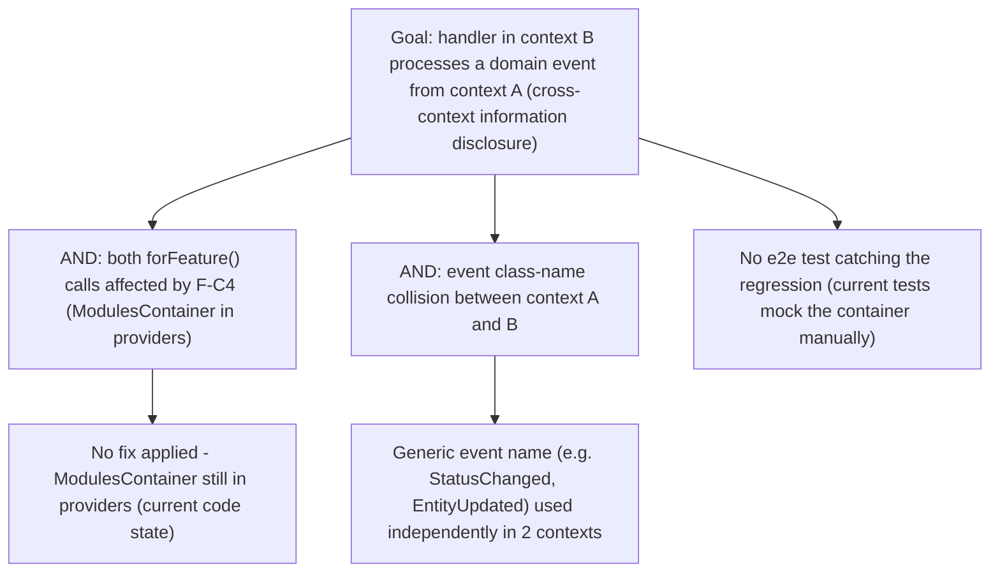

# TM-VB-003 — NestJS `forFeature()` DI wiring fix

## 1. Scope

**In scope:**

- `packages/nestjs/src/feature/vytches-ddd-feature.module.ts` —
  `ModulesContainer` in `providers` (F-C4)
- `packages/nestjs/src/feature/feature-handler-registrar.ts` —
  `findOwnModule()`, local bus registration
- `packages/nestjs/src/dispatchers/context-aware-event-dispatcher.ts` —
  DomainEvent→LOCAL_EVENT_BUS / IntegrationEvent→IEventBus routing
- `packages/nestjs/src/vytches-ddd.module.ts` — `forRootAsync()` (F-H8),
  `forContext()`/`forContexts()` (F-M5), deprecated-field cleanup (F-M15)
- Deep import `@nestjs/core/injector/modules-container.js` (F-M19)

**Out of scope:** container-adapter performance (VP-006b), the content of the
domain handlers owned by consumer applications.

**This is NOT a new trust boundary in the network sense** — this is an
in-process DI library running inside a host NestJS application. The "attacker"
here is not an external HTTP user but: (a) a code regression that silently
breaks cross-context event isolation, and (b) to a lesser extent, careless
third-party code sharing the same Node process (shared `ModulesContainer`,
`globalThis`).

**Actors and trust levels:**

| Actor                                                                              | Trust level                                                                                    |
| ---------------------------------------------------------------------------------- | ---------------------------------------------------------------------------------------------- |
| Bounded context A (e.g. `orders`) importing `forFeature('orders')`                 | Medium — trusted owner code, but should not see context B's events/commands                    |
| Bounded context B (e.g. `billing`) in the same process                             | Medium — symmetrically                                                                         |
| A handler registered on the GLOBAL bus (via the root `forRoot()` explorer)         | High within its own scope — but should not receive events intended as local to another context |
| External library consumer (any NestJS application importing `@vytches/ddd-nestjs`) | Medium — trusts the public module API contract                                                 |

**Asset classification:**

| Classification                     | Examples                                                                                                                                                                  |
| ---------------------------------- | ------------------------------------------------------------------------------------------------------------------------------------------------------------------------- |
| Confidential (architectural sense) | Domain event payloads of one bounded context (may carry business data/PII relevant only to that context — e.g. `orders` events may carry data `billing` should never see) |
| Internal                           | `ModulesContainer` structure, DI tokens, `anchorToken` (Symbol)                                                                                                           |
| Public                             | The module's public API (`forRoot`, `forFeature`, `forRootAsync`, `forContext(s)`) — the contract consumed by external NestJS modules                                     |

---

## 2. DFD — Data Flow Diagram

```mermaid
flowchart TD
    subgraph "Trust Boundary: Bounded Context A (orders)"
        HA[Handler A\n@CommandHandler/@EventHandler]
        MA[OrdersModule\nimports forFeature('orders')]
    end

    subgraph "Trust Boundary: Bounded Context B (billing)"
        HB[Handler B\n@CommandHandler/@EventHandler]
        MB[BillingModule\nimports forFeature('billing')]
    end

    subgraph "Trust Boundary: VytchesDDD NestJS Integration (in-process library)"
        MC[(ModulesContainer\nglobal, from InternalCoreModule)]
        FHR_A[FeatureHandlerRegistrar A\nfindOwnModule via anchorToken]
        FHR_B[FeatureHandlerRegistrar B\nfindOwnModule via anchorToken]
        LOCAL_A[(LOCAL_EVENT_BUS A\nper-forFeature instance)]
        LOCAL_B[(LOCAL_EVENT_BUS B\nper-forFeature instance)]
        GLOBAL[(Global ICommandBus/IQueryBus\nExplorerService — forRoot)]
        CAED_A[ContextAwareEventDispatcher A]
        CAED_B[ContextAwareEventDispatcher B]
    end

    MA -->|onModuleInit| FHR_A
    MB -->|onModuleInit| FHR_B
    FHR_A -->|"F-C4: reads own module's providers (BROKEN: empty map if ModulesContainer shadowed)"| MC
    FHR_B --> MC
    FHR_A -->|claimHandlerTypes messageType| GLOBAL
    FHR_B --> GLOBAL
    FHR_A -->|register handler A| LOCAL_A
    FHR_B -->|register handler B| LOCAL_B

    HA -->|apply -> DomainEvent| CAED_A
    CAED_A -->|DomainEvent| LOCAL_A
    CAED_A -->|IntegrationEvent| IEventBus[(Global IEventBus outbox-compatible)]

    HB -->|apply -> DomainEvent| CAED_B
    CAED_B -->|DomainEvent| LOCAL_B
    CAED_B -->|IntegrationEvent| IEventBus

    GLOBAL -.->|"if claimHandlerTypes never runs (F-C4 bug): the global explorer registers Handler A/B on the GLOBAL buses"| HA
    GLOBAL -.-> HB
```

**Key attack/regression path:** when `FHR_A.findOwnModule()` returns `undefined`
(because the local `ModulesContainer` is an empty map — F-C4),
`claimHandlerTypes()` never runs → the global `VytchesExplorerService` (from
`forRoot()`) sees handler A as unclaimed and registers it on the **global** bus.
If context B also has a handler listening for the same `messageType` (a
realistic event-name collision across contexts, e.g. a generic `EntityUpdated`),
handler B may end up invoked for an event that originated in context A.

---

## 3. STRIDE Analysis

### Component: `FeatureHandlerRegistrar.findOwnModule()` (F-C4 root cause)

| Category                     | Threat                                                                                                                                                                                                                                                                                                                                                                          | Attack Scenario                                                                                                                                                                                                                                                                           | Mitigation (exists)                                                                                       | Gap                                                                           | ATT&CK                                                              |
| ---------------------------- | ------------------------------------------------------------------------------------------------------------------------------------------------------------------------------------------------------------------------------------------------------------------------------------------------------------------------------------------------------------------------------- | ----------------------------------------------------------------------------------------------------------------------------------------------------------------------------------------------------------------------------------------------------------------------------------------- | --------------------------------------------------------------------------------------------------------- | ----------------------------------------------------------------------------- | ------------------------------------------------------------------- |
| S Spoofing                   | N/A — no network identity in this in-process component                                                                                                                                                                                                                                                                                                                          |                                                                                                                                                                                                                                                                                           |                                                                                                           |                                                                               |                                                                     |
| T Tampering                  | Low — no externally attacker-controlled input; the vector is a configuration defect, not active tampering                                                                                                                                                                                                                                                                       |                                                                                                                                                                                                                                                                                           |                                                                                                           | N/A                                                                           |                                                                     |
| R Repudiation                | A silent `internalLogger.warn` on missing own-module — no hard audit trail of "handler X landed on the wrong bus"; hard to prove after the fact that a cross-context leak occurred                                                                                                                                                                                              | Warn log exists                                                                                                                                                                                                                                                                           | No structured audit/metric for "handler misrouted"                                                        |                                                                               |
| **I Information Disclosure** | **A handler in context B receives and processes a domain event from context A (via a `messageType` collision on the global bus), exposing context A's business data/PII to a process that should not have access to it**                                                                                                                                                        | Two bounded contexts define events with the same class name (e.g. `StatusChanged`) carrying different payloads; both have `forFeature()` affected by F-C4 → both handlers land on the global bus → handler B subscribes to `StatusChanged` and receives the instance emitted by context A | None — this is the active bug described in the task                                                       | **CRITICAL — this is F-C4; fix = remove `ModulesContainer` from `providers`** | T1213 (Data from Information Repositories)                          |
| **D DoS**                    | Duplicate handler registration when `forRoot()` + `forContext()` are used together (F-M5) — a handler is invoked twice; for non-idempotent side effects (e.g. sending an email, writing to the outbox) this can duplicate side effects or saturate a downstream dependency (e.g. rate-limited third-party API)                                                                  | No guard against duplicate registration across multiple explorer instances                                                                                                                                                                                                                | Partial — `claimedTypes` in the explorer prevents some cases but not every forRoot+forContext combination | Guard required (task AC #5)                                                   | T1499 (analogous — resource exhaustion via duplicated side effects) |
| **E Elevation of Privilege** | A handler registered globally by mistake (as a result of F-C4) starts processing commands/queries it was never designed for — if handler B implicitly trusts that it only receives context-B events and acts on that assumption for privileged operations (e.g. auto-approve based on event type without re-validating the sender), this becomes a privilege-boundary violation | None — depends on the consumer application, but the library provides no isolation guarantee while F-C4 is active                                                                                                                                                                          | Fixing F-C4 + e2e tests (AC #2) structurally close this                                                   | T1068 (analogous, in the sense of "wrong-handler execution")                  |

### Component: `forRootAsync()` (F-H8)

| Category          | Threat                                                                                                                                                                                                                                                                                                                  | Attack Scenario | Mitigation                                                                                                   | Gap                              | ATT&CK |
| ----------------- | ----------------------------------------------------------------------------------------------------------------------------------------------------------------------------------------------------------------------------------------------------------------------------------------------------------------------- | --------------- | ------------------------------------------------------------------------------------------------------------ | -------------------------------- | ------ |
| I Info Disclosure | Low directly, but: if a consumer expects `useFactory` to supply e.g. `providers` config with secret-bearing bindings (a custom bus with authentication) and the result is silently discarded, the module boots with the DEFAULT (less restrictive) configuration without warning — "fail open" instead of "fail closed" | None            | `forRootAsync` neither validates nor reports that the `useFactory` result is discarded                       | T1548 (analogous, via fail-open) |
| E EoP             | A consumer that deliberately tries to scope/configure the module asynchronously (e.g. `isGlobal: false` via `useFactory`) effectively always gets `global: true` (hardcoded) — the module is ALWAYS global regardless of the caller's intent to scope it                                                                | None            | Real gap — decide to fix or remove from the public API before publishing (task AC #3 already addresses this) |                                  |

### Component: Deep import `@nestjs/core/injector/modules-container.js` (F-M19)

| Category    | Threat                                                                                                                                                                                                                 | Attack Scenario                                                          | Mitigation                                                                                                                                                     | Gap | ATT&CK |
| ----------- | ---------------------------------------------------------------------------------------------------------------------------------------------------------------------------------------------------------------------- | ------------------------------------------------------------------------ | -------------------------------------------------------------------------------------------------------------------------------------------------------------- | --- | ------ |
| T Tampering | Low direct attack vector, but: an unofficial internal NestJS API can change shape/semantics without warning across minor/patch NestJS releases → a silent fallback to F-C4-like broken isolation with no compile error | No runtime guard validating the shape of `ModulesContainer`/`Module` API | Recommendation: add a defensive runtime check (e.g. `typeof mod.imports?.has === 'function'`) + a contract test against multiple `@nestjs/core` versions in CI | N/A |

---

## 4. Attack Trees (Critical findings, DREAD >= 12)



**Cheapest attack path:** requires no malicious external activity at all — this
is a purely structural regression triggered by the mere fact of using
`forFeature()` in >=2 contexts with even one event-name collision.
**Highest-leverage mitigation:** node `A1` — removing `ModulesContainer` from
`providers` (the F-C4 fix) alone cuts the entire tree, because without it
`findOwnModule()` works correctly and `claimHandlerTypes()` prevents global
registration regardless of name collisions. Node `C` (missing e2e test) is a
secondary but necessary mitigation against regression — hence task AC #2
requires a real `Test.createTestingModule().compile()` + `app.init()`, not a
mock.

**Residual risk not fully closed by the F-C4 fix alone (see architecture panel
finding below):** even after removing `ModulesContainer` from `providers`,
`claimHandlerTypes()` (local, in `onModuleInit`) and the global explorer's
registration (also in `onModuleInit`) run in the same lifecycle phase across
modules. Init order between modules is not guaranteed by the framework, so a
race between "local claim" and "global registration" can persist. Closing this
fully likely requires separating the phases (e.g. claim in `onModuleInit`,
global registration deferred to `onApplicationBootstrap`) — this should be an
explicit acceptance criterion for F-C4/F-M5, not assumed as automatically
covered.

---

## 5. DREAD Risk Register

| ID            | Component                                    | Threat (STRIDE ref)                                                    | D   | R   | E   | A   | D   | Score  | Priority     | Owner  | Status |
| ------------- | -------------------------------------------- | ---------------------------------------------------------------------- | --- | --- | --- | --- | --- | ------ | ------------ | ------ | ------ |
| TM-VB-003-001 | FeatureHandlerRegistrar.findOwnModule()      | I — cross-context event/handler leakage (F-C4)                         | 3   | 3   | 3   | 3   | 2   | **14** | **Critical** | VB-003 | OPEN   |
| TM-VB-003-002 | forFeature() + forRoot() concurrent explorer | D — duplicate registration / duplicate side effects (F-M5)             | 2   | 2   | 2   | 2   | 2   | 10     | High         | VB-003 | OPEN   |
| TM-VB-003-003 | forRootAsync()                               | E — module always `global:true` regardless of useFactory intent (F-H8) | 2   | 3   | 2   | 2   | 2   | 11     | High         | VB-003 | OPEN   |
| TM-VB-003-004 | Deep import modules-container.js             | T — silent fallback on internal NestJS API changes (F-M19)             | 2   | 1   | 1   | 2   | 1   | 7      | Medium       | VB-003 | OPEN   |

**Rationale for TM-VB-003-001 (Score 14, Critical):**

- **D=3**: business/PII data from context A reaches a context-B handler — a
  potential leak of sensitive data across DDD boundaries, exactly the class of
  problem ADR-0034 was meant to permanently close.
- **R=3**: fully reproducible — simply using `forFeature()` in the current
  (unfixed) code state reproduces the bug deterministically, no special
  conditions needed.
- **E=3**: requires no specialized knowledge or tooling — the defect is
  triggered by ordinary, documented use of the public API.
- **A=3**: affects EVERY consumer application using `forFeature()` with >=2
  contexts (confirmed real-world usage: a primary downstream consumer
  application with 10+ bounded contexts — full blast radius).
- **D=2**: requires code/test review to notice (not visible via black-box
  external scanning, but the library-wide audit conducted on 2026-07-02 found it
  empirically in under a day of work).

---

## 6. LINDDUN Privacy Analysis

This library does not itself store or process PII — event payloads are defined
by the consuming application. LINDDUN applies conditionally: **if** a consumer
application carries PII in domain events, F-C4 creates a leak vector between
contexts.

| Threat            | Applies?                                                                                                                                                                                                                                     | Description                                                                                                                                                                  | Mitigation (exists)                                                                                                                                                                                     | Gap                                                                                                        |
| ----------------- | -------------------------------------------------------------------------------------------------------------------------------------------------------------------------------------------------------------------------------------------- | ---------------------------------------------------------------------------------------------------------------------------------------------------------------------------- | ------------------------------------------------------------------------------------------------------------------------------------------------------------------------------------------------------- | ---------------------------------------------------------------------------------------------------------- |
| L Linkability     | CONDITIONAL (depends on the consumer)                                                                                                                                                                                                        | If events from different contexts carry a shared entity identifier, the cross-context leak (F-C4) could allow linking records from context A and B without authorized access | None at the library level — consumer responsibility + F-C4 fix                                                                                                                                          | Documentation: warn in the `forFeature()` README/JSDoc that isolation is a library contract, not an option |
| I Identifiability | CONDITIONAL                                                                                                                                                                                                                                  | As above — event payloads may carry identifying data that a context-B handler should not see                                                                                 | F-C4 fix                                                                                                                                                                                                | e2e test (AC #2) as a regression gate                                                                      |
| N Non-repudiation | NO                                                                                                                                                                                                                                           | The library does not create evidentiary pressure on a natural person                                                                                                         | —                                                                                                                                                                                                       | —                                                                                                          |
| D Detectability   | Not directly                                                                                                                                                                                                                                 | —                                                                                                                                                                            | —                                                                                                                                                                                                       | —                                                                                                          |
| D Disclosure      | **YES** — same mechanism as STRIDE-I above                                                                                                                                                                                                   | None (active bug)                                                                                                                                                            | F-C4 fix                                                                                                                                                                                                |
| U Unawareness     | NO — this is a DI-library defect, not a failure to inform a natural person about processing                                                                                                                                                  | —                                                                                                                                                                            | —                                                                                                                                                                                                       |
| N Non-compliance  | CONDITIONAL — if a consumer processes PII and F-C4 causes unauthorized access across contexts/teams with different lawful bases for processing, this may violate the purpose-limitation principle (GDPR Art. 5(1)(b)) on the consumer's side | Outside the library's control                                                                                                                                                | Recommendation: consumer applications should re-verify whether the pre-fix behavior led to an actual cross-context leak in production — escalate to the relevant downstream-application validation task |

**DPIA:** NOT required at the library level (the library does not process PII
itself — it is DI wiring). Recommendation passed to consumers: if a production
deployment was exposed to F-C4, perform a retrospective analysis of whether an
actual cross-context PII leak occurred.

---

## 7. Summary and Recommendations

**Critical threats (DREAD >= 12):**

- **TM-VB-003-001** (Score 14) — cross-context information disclosure via
  `FeatureHandlerRegistrar.findOwnModule()`. Mitigation: **fix F-C4** (remove
  `ModulesContainer` from `providers` — it is globally injectable from
  `InternalCoreModule`) + **a real module-compilation e2e test** (task AC #2),
  not a mock. This is unambiguously the top implementation priority in VB-003.

**Risks requiring a DPIA:** none at this library's level — conditional
escalation to consumer applications if PII actually flowed through the affected
mechanism in production.

**Recommended mitigations (High):**

- TM-VB-003-002 (F-M5, Score 10): guard against duplicate registration when
  `forRoot()+forContext()` are combined — idempotent registration keyed by
  `(messageType, handlerType)` rather than `messageType` alone, or a hard error
  on conflict.
- TM-VB-003-003 (F-H8, Score 11): `forRootAsync()` — either actually consume the
  `useFactory` result (honor `isGlobal`/`providers` from it) or deliberately
  remove it from the public API before the first publish (the task already
  frames this as an explicit decision in AC #3) — **recommendation: removal is
  safer than fixing**, since async DI for shared bridge tokens
  (`COMMAND_BUS_TOKEN` etc.) carries an inherent circular-dependency risk when
  `useFactory`+`inject` touch the same shared tokens; if no consumer actually
  relies on this method, removing it before publication is cheaper than
  maintaining a poorly-tested async path.

**Medium:**

- TM-VB-003-004 (F-M19): replace the deep import with the public `@nestjs/core`
  import (AC #7) + optionally add a defensive runtime shape-check as an
  additional safety layer (does not block).

**Additional residual risk flagged by the architecture panel (not in the
original findings list):** the F-C4 fix alone restores `findOwnModule()`'s
ability to locate the owning module, but does not by itself guarantee that local
"claim" always completes before the global explorer's registration — both
currently run in the `onModuleInit` phase across modules, and NestJS does not
guarantee inter-module init ordering. This should be treated as part of closing
TM-VB-003-001, not as fully mitigated by the one-line fix alone.

**TM status remains DRAFT pending Tech Lead sign-off.** All 4 findings have an
assigned task (VB-003) — consistent with the rule that Critical findings must
have an assigned task before approval.

---

## Addendum VF-037 (2026-08-10)

Added while analysing VF-037 (standing cross-context isolation regression suite
plus the behavioural-BC checklist). VF-037 introduces no production code and no
new trust boundary, so it gets no separate threat model. It does two things to
this one: it changes the residual-risk position of TM-VB-003-001, and it
surfaces two release-integrity findings that belong here rather than in a new
document.

### A1. TM-VB-003-001 — detection control, and what it does not cover

The F-C4 fix is a preventive control. Until now nothing detected its regression
on a live container: `feature-isolation.test.ts` asserts against a hand-built
`Map` mock and never calls `Test.createTestingModule`, and every real-boot test
in the repo (`feature-di-wiring.e2e.test.ts`, `global-bus-acl.test.ts`) boots
exactly one `forFeature()` context. A single context cannot falsify an isolation
claim — there is no B to check against.

VF-037's suite adds that detection control: two bounded contexts in one module
graph, with negative assertions in both directions for commands, queries and
domain events. Treat it as lowering the _likelihood_ term for TM-VB-003-001, not
its impact. A leak still exposes context A's event payloads to context B — the
confidentiality classification in §1 is unchanged.

Explicitly still uncovered, and carried forward from the architecture panel's
residual-risk note above: **inter-module `onModuleInit` ordering**. NestJS does
not guarantee that a feature registrar's local claim completes before the global
explorer registers the same message type. A suite that boots a fixed module
graph observes one ordering, not the space of orderings, so a green suite is not
evidence this race is absent. Do not let VF-037 close that item.

### A2. TM-VB-003-005 (new) — the api-surface gate cannot fail on drift

**Category:** Tampering / release integrity. **Severity:** moderate — no runtime
exposure, but it removes the control that was believed to catch surface changes
such as the F-C4 class.

`.github/workflows/ci.yml:159-164` and `:171-176` detect drift with
`git diff --name-only | grep -q "api-report"` and respond with `echo "⚠️"`. A
command in an `if` condition is exempt from `set -e`, so drift cannot fail the
build — structurally, not by oversight. Compounding it, every invocation passes
`--local`, which copies the generated report over the committed baseline instead
of comparing against it. The only blocking behaviour in the whole step is a
non-zero exit from api-extractor itself at `:170`.

Measured 2026-08-10 on `develop`: after `build` + `fix:dts`, running the same
three configs in comparison mode (no `--local`) returns **exit 1 for all three**
— enterprise, contracts and events each carry real signature drift against their
committed baselines. The CI step is nonetheless green. This is a control
reporting success without having performed its check.

**Mitigation:** VF-037 AC-GATES — drop `--local` in CI so drift exits non-zero,
extend coverage to `value-objects` (which has a config and appears in no CI
step), and remove `|| true` from contracts/events once the baselines are
settled. Sequence matters: tightening before re-baselining produces a red build
on day one, and a gate people learn to override is worse than no gate.

### A3. TM-VB-003-006 (new) — stale baselines invite rubber-stamped approval

**Category:** Tampering / release integrity. **Severity:** low, contingent.

`contracts` and `events` baselines sit at `588c5eb7` (2026-04-16). Regenerating
`contracts` produces a large diff whose most conspicuous element is the removal
of an entire Scheduler subsystem. Investigated during this analysis and resolved
as benign: the removal was deliberate, in VF-013 (`e6e7b2b5`, 2026-03-31, "Zero
usage in any implementation package"), and the downstream consumer uses none of
the affected symbols. The baseline is drift, not a hidden breaking change.

The finding is the shape, not this instance. A four-month-stale baseline
regenerated in one commit presents a reviewer with a diff too large to read, at
exactly the moment the process wants a yes. Any future re-baseline must be its
own reviewed commit with each removal accounted for, never folded into a
functional change.

### A4. Note on the scope of the api-surface control

Recorded because the task asks for it in the outcome, and because it is the
reason AC-CHECKLIST exists alongside AC-GATES: a clean api-surface diff proves
the exported shape did not change. It carries no information about behaviour.
F-C4, VP-009 Bug #3, VF-023 and VF-036 all had unchanged signatures. Fixing this
gate buys back a control that should have existed; it does not address the
defect class that produced TM-VB-003-001.

**Addendum status:** the two new findings (TM-VB-003-005, TM-VB-003-006) have an
assigned task (VF-037). The parent TM remains DRAFT pending Tech Lead sign-off.
