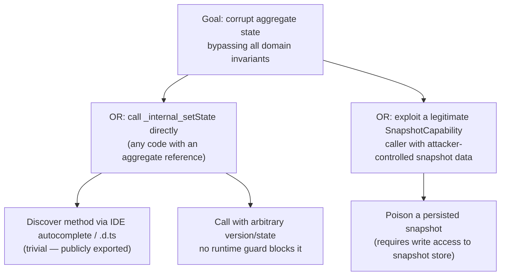

# TM-VF-023 — BaseValueObject always-valid + AggregateRoot atomic apply + internal-state lock

**Status:** APPROVED (2026-07-11) **Date:** 2026-07-11 **Task:**
`project-orchestration/completed-tasks/VF-023-ddd-foundation-guarantees.md`
**Granularity:** Feature TM (adapted for library context — no HTTP endpoints, no
PII, no auth)

## Scoping note (context adaptation)

This threat model applies STRIDE/DREAD to a **pure TypeScript domain-primitives
library** (`@vytches/ddd-value-objects`, `@vytches/ddd-aggregates`), not an
application with HTTP endpoints, authentication, or PII data flows.
Consequently:

- **DFD (Step 3) and LINDDUN (Step 6) are N/A** — there is no network boundary,
  no authentication flow, and no PII processed by these classes. Justification
  recorded per-section below rather than skipped silently.
- The relevant "actor" in STRIDE terms is **consumer application code** (a
  downstream service using this library — e.g. juz-ide-api with 237+
  aggregates), not a remote network attacker. Threats here are about **silent
  integrity guarantees breaking**, which can be triggered by ordinary bugs,
  retries, or corrupted/renamed event streams — not necessarily malicious
  intent. This is consistent with how the source LIB-AUDIT and SEC-AUDIT
  findings (F-C5, F-C6, F-H4, F-H5, F-M2, SA-M7, SA-M9) were originally framed.
- MITRE ATT&CK mapping is skipped as not meaningful for library-internal
  invariant bugs (no adversary technique catalog entry fits "buggy retry
  middleware" or "silent no-op"). Attack tree (Step 4b) is produced for the one
  Critical-severity finding, since that one _does_ have a plausible
  deliberate-misuse angle.

## 1. Scope

**In scope (classes/methods):**

- `BaseValueObject` constructor + `validate()` contract
  (`value-objects/src/base-value-object.ts`)
- `BaseValueObject.equals()` (JSON.stringify-based)
- `AggregateRoot.apply()`, `AggregateRoot.loadFromHistory()`,
  `AggregateRoot._internal_setState()` (`aggregates/src/aggregate-root.ts`)
- `IEventPersistenceHandler` contract + `BaseRepository.save()`
  (`contracts/src/events/...`, `repositories/src/base-repository.ts`)

**Out of scope:** BrandedId, CQRS type-safe register (tracked separately,
VF-025).

**Actors and trust levels:**

| Actor                                                                                                              | Trust Level                                                        | Notes                                                                                     |
| ------------------------------------------------------------------------------------------------------------------ | ------------------------------------------------------------------ | ----------------------------------------------------------------------------------------- |
| Consumer application code (e.g. juz-ide-api)                                                                       | Medium — internal, but not infallible                              | Normal usage; bugs/retries can trigger these paths without malicious intent               |
| Event store / stream producer                                                                                      | Medium — trusted but can be corrupted by schema migration mistakes | Relevant to SA-M7 (renamed/unknown event types in a replayed stream)                      |
| Any code with a reference to an aggregate instance (incl. a compromised transitive dependency in a large monorepo) | Low (should be) / currently High due to F-H4                       | `_internal_setState` being public means trust boundary is not enforced by the type system |

**Assets classification:**

| Classification                                          | Examples                                                                                                                                     |
| ------------------------------------------------------- | -------------------------------------------------------------------------------------------------------------------------------------------- |
| Internal                                                | Aggregate version counters, domain event history, VO internal state                                                                          |
| Confidential (integrity-critical, not secrecy-critical) | None — this is not PII/secrets, but corruption here silently propagates into business data that IS PII/financial downstream in consumer apps |

## 2. DFD — N/A

No network trust boundary exists inside a domain-primitives library. The
relevant "flow" is purely in-process:
`consumer code → BaseValueObject/AggregateRoot method call → in-memory state mutation`.
A DFD would add no information beyond the STRIDE table below.

## 3. STRIDE Analysis

| Category                             | Component                                            | Threat                                     | Attack/Failure Scenario                                                                                                                                                                                                                                                                                                                                                                                                                                     | Mitigation (exists)                                                                        | Gap                                                                                                                                                                                                                           |
| ------------------------------------ | ---------------------------------------------------- | ------------------------------------------ | ----------------------------------------------------------------------------------------------------------------------------------------------------------------------------------------------------------------------------------------------------------------------------------------------------------------------------------------------------------------------------------------------------------------------------------------------------------- | ------------------------------------------------------------------------------------------ | ----------------------------------------------------------------------------------------------------------------------------------------------------------------------------------------------------------------------------- |
| **T** Tampering                      | `BaseValueObject` ctor                               | Invalid VO constructible                   | `validate()` is declared abstract but never invoked by the constructor (F-C5) — any subclass VO can hold semantically invalid data with zero indication.                                                                                                                                                                                                                                                                                                    | None — `validate()` is only called in tests.                                               | Constructor must call `this.validate(value)`; needs throw-vs-`Result<T>` design decision (open question).                                                                                                                     |
| **T** Tampering                      | `BaseValueObject` freeze/equals                      | Illusory immutability                      | Constructor comment claims "Deep freeze" but only shallow-freezes (F-H5) — `vo.getValue().nested.push(x)` mutates in place. `equals()` via `JSON.stringify` is key-order-dependent, loses `undefined`, breaks on `Date`/`Map`/`Set`.                                                                                                                                                                                                                        | Shallow `Object.freeze()` exists.                                                          | Deep freeze OR explicit documented shallow-freeze decision; `equals()` → `LibUtils.deepEqual`.                                                                                                                                |
| **T** Tampering                      | `AggregateRoot.apply()`                              | Partial mutation on throw                  | `_version` increments (line 219) _before_ the `maxEvents` guard (255-262) — a throw leaves the aggregate with a bumped version but no corresponding event/state change (F-C6). On middleware retry, version silently diverges from actual event history, corrupting optimistic-concurrency version tracking (the mechanism ADR-0008 relies on).                                                                                                             | Guard exists, just ordered wrong.                                                          | Reorder: all guards before any mutation of `_version`/`_domainEvents`.                                                                                                                                                        |
| **E** Elevation of Privilege         | `AggregateRoot._internal_setState()`                 | Invariant bypass via public "internal" API | Method is `public`, not capability-gated (F-H4). Any caller — including a bug, a misused test helper promoted to prod code, or a compromised transitive dependency — can do `aggregate._internal_setState({version: 99999, ...})`, silently bypassing every domain invariant. Only `SnapshotCapability` is a legitimate caller today.                                                                                                                       | Naming convention (`_internal_` prefix) only — not enforced by the type system or runtime. | Module-private `Symbol` or `WeakMap`-registry gate so only `SnapshotCapability`/`VersioningCapability` can call it; public surface removes the method entirely.                                                               |
| **R** Repudiation / silent data loss | `AggregateRoot.apply()` + `loadFromHistory()`        | Unknown event silently dropped             | Missing handler for an event name is currently a silent no-op both live (apply, F-M2) and during **replay** (`loadFromHistory`, SA-M7) — the event is persisted/present in the stream but has zero effect on rebuilt state. On a renamed-event-type migration or a corrupted stream, this silently produces a stale/incorrect aggregate with no error, no log, no trace — directly undermining the auditability that event sourcing is supposed to provide. | None — truly silent.                                                                       | Configurable warn (default) / throw (strict) on missing handler, applied identically to both `apply()` and `loadFromHistory()`.                                                                                               |
| **T** Tampering (concurrency)        | `IEventPersistenceHandler` / `BaseRepository.save()` | Lost update under concurrent writes        | Interface doesn't document an atomicity/compare-and-set requirement; `BaseRepository.save()` does a non-atomic check-then-act version check (SA-M9). Two concurrent `save()` calls can both pass the version check and both write — a classic lost-update race, silently defeating "optimistic concurrency" as a guarantee.                                                                                                                                 | Version field exists and is checked — just not atomically.                                 | JSDoc `IEventPersistenceHandler` to explicitly require atomic/CAS semantics on `expectedVersion`; document that a non-CAS-backed handler provides **no actual concurrency guarantee** despite the library's API implying one. |
| S / I / D                            | (all components)                                     | —                                          | Spoofing, Information Disclosure, and Denial-of-Service are **N/A** for this scope: no network identity to spoof, no secret/PII data disclosed by these classes, no resource-exhaustion vector introduced by any of these bugs (they are correctness bugs, not availability bugs).                                                                                                                                                                          | —                                                                                          | —                                                                                                                                                                                                                             |

## 4b. Attack Tree — F-H4 (`_internal_setState`, DREAD 13, Critical)

**Cheapest path:** A1→A2 — trivially cheap, requires only a reference to an
aggregate instance and knowledge that the method exists (which the current
public export makes easy to discover). **Highest-leverage mitigation:** removing
`_internal_setState` from the public surface (capability-gated
`Symbol`/`WeakMap` access) collapses branch A entirely, which is by far the
cheaper and more commonly reachable branch vs. B.

## 5. DREAD Risk Register

| ID            | Component                                          | Threat                                                 | D   | R   | E   | A   | D   | Score  | Priority     | Status |
| ------------- | -------------------------------------------------- | ------------------------------------------------------ | --- | --- | --- | --- | --- | ------ | ------------ | ------ |
| TM-VF-023-001 | `AggregateRoot._internal_setState`                 | Public invariant-bypass method (F-H4)                  | 3   | 3   | 2   | 3   | 2   | **13** | **Critical** | OPEN   |
| TM-VF-023-002 | `AggregateRoot.apply()`+`loadFromHistory()`        | Silent event drop, live + replay (F-M2, SA-M7)         | 3   | 3   | 1   | 2   | 1   | **10** | High         | OPEN   |
| TM-VF-023-003 | `IEventPersistenceHandler`/`BaseRepository.save()` | Non-atomic optimistic concurrency, lost update (SA-M9) | 3   | 2   | 2   | 3   | 1   | **11** | High         | OPEN   |
| TM-VF-023-004 | `AggregateRoot.apply()`                            | Version desync on throw+retry (F-C6)                   | 2   | 3   | 2   | 3   | 1   | **11** | High         | OPEN   |
| TM-VF-023-005 | `BaseValueObject` constructor                      | `validate()` never invoked (F-C5)                      | 2   | 3   | 1   | 3   | 2   | **11** | High         | OPEN   |
| TM-VF-023-006 | `BaseValueObject` freeze/equals                    | Shallow freeze + unreliable `equals()` (F-H5)          | 2   | 3   | 1   | 2   | 2   | **10** | High         | OPEN   |

**1 Critical, 5 High.** Per skill rule, Critical findings require an assigned
task/deadline before this TM can move DRAFT → APPROVED — TM-VF-023-001 is
covered by VF-023 AC5.

## 6. LINDDUN — N/A

No PII flows through `BaseValueObject`/`AggregateRoot` themselves (they are
generic containers — actual PII, if any, lives in consumer-defined VO/aggregate
subclasses, out of this library's control and out of scope for VF-023). No GDPR
obligation is triggered by this task.

## 7. Recommended Mitigations (mapped to VF-023 ACs)

| Finding                     | AC       | Pattern reference                                                                                                          |
| --------------------------- | -------- | -------------------------------------------------------------------------------------------------------------------------- |
| TM-VF-023-001 (F-H4)        | AC5      | `.claude/knowledge/patterns/typescript-library/public-api-pattern.md` (internal-symbol encapsulation)                      |
| TM-VF-023-002 (F-M2, SA-M7) | AC6      | `.claude/knowledge/patterns/cross-layer/domain-errors-pattern.md` (fail loud vs silent swallow)                            |
| TM-VF-023-003 (SA-M9)       | AC9      | Doc-only — no pattern file directly covers CAS contracts; recommend citing ADR-0008                                        |
| TM-VF-023-004 (F-C6)        | AC4      | N/A — ordering fix, no pattern needed                                                                                      |
| TM-VF-023-005 (F-C5)        | AC1      | `.claude/knowledge/patterns/typescript-library/backward-compatibility-pattern.md` (BC impact of newly-enforced validation) |
| TM-VF-023-006 (F-H5)        | AC2, AC3 | N/A — internal implementation swap                                                                                         |

**Next steps:** Review this TM + confirm findings with Tech Lead sign-off.
Status transitions DRAFT → APPROVED after sign-off; VF-023 AC1's
throw-vs-`Result<T>` design decision remains the primary open question, tracked
in the `analysis/VF-023.analysis.md` artifact (not duplicated here).
