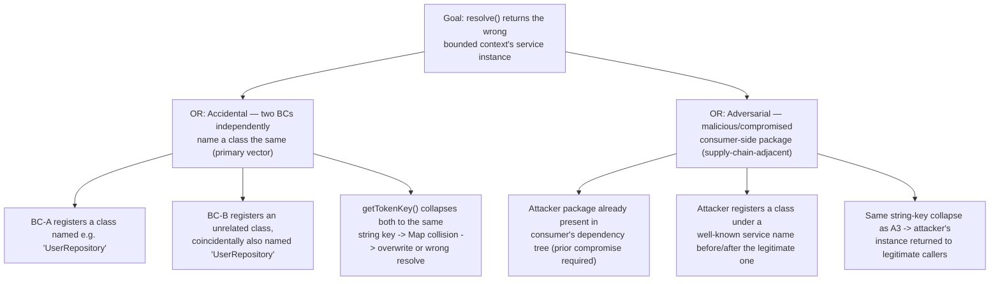

# TM-VF-030 — DI Token Identity in `@vytches/ddd-di` + `@vytches/ddd-nestjs`

**Status:** ACCEPTED (2026-07-11 — VF-030 analysis approved; Q1 verdict: pure
reference identity, mitigation M1 name-fallback REJECTED in favor of
`Symbol.for()` guidance; see
`project-orchestration/analysis/VF-030-di-token-identity.analysis.md`) **Date:**
2026-07-11 **Task:** VF-030 (bug/high) **Granularity:** Bug-class TM (adapted
for library context — no HTTP endpoints, no PII, no auth server)

## Scoping note (context adaptation)

This threat model applies STRIDE/DREAD to a dependency-free TypeScript DI
container (`@vytches/ddd-di`) and its NestJS bridge adapter
(`@vytches/ddd-nestjs`), not to an application with HTTP endpoints or a network
trust boundary. Consequently:

- **DFD (Step 2) is N/A** — the relevant flow is entirely in-process:
  `consumer bounded-context code → container.register()/resolve() → Map<string, ServiceDescriptor> lookup`.
  No network hop exists between "trust levels" here; the boundary that matters
  is **logical isolation between bounded contexts sharing one process/container
  instance**, which the STRIDE table below captures directly.
- The relevant "actor" is **consumer application code across multiple bounded
  contexts (BCs) registered into the same container**, not a remote network
  attacker. The primary threat vector is accidental (two teams independently
  naming a class the same thing); a secondary, lower-likelihood vector is
  adversarial (a malicious or compromised consumer-side package intercepting
  resolution) — see Section 3.
- MITRE ATT&CK mapping is skipped — no adversary-technique catalog entry fits
  "two teams both named a class `UserRepository`". An attack/failure tree is
  produced for the Critical finding (Section 4) since it has both an accidental
  and a plausible deliberate-misuse path.

## 1. Scope

**In scope (classes/methods):**

- `SimpleContainer.getTokenKey()`
  (`packages/di/src/containers/simple-container.ts:355-390`)
- `BaseContainerAdapter.getTokenKey()`
  (`packages/di/src/adapters/base-adapter.ts:76-86`)
- `NestJSContainerAdapter.getTokenKey()`
  (`packages/nestjs/src/adapters/nestjs-container.adapter.ts:33-41`)
- `NestJSContainerAdapter.resolve()` / `register()` / `createInstance()` (same
  file, lines 53-98, 238-254) — included because their defects directly amplify
  the blast radius of a token-identity collision (Section 3, threat T-007).

**Out of scope:**

- `ServiceLocator` silent-overwrite/registration-policy semantics
  (SA-H4/SA-M10/SA-L4 from SEC-AUDIT-2026-07-09) — that is an _overwrite policy_
  question (what happens when the same key is registered twice), orthogonal to
  _key derivation_ (whether two different things end up with the same key in the
  first place), which is this TM's subject.
- CQRS `CommandBus` handler-map keying — already fixed per ADR-0034 and used
  here only as precedent (Section 3, Section 5).

**Actors and trust levels:**

| Actor                                                                           | Trust Level                                                                                              | Notes                                                                                                                                                     |
| ------------------------------------------------------------------------------- | -------------------------------------------------------------------------------------------------------- | --------------------------------------------------------------------------------------------------------------------------------------------------------- |
| Consumer bounded-context A (registers/resolves via a shared container instance) | Medium — internal, but namespace-isolation is expected, not guaranteed by convention alone               | Primary actor; ordinary team naming conventions (`UserRepository`, `Logger`, `CacheService`) trigger collisions without any malicious intent              |
| Consumer bounded-context B (shares the same container instance as A)            | Medium                                                                                                   | Victim of A's collision, or vice versa — symmetric risk                                                                                                   |
| Third-party/consumer-side package with require access to the shared container   | Low (should be) / currently unenforceable, since the container has no token-registration ACL             | Adversarial vector — see T-003; requires a prior supply-chain compromise already present in the consumer app (the library itself remains dependency-free) |
| `@vytches/ddd-nestjs` NestJS module graph (dual ESM/CJS load)                   | Medium — trusted, but module-format duplication is an environment property outside the library's control | Relevant to the residual-risk analysis in Section 7 (dual-package hazard)                                                                                 |

**Assets classification:**

| Classification                                                                 | Examples                                                                                                                                                                                                                                                                                              |
| ------------------------------------------------------------------------------ | ----------------------------------------------------------------------------------------------------------------------------------------------------------------------------------------------------------------------------------------------------------------------------------------------------- |
| Internal                                                                       | Service registrations (`ServiceDescriptor`), singleton/scoped instance caches, DI token→instance mapping                                                                                                                                                                                              |
| Confidential (integrity-critical, not secrecy-critical for the library itself) | None held directly by the container — but any BC-scoped service that is silently cross-wired (e.g., a repository, cache, or credential-holding singleton) can carry consumer-level Confidential/PII data downstream, making this a high-leverage bug class despite the library holding no data itself |

## 2. DFD — N/A

See Scoping note above. No network trust boundary exists inside a DI container
library; the relevant boundary is logical BC isolation within one process, fully
captured by the STRIDE table.

## 3. STRIDE Analysis

| Category                     | Component                                                      | Threat                                                              | Scenario                                                                                                                                                                                                                                                                                                                                                                                                                                                                                                                                                                                                                                                        | Mitigation (exists today)                                                                                                                                                                                                                                                                            | Gap                                                                                                                                                                                                                                                                                 |
| ---------------------------- | -------------------------------------------------------------- | ------------------------------------------------------------------- | --------------------------------------------------------------------------------------------------------------------------------------------------------------------------------------------------------------------------------------------------------------------------------------------------------------------------------------------------------------------------------------------------------------------------------------------------------------------------------------------------------------------------------------------------------------------------------------------------------------------------------------------------------------- | ---------------------------------------------------------------------------------------------------------------------------------------------------------------------------------------------------------------------------------------------------------------------------------------------------- | ----------------------------------------------------------------------------------------------------------------------------------------------------------------------------------------------------------------------------------------------------------------------------------- |
| **S** Spoofing               | `getTokenKey()` (all 3 copies) — named-class branch            | Class impersonation by name                                         | Two bounded contexts each register an unrelated class that happens to share a `name` (e.g. `UserRepository`, `Logger`, `CacheService` — extremely common in DDD codebases with repeated tactical patterns per BC). `getTokenKey()` derives the _same_ string key `fn.name` for both, so the container cannot tell them apart.                                                                                                                                                                                                                                                                                                                                   | `SimpleContainer` has partial anonymous-function handling (WeakMap unique ids) but the named-class path is unprotected. `BaseContainerAdapter`/`NestJSContainerAdapter` have no protection at all.                                                                                                   | Key by object/reference identity (`Map<Function, ...>`), not by `.name` string, for class/Symbol tokens — string name only as a documented BC-compat fallback.                                                                                                                      |
| **S** Spoofing               | `getTokenKey()` — symbol branch                                | `Symbol()` uniqueness contract silently broken                      | Two distinct `Symbol('CacheToken')` objects — which consumers choose specifically _because_ `Symbol()` guarantees per-call uniqueness — both collapse to the same string key via `symbol.toString()` (`"Symbol(CacheToken)"`). This is worse than the class case: it defeats the one JS primitive whose entire purpose is guaranteed identity.                                                                                                                                                                                                                                                                                                                  | None — all 3 copies key symbols by `.toString()`.                                                                                                                                                                                                                                                    | Use the `Symbol` object itself as the Map key (reference/SameValueZero semantics), never a string derived from its description.                                                                                                                                                     |
| **T** Tampering              | `resolve()` (all 3 containers)                                 | Wrong-instance injection                                            | Following a Spoofing collision, `resolve()` returns whatever `ServiceDescriptor` currently occupies the collided string key — i.e., bounded-context B's class gets constructed/injected in place of bounded-context A's, or vice versa, with no exception raised in the silent-overwrite path. Precedent: identical bug class in `CommandBus` (string-name-keyed handler map → cross-context routing → NULL overwrites → production data corruption) per `docs/adr/0034-per-context-cqrs-bus-isolation.md`.                                                                                                                                                     | None at the token-key layer. `SimpleContainer` may throw `ServiceAlreadyRegisteredError` in some registration paths (see T-004/DoS below) — that is a _partial, inconsistent_ safety net, not a fix.                                                                                                 | Same as Spoofing fix (reference-identity keying) — resolves both categories simultaneously since they share the same root cause.                                                                                                                                                    |
| **I** Information Disclosure | `resolve()` / singleton & scoped instance caches               | Cross-context instance/state leakage                                | If the wrongly-shared instance from the Tampering scenario holds in-memory mutable state (a cache, a connection/session object, a repository with request-scoped context), bounded-context B can observe or mutate state that was intended to remain private to bounded-context A. Conditional on the colliding service being stateful — not guaranteed like Tampering, but plausible for common tactical patterns (repositories, caches, unit-of-work implementations).                                                                                                                                                                                        | None.                                                                                                                                                                                                                                                                                                | Same root fix; additionally, document that colliding-name services sharing a singleton lifetime are the highest-risk combination and should be flagged in code review / lint if detectable.                                                                                         |
| **D** Denial of Service      | `register()` (`SimpleContainer` path with duplicate detection) | Registration failure blocks bootstrap                               | When the container _does_ detect the string-key collision, it throws `ServiceAlreadyRegisteredError` at module-registration time, preventing app startup for two BCs that never intended to conflict (their classes are unrelated — only the name matches). This is the comparatively _safer_ failure mode (fail-closed, loud) but is still a false-positive deployment blocker with no way to disambiguate short of renaming a class.                                                                                                                                                                                                                          | Fail-closed behavior exists in at least one of the 3 copies — this is a working safety net for that path, but is applied inconsistently (`BaseContainerAdapter`/`NestJSContainerAdapter` do not perform this check and would instead silently overwrite, falling into the Tampering scenario above). | Reference-identity keying removes the false-positive entirely (unrelated classes no longer collide), while a genuine duplicate registration of the _same_ reference can still fail loudly and correctly.                                                                            |
| **E** Elevation of Privilege | `resolve()` across BCs of differing trust/privilege            | Low-privilege context receives a higher-privilege context's service | Special case of Tampering where the colliding class specifically encapsulates a privileged capability (e.g., a `PaymentAuthorizationService` or `AdminOperationsService` singleton from a high-trust BC is handed to — or invoked on behalf of — a lower-trust BC's caller purely because both classes share a name). The lower-trust caller effectively gains access to a capability it was never granted.                                                                                                                                                                                                                                                     | None beyond whatever the colliding class does internally (out of the DI layer's control).                                                                                                                                                                                                            | Same root fix (reference-identity keying) removes the _unintentional_ path; the library cannot and should not attempt to enforce cross-BC privilege boundaries itself — that remains a consumer-application responsibility, but the DI layer must stop being the accidental bridge. |
| Adversarial variant (S/T/E)  | `register()` on a shared container instance                    | Malicious/compromised consumer-side package intercepts resolution   | The library itself is dependency-free, but **consumer applications are not** — a compromised or malicious transitive dependency with require-access to the shared container instance could deliberately register a class under a well-known service name (e.g., `AuthTokenValidator`, `PaymentGateway`) to intercept or replace legitimate resolutions. This is supply-chain-adjacent: it requires a prior compromise already present in the consumer's dependency tree; the DI layer's weak key derivation is what turns "a compromised package exists somewhere in node_modules" into "that package can silently hijack calls to a named, unrelated service." | Whatever registration-order/overwrite policy the container has (out of scope here, tracked as SA-H4/SA-M10/SA-L4).                                                                                                                                                                                   | Reference-identity keying raises the bar from "guess a common class name" to "forge/obtain the exact class reference," which is materially harder — document this as a partial mitigation, not a complete one; full defense requires the (out-of-scope) overwrite-policy fix too.   |

## 4. Attack/Failure Tree — T-001 (Class-name collision → wrong instance, DREAD 13, Critical)

**Cheapest path:** A1→A2→A3 — zero attacker effort, purely a consequence of
ordinary tactical-pattern naming (`Repository`, `Service`, `Logger` suffixes
repeated across every BC), and the library's own consuming project has 10+
bounded contexts and 237+ aggregates where this class of name reuse is the norm,
not the exception. **Highest-leverage mitigation:** reference- identity keying
(Map keyed by the `Function`/`Symbol` object itself, not a derived string)
collapses branch A entirely and raises branch B's bar from "guess a name" to
"forge/obtain the exact object reference" — a qualitatively harder attack that
also requires the separate, out-of-scope overwrite-policy fix
(SA-H4/SA-M10/SA-L4) to fully close.

## 5. DREAD Risk Register

| ID            | Component                                             | Threat                                                                                                                                                                                                                                                                    | D   | R   | E   | A   | Disc | Score  | Priority     | Status |
| ------------- | ----------------------------------------------------- | ------------------------------------------------------------------------------------------------------------------------------------------------------------------------------------------------------------------------------------------------------------------------- | --- | --- | --- | --- | ---- | ------ | ------------ | ------ |
| TM-VF-030-001 | `getTokenKey()` (all 3 copies)                        | Named-class collision → silent wrong-instance resolution (S+T, accidental)                                                                                                                                                                                                | 3   | 3   | 3   | 3   | 1    | **13** | **Critical** | OPEN   |
| TM-VF-030-002 | `getTokenKey()` — symbol branch                       | `Symbol()` uniqueness contract broken via `.toString()` keying (S)                                                                                                                                                                                                        | 3   | 3   | 2   | 2   | 1    | **11** | High         | OPEN   |
| TM-VF-030-003 | `register()` on shared container                      | Adversarial: malicious/compromised package intercepts resolution via name collision (S+T+E, supply-chain-adjacent)                                                                                                                                                        | 3   | 2   | 1   | 2   | 1    | **9**  | Medium       | OPEN   |
| TM-VF-030-004 | `register()` (inconsistent duplicate-check path)      | False-positive `ServiceAlreadyRegisteredError` blocks bootstrap for unrelated same-named classes (D)                                                                                                                                                                      | 1   | 3   | 2   | 2   | 3    | **11** | High         | OPEN   |
| TM-VF-030-005 | `resolve()` across differing-trust BCs                | Elevation via collision with a privileged-capability class (E)                                                                                                                                                                                                            | 3   | 2   | 2   | 2   | 1    | **10** | High         | OPEN   |
| TM-VF-030-006 | Singleton/scoped instance cache                       | Cross-context stateful instance leakage (I)                                                                                                                                                                                                                               | 2   | 2   | 2   | 2   | 1    | **9**  | Medium       | OPEN   |
| TM-VF-030-007 | `NestJSContainerAdapter.resolve()`/`createInstance()` | Compounding defects amplify token-identity failures: `Scoped` silently treated as `Transient`; raw `new Error()` instead of `DIError` hierarchy; silent `new paramType()` zero-arg fallback on failed dependency resolution masks (or worsens) a collision-caused failure | 2   | 3   | 2   | 2   | 1    | **10** | High         | OPEN   |

Scale: each axis 1 (Low) – 3 (High); Score = D+R+E+A+Disc, thresholds 13–15
Critical / 10–12 High / 7–9 Medium / <7 Low.

**1 Critical, 4 High, 2 Medium.** Per project convention, the Critical finding
(TM-VF-030-001) requires an assigned task/AC with a deadline before this TM can
move DRAFT → APPROVED.

## 6. LINDDUN — mostly N/A, Linkability noted

The DI container itself holds no PII — it is a generic token→instance map.
LINDDUN categories (Linkability, Identifiability, Non-repudiation,
Detectability, Disclosure of information, Unawareness, Non-compliance) are
**N/A** for the container's own data model.

One exception: **Linkability**, inherited via TM-VF-030-006 (Information
Disclosure). If a consumer's colliding, cross-context-leaked singleton happens
to hold user-identifying data (e.g., a repository whose singleton internally
caches user records, session tokens, or request-scoped identity context), a
resolution collision could link data that two bounded contexts intentionally
kept apart for data-minimization/purpose-limitation reasons. This is entirely
conditional on consumer-defined service internals — the library has no
visibility into what a registered class stores — but the mitigation for
TM-VF-030-001 (reference-identity keying) removes the DI layer's contribution to
this risk as a side effect, since the instance leak that enables it can no
longer occur via name collision.

## 7. Residual Risks of the Planned Fix (reference-identity keying)

Switching the primary key from `fn.name`/`.toString()` string derivation to
object-reference identity (`Map<Function | symbol, ServiceDescriptor>`) fixes
T-001/T-002/T-004/T-005 at the root, but introduces its own residual risks that
the implementation MUST account for:

1. **Dual ESM/CJS module-graph split.** If the same package is loaded twice
   (once as ESM, once as CJS — e.g., mixed Vitest/Node environments, or two
   consumer packages each importing a differently-bundled copy of a shared
   domain-primitives package), the "same" class produces two _distinct_
   constructor function references. Reference-identity keying would then treat
   them as different tokens, reintroducing a _different_ failure mode: a
   false-negative `ServiceNotFoundError` for a class that IS registered, just
   under the "other" reference. This is exactly **Bug #3** from
   `docs/adr/0034-per-context-cqrs-bus-isolation.md`, already solved there via
   `Symbol.for('vytches:cqrs:command-bus')` global-registry tokens instead of
   raw class references for framework-level CQRS bus tokens. **The fix for T-001
   must not regress this already-fixed bug class** — library-internal/well-known
   DI tokens should continue using the `Symbol.for()` pattern; only
   consumer-defined class tokens should move to reference-identity keying, with
   a string-name fallback preserved for backward compatibility (mirroring the
   precedent already shipped in
   `packages/cqrs/src/implementations/command-bus.ts:119-121`: "Function ref
   first (no cross-context collision), string fallback for BC").
2. **Serialization / cross-realm boundaries.** A class-reference `ServiceToken`
   is not serialization-safe: if ever cloned across a `worker_threads`/`vm`
   boundary, or reconstructed by a plugin/hot-reload system, reference identity
   is lost on the far side and resolution will silently fail-closed (NotFound)
   rather than fail-open (wrong instance) — a safer but still surprising failure
   mode that should be documented, not silently absorbed.
3. **Public API / backward-compatibility impact.** `getServices()` /
   `ServiceDescriptor.token` currently exposes a `string`. Reference-identity
   keying as the _internal_ Map key must not change this externally-visible
   shape — the descriptor should retain a string representation for
   introspection while using the reference as the actual lookup key, otherwise
   this becomes an unplanned breaking change to public API surface (see
   `backward-compatibility-pattern.md` / `public-api-pattern.md`).
4. **Adversarial threat (T-003) is only partially mitigated**, not closed.
   Reference-identity keying raises the bar from "guess a common class name" to
   "obtain/forge the exact object reference," which is substantially harder but
   not theoretically impossible if the attacker's package can
   `require()`/`import` the exact same module instance. Full closure requires
   the separate, out-of-scope overwrite-policy fix (SA-H4/SA-M10/SA-L4) — this
   TM does not claim T-003 is fully resolved by VF-030 alone.
5. **Consolidation debt.** The bug exists as 3 divergent copies today
   (`SimpleContainer`, `BaseContainerAdapter`, `NestJSContainerAdapter`). Fixing
   only one and leaving the others is not an acceptable partial fix — all three
   currently-independent `getTokenKey()` implementations should converge on one
   shared implementation to prevent this exact bug class from silently
   re-diverging in a future edit to only one of the three.

## 8. Recommended Mitigations (MUST be part of the VF-030 fix)

| #   | Requirement                                                                                                                                                                                                                                                                                                                                                                                                                                                   | Threats closed                   | Pattern / precedent reference                                                                              |
| --- | ------------------------------------------------------------------------------------------------------------------------------------------------------------------------------------------------------------------------------------------------------------------------------------------------------------------------------------------------------------------------------------------------------------------------------------------------------------- | -------------------------------- | ---------------------------------------------------------------------------------------------------------- |
| M1  | Key class/function tokens by object reference (`Map<Function, ServiceDescriptor>`), not by `fn.name`; string-name fallback only for documented BC-compat, never as the primary path. Consolidate all 3 divergent `getTokenKey()` copies into one shared implementation.                                                                                                                                                                                       | T-001, T-004, T-005              | `packages/cqrs/src/implementations/command-bus.ts:119-121` (already-shipped precedent)                     |
| M2  | Key `Symbol` tokens by the Symbol object itself (reference/SameValueZero), never by `symbol.toString()`.                                                                                                                                                                                                                                                                                                                                                      | T-002                            | —                                                                                                          |
| M3  | Preserve/extend the `Symbol.for('vytches:...')` global-registry pattern for library-internal, well-known DI tokens exported across package/module-format boundaries — do not let class-reference keying regress the dual ESM/CJS fix already shipped for CQRS bus tokens.                                                                                                                                                                                     | Residual risk #1 (Section 7)     | ADR-0034 "Bug #3 Fix — Symbol.for DI Tokens (VP-009)"                                                      |
| M4  | Keep `getServices()`/`ServiceDescriptor.token` returning a `string` for introspection even though the internal lookup key becomes a reference — no breaking change to public API shape.                                                                                                                                                                                                                                                                       | Residual risk #3 (Section 7)     | `.claude/knowledge/patterns/typescript-library/backward-compatibility-pattern.md`, `public-api-pattern.md` |
| M5  | Fail loudly (`ServiceAlreadyRegisteredError` or equivalent `DIError` subtype) only for a genuine re-registration of the _same_ reference; a collision that is purely a string-fallback artifact must not throw once reference-identity is primary.                                                                                                                                                                                                            | T-004                            | —                                                                                                          |
| M6  | In the same PR (same file, low incremental cost, directly amplifies T-001/T-005's blast radius): fix `NestJSContainerAdapter` to (a) honor `ServiceLifetime.Scoped` instead of silently treating it as Transient, (b) throw from the `DIError` hierarchy instead of raw `new Error()`, (c) remove the silent `new paramType()` zero-arg fallback in `createInstance()` — propagate the resolution failure instead of manufacturing an uninitialized instance. | T-007                            | —                                                                                                          |
| M7  | Document (JSDoc + README) that `ServiceToken` reference identity is a same-process, same-module-graph guarantee only — not safe across serialization, worker/process boundaries, or duplicated module instances outside the `Symbol.for()` pattern.                                                                                                                                                                                                           | Residual risk #2, #4 (Section 7) | —                                                                                                          |

**Next steps:** Review this TM + confirm findings with Tech Lead sign-off.
Status transitions DRAFT → APPROVED after sign-off; TM-VF-030-001 (Critical)
requires an assigned VF-030 acceptance criterion + deadline before approval, per
project convention (cf. TM-VF-023).
