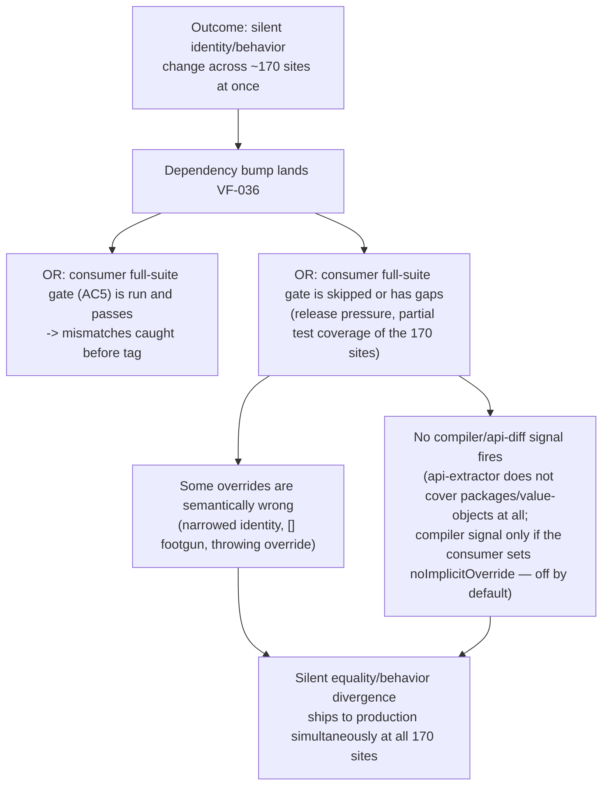

# TM-VF-036 — `BaseValueObject.getEqualityComponents()` (docs-phantom API made real)

**Status:** DRAFT **Date:** 2026-08-09 **Task:**
`project-orchestration/tasks/VF-036-value-object-equality-components.md`
**Granularity:** Feature TM (adapted for library context — no HTTP endpoints, no
PII, no auth)

## Scoping note (context adaptation)

Same adaptation as TM-VF-023 (`docs/security/threat-models/TM-VF-023.md`),
applied here without re-deriving it:

- **DFD (Step 2) is N/A.** No network trust boundary exists inside a
  domain-primitives library. The only "flow" is in-process:
  `consumer VO subclass override → BaseValueObject.equals() → LibUtils.deepEqual`.
  A DFD adds no information beyond the STRIDE table below.
- The "actor" is **consumer application code** (a downstream service with ~237
  aggregates / ~170 `getEqualityComponents()` override sites), not a remote
  network attacker. Threats here are about **silent integrity guarantees
  breaking** — specifically equality/identity semantics — under ordinary bugs or
  an ordinary version upgrade, not malicious intent.
- **MITRE ATT&CK mapping is skipped** — no adversary technique catalog entry
  fits "a value-object equality override was already buggy for years and nobody
  knew because it was dead code." Attack tree (Step 4b) is produced for the one
  Critical finding, per the same rule TM-VF-023 used.
- **LINDDUN (Step 6) is N/A** — see §6.

**Relationship to TM-VF-023:** TM-VF-023 already covered
`BaseValueObject.equals()` under finding **TM-VF-023-006** (shallow-freeze +
unreliable `equals()`, resolved via `LibUtils.deepEqual`, DREAD 10/High). That
finding is about `equals()` comparing the _raw value_ correctly. VF-036 does
**not** revisit that ground. It is entirely new surface: `equals()` gains a
second, consumer-authored comparison path (`getEqualityComponents()`) that sits
_in front of_ the raw-value comparison and that the library can neither see the
contents of nor validate. Everything below is specific to that new path. One
item (§3, Finding 006) is an inherited limitation of `LibUtils.deepEqual`'s
`Set` handling that now also applies to component arrays — it is flagged as a
minor extension of TM-VF-023-006, not a new root cause.

## 1. Scope

**In scope:**

- `BaseValueObject.getEqualityComponents()` — new protected hook, default
  `undefined` (`packages/value-objects/src/base-value-object.ts:7-124`, per the
  VF-036 design: `equals()` gains a components-first branch ahead of the current
  raw-value logic at lines 58-73).
- The interaction between that hook and `LibUtils.deepEqual`
  (`packages/utils/src/lib-utils.ts:259-332`), reused for element-wise
  comparison per the task design.
- The activation of ~170 pre-existing, previously-dead-code consumer overrides
  of this method name (per task doc: never invoked in any released version,
  `d1c13027`→`0ad22d88`→`90d393a8` history).

**Out of scope:** `AggregateRoot`/entity identity comparison (explicit non-goal
in the task); the raw-value `equals()` path itself (TM-VF-023-006 territory).

**Actors and trust levels:**

| Actor                                                                                     | Trust Level                                                                                              | Notes                                                                                                                                        |
| ----------------------------------------------------------------------------------------- | -------------------------------------------------------------------------------------------------------- | -------------------------------------------------------------------------------------------------------------------------------------------- |
| Consumer application code authoring VO subclasses                                         | Medium — internal, but the override body is opaque to the library                                        | The library cannot see, constrain, or validate what a subclass puts into the returned array                                                  |
| The ~170 pre-existing override sites specifically                                         | Medium — written years ago against a phantom API, unreviewed against real semantics since they never ran | Correctness unknown until first real execution post-upgrade (this is the crux of the risk)                                                   |
| Downstream code that calls `.equals()` (dedupe, `.some()`, caches, Sets/Maps keyed by VO) | Low visibility into which VOs use partial-identity comparison                                            | Consumers of `equals()` typically assume it is total-identity and side-effect-free; VF-036 breaks both assumptions for overriding subclasses |

**Assets classification:** Same as TM-VF-023 — Internal (VO instances, no
secrecy) / Confidential-for-integrity-not-secrecy (equality decisions can
silently propagate into consumer-side authorization, caching, or deduplication
logic that IS security- or correctness-relevant downstream, even though this
library holds no PII/secrets itself).

## 2. DFD — N/A

See scoping note above; identical justification to TM-VF-023 §2.

## 3. STRIDE Analysis

| Category                                                            | Component                                                                       | Threat                                                                                                                                                                                  | Attack/Failure Scenario                                                                                                                                                                                                                                                                                                                                                                                                                                                                                                                                                                                                                                                                                                                                                                                                                                                                                                                                                                                                                      | Mitigation (exists)                                                                                                                                                                                                                | Gap                                                                                                                                                                                                                                                                                                                                                                                            |
| ------------------------------------------------------------------- | ------------------------------------------------------------------------------- | --------------------------------------------------------------------------------------------------------------------------------------------------------------------------------------- | -------------------------------------------------------------------------------------------------------------------------------------------------------------------------------------------------------------------------------------------------------------------------------------------------------------------------------------------------------------------------------------------------------------------------------------------------------------------------------------------------------------------------------------------------------------------------------------------------------------------------------------------------------------------------------------------------------------------------------------------------------------------------------------------------------------------------------------------------------------------------------------------------------------------------------------------------------------------------------------------------------------------------------------------- | ---------------------------------------------------------------------------------------------------------------------------------------------------------------------------------------------------------------------------------- | ---------------------------------------------------------------------------------------------------------------------------------------------------------------------------------------------------------------------------------------------------------------------------------------------------------------------------------------------------------------------------------------------- |
| **T** Tampering (identity/authorization scope collapse)             | `getEqualityComponents()` override body (consumer code)                         | Two semantically **different** values compare equal                                                                                                                                     | A consumer override excludes a discriminating field (e.g. tenant id, permission scope, role, resource key, idempotency/cache key). If that field is security-relevant downstream, `equals()` now silently reports two distinct-scope values as identical, widening an authorization check or a cache/idempotency lookup that relies on VO equality. The library cannot see or constrain what a consumer puts in `getEqualityComponents()` — it can only execute whatever array is returned.                                                                                                                                                                                                                                                                                                                                                                                                                                                                                                                                                  | None — this is inherent to the design (partial-identity equality is the _feature_, not a bug); mitigation is entirely on the JSDoc/documentation side.                                                                             | JSDoc must explicitly warn against putting security-relevant fields in _excluded_ territory without excluding them from components deliberately; no runtime guard is possible without knowing consumer semantics (UNVERIFIED whether any of the ~170 override sites actually encode a security-relevant field this way — out-of-repo, cannot confirm from this codebase).                      |
| **T/R** Tampering + silent behavior change (mass activation)        | `BaseValueObject.equals()`, all ~170 pre-existing override sites simultaneously | Dormant code activates fleet-wide on a single upgrade; whether a compiler signal fires depends on a consumer-side flag the library cannot control (see the 2026-08-09 correction in §5) | `getEqualityComponents()` overrides were written against a phantom README API and have **never executed** in any released version (confirmed: zero occurrences of the symbol in this repo's source as of this TM). VF-036 does not change any public signature — it adds a new `protected` member with a default that is behavior-preserving for non-overriding subclasses. `api-extractor`/`validate:api` diffing typically flags _removed or changed_ public signatures, not _newly meaningful_ protected members with an already-compatible-looking name (UNVERIFIED — not confirmed against this project's actual `validate:api` config whether it would flag this at all). Every one of the ~170 sites goes live simultaneously the moment the dependency is bumped, with no per-site opt-in and no staged rollout.                                                                                                                                                                                                                     | Task AC5 already mandates a consumer full-suite sign-off gate before any npm tag — this is the correct control, but it is a _process_ mitigation, not a code-level one; a mis-run or skipped gate ships all 170 activations blind. | CHANGELOG `BREAKING CHANGE:` entry + grep hint (AC4) is necessary but not sufficient on its own — it informs, it does not verify. AC5 (consumer sign-off) is the load-bearing control and must not be skipped under release-pressure.                                                                                                                                                          |
| **T** Tampering (broken symmetry)                                   | `equals()` components-first branch, asymmetric override case                    | `a.equals(b) !== b.equals(a)`                                                                                                                                                           | Per the documented design, the components path only engages if **both** sides return a defined array; if only one side overrides, the pair falls back to raw-value comparison. This is internally consistent for `a.equals(b)` vs `b.equals(a)` on _that specific pair_ (both fall back identically) — but breaks down across a _mixed population_ of VO instances/subclasses: a subtype hierarchy or a partial migration where some instances have the override and some don't produces a set of pairs where some compare via components and others via raw value, with no way for calling code (`list.some(x => x.equals(y))`) to know which comparison semantics applied to which pair. The net effect is equality that is not consistently defined across the whole collection, even though each individual pair is well-defined.                                                                                                                                                                                                        | Documented as an explicit fallback rule in the design (task item "Asymmetric case ... document this explicitly").                                                                                                                  | JSDoc must state this collection-level caveat plainly, not just the pairwise fallback rule, since AC3 currently only requires documenting "the asymmetric-fallback rule" pairwise.                                                                                                                                                                                                             |
| **T** Tampering (universal-equality footgun)                        | `getEqualityComponents()` returning `[]`                                        | Every instance of a VO subclass compares equal to every other instance of that subclass                                                                                                 | An override that returns an empty array — a plausible copy-paste or "not-yet-implemented" placeholder among 170 sites — makes `equals()` component-wise-compare zero elements, which is vacuously true for every pair. This collapses the VO's entire identity.                                                                                                                                                                                                                                                                                                                                                                                                                                                                                                                                                                                                                                                                                                                                                                              | Same-length + element-wise check as designed will pass trivially for length-0 arrays on both sides; no library-side guard against this exists or is proposed.                                                                      | Recommend JSDoc explicitly flag `[]` as almost always a bug (distinct from `undefined`, which is the documented "opt out" signal) and recommend AC2's test corpus include an explicit `[]` case with an assertion on the documented behavior (not just "some tests"), so this is a conscious, tested design choice rather than an accidental one.                                              |
| **D** Denial of Service (new — was N/A in TM-VF-023 for this class) | `getEqualityComponents()` invoked from inside `equals()`                        | A previously-total, side-effect-free predicate can now throw or become expensive                                                                                                        | `equals()` currently cannot throw (it is a pure comparison over already-constructed, already-frozen values). Once it calls consumer code, it inherits whatever that code does: (a) it can throw, turning every caller of `.equals()` — including code that assumed a boolean-returning, non-throwing method, e.g. `Array.prototype.some`/`.filter`/dedupe loops — into a caller that must now handle exceptions from a method that never used to raise them; (b) the override can allocate/compute an O(n) array on every single `.equals()` call, and `.equals()` is frequently invoked inside hot loops (`.some()` over a list) — CPU cost scales with `(list size) × (component construction cost)` per comparison, which is a plausible amplification vector under ordinary (non-malicious) large-collection usage. This is UNVERIFIED against this repo specifically (no evidence any of the ~170 sites do this today), but the _capability_ is a direct, structural consequence of the VF-036 design as specified, not a hypothetical. | The base `value` is deep-frozen (VF-023 D-3), but the array returned by `getEqualityComponents()` is consumer-constructed on each call and is not frozen or otherwise guarded by the library.                                      | JSDoc must document throw-propagation explicitly ("if your override can throw, `equals()` can now throw — previously it could not") and should recommend overrides be side-effect-free, allocation-light, pure functions of already-available fields. No runtime try/catch swallow is recommended (would silently convert a real bug into `false`, violating "never swallow errors silently"). |
| **S / I** Spoofing / Information Disclosure                         | (all components)                                                                | —                                                                                                                                                                                       | **N/A** — no network identity to spoof, no secret/PII data disclosed by any of the above; the leakage is at most cross-field identity information already present in the VO's own already-frozen value, visible to whatever code already holds a reference to the VO. Consistent with TM-VF-023's S/I framing.                                                                                                                                                                                                                                                                                                                                                                                                                                                                                                                                                                                                                                                                                                                               | —                                                                                                                                                                                                                                  | —                                                                                                                                                                                                                                                                                                                                                                                              |

## 4b. Attack/Failure Tree — Finding 002 (mass activation, DREAD 11, High — was 13/Critical before the 2026-08-09 correction in §5)

**Cheapest path:** C→C1/C2→D — this requires no attacker action at all, only an
ordinary dependency upgrade combined with the sign-off gate (AC5) being skipped,
rushed, or incomplete. **Highest-leverage mitigation:** AC5 itself (consumer
full-suite sign-off recorded _before_ any npm tag) — collapsing branch C to
branch B is the only mitigation that scales to all 170 sites at once, since no
code-level fix can validate consumer-authored semantics. **Correction
2026-08-09:** this holds only for rollout option (A). Under option (C) —
shipping the hook under a new name — branch A never leads to activation at all,
so the whole tree collapses at the root without relying on any process gate. See
§5.

## 5. DREAD Risk Register

| ID            | Component                                                        | Threat                                                                                                                                             | D   | R   | E   | A   | D   | Score  | Priority | Status                |
| ------------- | ---------------------------------------------------------------- | -------------------------------------------------------------------------------------------------------------------------------------------------- | --- | --- | --- | --- | --- | ------ | -------- | --------------------- |
| TM-VF-036-001 | `getEqualityComponents()` override body                          | Identity narrowing → equality false-positive on security-relevant field                                                                            | 3   | 3   | 2   | 2   | 1   | **11** | High     | OPEN                  |
| TM-VF-036-002 | `equals()` + all pre-existing override sites                     | Dormant-code mass activation on upgrade; compiler signal depends on a consumer-side flag we do not control (CORRECTED 2026-08-09, was 13/Critical) | 3   | 2   | 1   | 3   | 2   | **11** | High     | OPEN                  |
| TM-VF-036-003 | `equals()` components-first branch, mixed population             | Broken symmetry across a collection (asymmetric fallback)                                                                                          | 2   | 3   | 1   | 2   | 1   | **9**  | Medium   | OPEN                  |
| TM-VF-036-004 | `getEqualityComponents()` returning `[]`                         | Universal-equality footgun (vacuous same-length-zero match)                                                                                        | 2   | 3   | 1   | 1   | 2   | **9**  | Medium   | OPEN                  |
| TM-VF-036-005 | `getEqualityComponents()` invoked inside `equals()`              | Previously-total predicate can now throw / CPU amplification in hot loops                                                                          | 2   | 3   | 1   | 2   | 1   | **9**  | Medium   | OPEN                  |
| TM-VF-036-006 | `LibUtils.deepEqual` `Set` handling, applied to component arrays | Reference-equality-for-object-members limitation inherited from TM-VF-023-006                                                                      | 1   | 3   | 1   | 1   | 1   | **7**  | Low      | OPEN — cross-ref only |

**2 High, 3 Medium, 1 Low** (after the 2026-08-09 correction below; the register
previously read 1 Critical, 1 High).

**Correction 2026-08-09 — TM-VF-036-002 downgraded 13/Critical → 11/High.** The
finding was written on the assumption that mass activation carries _no_ compiler
signal. Direct measurement of the known downstream consumer (recorded as Q2 in
`project-orchestration/analysis/VF-036-value-object-equality-components.analysis.md`)
disproves that for them: they compile with `noImplicitOverride: true` and
`strict: true`, their 179 override declarations are uniformly plain `protected`
methods with array return types, and 171 of them lack the `override` keyword.
Under rollout option (A) — a concrete base member reusing the name — those 171
sites therefore fail loudly with TS4114 rather than activating silently; under
option (C) — a new hook name — nothing of theirs activates at all.
Discoverability stays high (3) but Reproducibility drops 3 → 2 and the
Damage-in-practice sub-score 3 → 2, because the silent-activation scenario now
requires a _different_, unquantified consumer: one who built on the phantom
README between 2025-07-16 and 2026-05-23 AND does not enable
`noImplicitOverride` (off by default in TypeScript). Plausible, but no longer
the expected case. Note the library cannot influence this — a consumer's
tsconfig is not inherited from a dependency — so the residual risk is real but
not addressable by any code-level control on our side.

Per the same rule TM-VF-023 applied, the register no longer contains a Critical
finding, so the DRAFT → APPROVED transition is not blocked on assigning a new
task. The mitigation for TM-VF-036-002 remains VF-036 AC5 (consumer full-suite
sign-off recorded before any npm tag), treated as load-bearing and
non-skippable. If rollout option (C) is chosen, this finding is additionally
mitigated **by construction** rather than by process, since no dormant override
activates on upgrade for any consumer.

## 6. LINDDUN — N/A

No PII flows through `BaseValueObject` or `getEqualityComponents()` itself —
both are generic containers; any PII possibly present in consumer-defined VO
field values (out of this library's control) is unaffected by _how_ the library
compares those values for equality. No GDPR obligation is triggered by VF-036.
Identical justification to TM-VF-023 §6.

## 7. Recommended Mitigations (mapped to VF-036 ACs)

| Finding                  | AC(s)              | Mitigation shape                                                                                                                                                                                                                                                      |
| ------------------------ | ------------------ | --------------------------------------------------------------------------------------------------------------------------------------------------------------------------------------------------------------------------------------------------------------------- |
| TM-VF-036-001            | AC3                | JSDoc must explicitly warn: do not exclude security/authorization/cache-key-relevant fields from `getEqualityComponents()` unless that is a deliberate identity decision; give a worked example.                                                                      |
| TM-VF-036-002 (Critical) | AC4, AC5           | CHANGELOG `BREAKING CHANGE:` entry + grep hint (AC4) as an _informational_ control; VF-036 AC5's consumer full-suite sign-off, recorded in this task file before any npm tag, as the _load-bearing_ control. Do not tag without AC5 evidence recorded.                |
| TM-VF-036-003            | AC2, AC3           | AC2's asymmetric-override test must additionally assert collection-level behavior (e.g. a `.some()`-style scan over a mixed-override list), not just a single pairwise fallback case; AC3's JSDoc must state the collection-level caveat, not only the pairwise rule. |
| TM-VF-036-004            | AC2, AC3           | AC2's test corpus must include an explicit `[]`-returning override case with an asserted, documented outcome; AC3's JSDoc must call out `[]` as a near-always-a-bug pattern, distinct from `undefined`.                                                               |
| TM-VF-036-005            | AC3                | JSDoc must document throw-propagation explicitly (equals() can now throw) and recommend pure, allocation-light overrides; no library-side try/catch swallow (would violate fail-loud principle).                                                                      |
| TM-VF-036-006            | — (cross-ref only) | No new AC needed — already covered by TM-VF-023-006's disposition of `LibUtils.deepEqual`; noted here only so a future reviewer does not mistake it for a new root cause introduced by VF-036.                                                                        |

**UNVERIFIED items in this TM** (flagged rather than assumed): (a) whether
`api-extractor`/`validate:api` in this repo would flag a new `protected` member
at all; (b) whether any of the ~170 actual consumer override sites encode a
security-relevant field (tenant/permission/cache-key) in a way that
TM-VF-036-001 would fire on in practice; (c) whether any existing override
bodies throw or are non-trivially expensive (TM-VF-036-005). All three are
out-of-repo / consumer-internal facts not derivable from this codebase and
should be confirmed as part of the VF-036 AC5 consumer sign-off process.

**Next steps:** Review this TM + confirm findings with Tech Lead sign-off.
Status transitions DRAFT → APPROVED after sign-off; TM-VF-036-002 (Critical)
must have AC5 evidence recorded in the task file before this TM's status
changes, per the same rule applied to TM-VF-023-001.
