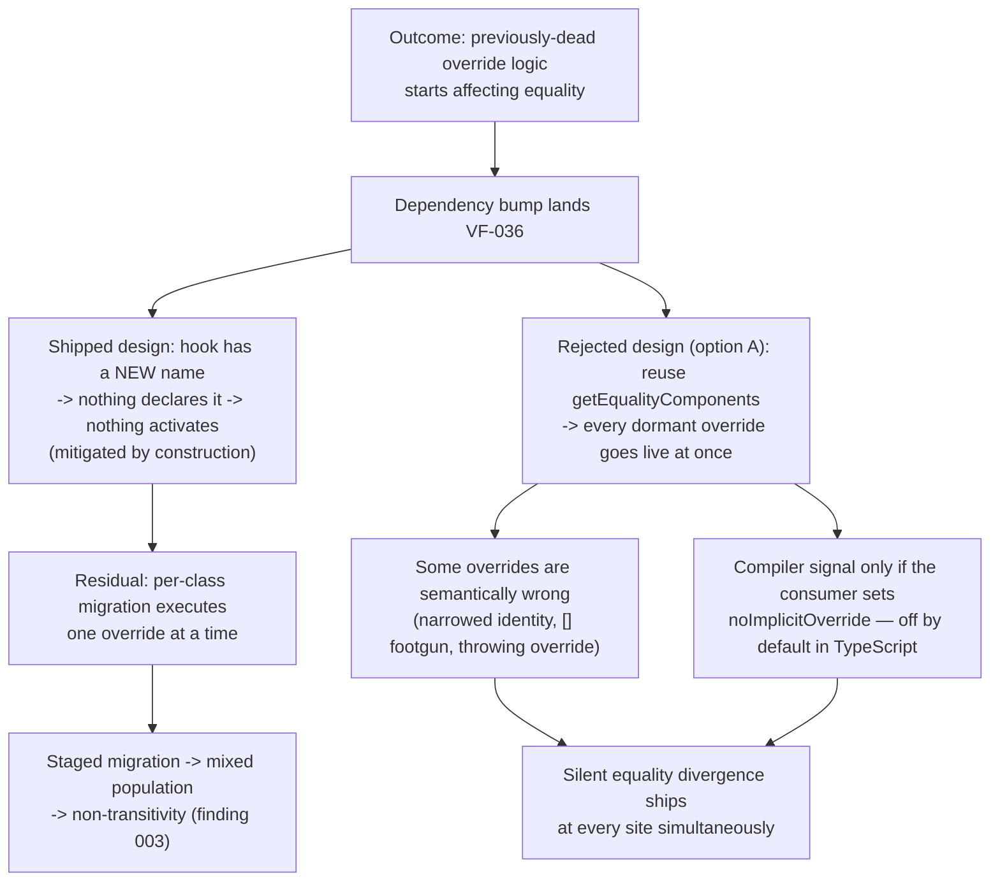

# TM-VF-036 — `BaseValueObject.getIdentityComponents()` (partial-identity equality hook)

**Status:** APPROVED **Date:** 2026-08-09 (rewritten 2026-08-09 after the
rollout decision) **Task:**
`project-orchestration/tasks/VF-036-value-object-equality-components.md`
**Granularity:** Feature TM (adapted for library context — no HTTP endpoints, no
PII, no auth)

> **Rewrite notice.** The first draft of this TM modelled a hook named
> `getEqualityComponents()` shipped by reusing a name that ~179 downstream
> subclasses already declare as dead code. That rollout was rejected (analysis
> Q1, option C). The shipped design uses a **new** name,
> `getIdentityComponents()`, which nothing declares — so the entire "mass
> activation on upgrade" threat class is removed **by construction**, not by
> process. Finding IDs 001–006 are preserved because they are cited elsewhere;
> 002 is restated to match the design that actually shipped.

## Scoping note (context adaptation)

Same adaptation as TM-VF-023 (`docs/security/threat-models/TM-VF-023.md`),
applied here without re-deriving it:

- **DFD (Step 2) is N/A.** No network trust boundary exists inside a
  domain-primitives library. The only "flow" is in-process:
  `consumer VO subclass override → BaseValueObject.equals() → componentEquals → LibUtils.deepEqual`.
- The "actor" is **consumer application code**, not a remote network attacker.
  Threats here are about **integrity guarantees breaking silently** —
  specifically equality/identity semantics — under ordinary bugs, not malicious
  intent.
- **MITRE ATT&CK mapping is skipped** — no adversary technique catalog entry
  fits "a value-object equality override silently widened identity".
- **LINDDUN (Step 6) is N/A** — see §6.

**Relationship to TM-VF-023:** TM-VF-023 covered `BaseValueObject.equals()`
under finding **TM-VF-023-006** (shallow-freeze + unreliable `equals()`,
resolved via `LibUtils.deepEqual`, DREAD 10/High). That finding is about
`equals()` comparing the _raw value_ correctly. VF-036 does not revisit it: the
raw path is unchanged bit-for-bit and is only reached when the new hook is not
overridden on both sides. VF-036's surface is the **second**, consumer-authored
comparison path placed ahead of it, whose contents the library can neither see
nor validate. Finding 006 below is an inherited `LibUtils.deepEqual` `Set`
limitation that now also applies to component arrays — a minor extension of
TM-VF-023-006, not a new root cause.

## 1. Scope

**In scope:**

- `BaseValueObject.getIdentityComponents()` — new `protected` hook returning
  `readonly unknown[] | undefined`, default `undefined`
  (`packages/value-objects/src/base-value-object.ts:198`).
- The components branch inside `equals()` (`:244`), which engages only when
  **both** sides return a defined array.
- `componentEquals` (`:33`) and its dispatch to a nested value object's own
  `equals()` via the `Symbol.for('@vytches/ddd.valueObject')` brand, falling
  through to `LibUtils.deepEqual` (`packages/utils/src/lib-utils.ts:259-332`).

**Out of scope:** `AggregateRoot`/entity identity comparison (explicit non-goal;
`EntityId` does not extend `BaseValueObject`); the raw-value `equals()` path
itself (TM-VF-023-006 territory, and unchanged by this task).

**Explicitly NOT in scope, because the design removed it:** activation of
pre-existing consumer `getEqualityComponents` overrides. That symbol is never
implemented and no shim delegates to it, so those overrides stay dead code after
upgrade exactly as they were before it.

**Actors and trust levels:**

| Actor                                                                                  | Trust Level                                                                       | Notes                                                                                                                                            |
| -------------------------------------------------------------------------------------- | --------------------------------------------------------------------------------- | ------------------------------------------------------------------------------------------------------------------------------------------------ |
| Consumer application code authoring VO subclasses                                      | Medium — internal, but the override body is opaque to the library                 | The library cannot see, constrain or validate what a subclass puts into the returned array                                                       |
| Consumers migrating dead `getEqualityComponents` overrides to the new name             | Medium — code written years ago against a phantom API, never executed, unreviewed | Correctness is unknown until first real execution, which now happens per-class at migration time rather than fleet-wide on upgrade               |
| Downstream code calling `.equals()` (dedupe, `.some()`, caches, Sets/Maps keyed by VO) | Low visibility into which VOs use partial-identity comparison                     | Such callers typically assume `equals()` is total-identity, side-effect-free and non-throwing; VF-036 breaks all three for overriding subclasses |

**Assets classification:** Same as TM-VF-023 — Internal (VO instances, no
secrecy) / Confidential-for-integrity-not-secrecy: equality decisions can
propagate into consumer-side authorization, caching or deduplication logic that
IS correctness-relevant downstream, even though this library holds no
PII/secrets itself.

## 2. DFD — N/A

See scoping note; identical justification to TM-VF-023 §2.

## 3. STRIDE Analysis

AC references below use the **stable AC identifiers** defined in the task file,
not ordinal numbers — ordinals drifted once already and silently repointed the
release-blocking sign-off gate at a documentation item.

| Category                                                            | Component                                                                         | Threat                                                                           | Failure Scenario                                                                                                                                                                                                                                                                                                                                                                                                                                         | Mitigation                                                                                                                                                                                                                                                                                                                   | Gap                                                                                                                                                                                                                                                                                                  |
| ------------------------------------------------------------------- | --------------------------------------------------------------------------------- | -------------------------------------------------------------------------------- | -------------------------------------------------------------------------------------------------------------------------------------------------------------------------------------------------------------------------------------------------------------------------------------------------------------------------------------------------------------------------------------------------------------------------------------------------------- | ---------------------------------------------------------------------------------------------------------------------------------------------------------------------------------------------------------------------------------------------------------------------------------------------------------------------------- | ---------------------------------------------------------------------------------------------------------------------------------------------------------------------------------------------------------------------------------------------------------------------------------------------------- |
| **T** Tampering (identity/authorization scope collapse)             | `getIdentityComponents()` override body (consumer code)                           | Two semantically **different** values compare equal                              | A consumer override omits a discriminating field (tenant id, permission scope, role, resource key, idempotency/cache key). If that field is security-relevant downstream, `equals()` silently reports two distinct-scope values as identical, widening an authorization check or a cache lookup that relies on VO equality. The library can only execute whatever array is returned.                                                                     | None at code level — partial-identity equality IS the feature. Mitigation is documentation (`AC-DOCS`).                                                                                                                                                                                                                      | No runtime guard is possible without knowing consumer semantics. Whether any real override encodes a security-relevant field this way is out-of-repo and UNVERIFIED.                                                                                                                                 |
| **T/R** Tampering + silent behavior change                          | `equals()`, consumer classes migrating from the dead `getEqualityComponents` name | A migration turns previously-dead code live, class by class                      | The overrides exist and have never run. Renaming one to `getIdentityComponents` executes it for the first time. Done as a **staged** migration this also produces a mixed population, which is precisely the non-transitivity condition in finding 003.                                                                                                                                                                                                  | Design: the new name means **nothing activates on upgrade** — mitigated by construction, not by process. `AC-MIGRATION` requires the rename be performed as ONE atomic codemod, with the rationale stated. `AC-SIGNOFF` (downstream full-suite run on a pre-release build before any npm tag) validates the migrated corpus. | Residual and unavoidable for any new name: a consumer that already declares a member called `getIdentityComponents` and compiles with `noImplicitOverride` gets TS4114 at those sites. Compile-time signal, not a runtime change; measured as zero occurrences in the known consumer (analysis Q2c). |
| **T** Tampering (broken symmetry across a collection)               | `equals()` components branch, asymmetric-override case                            | Equality stops partitioning into classes                                         | The components path engages only if **both** sides return a defined array; otherwise the pair falls back to raw comparison. Each pair is well-defined and the relation is symmetric, but it is **not transitive** across a mixed population, so `list.some(x => x.equals(y))` depends on which representative is in the list.                                                                                                                            | Accepted, documented and pinned by a test commented as a KNOWN ACCEPTED LIMITATION so it is not "fixed" later. `AC-DOCS` requires the collection-level consequence be stated, not only the pairwise rule.                                                                                                                    | Inherent to any opt-in-per-class equality hook with a fallback. The alternatives — removing the fallback, or refusing the feature — are worse. TypeScript cannot enforce the "all classes in an equality domain must provide components" invariant.                                                  |
| **T** Tampering (universal-equality footgun)                        | `getIdentityComponents()` returning `[]`                                          | Every instance of the subclass compares equal to every other                     | An override returning an empty array — a plausible placeholder, or the output of `return this.parts ?? []` — compares zero elements, vacuously true for every pair, collapsing the VO's identity. A sibling trap: an override returning `undefined` because a field is not yet initialised silently DOWNGRADES to raw comparison instead of failing.                                                                                                     | Documented as a loaded gun and pinned by tests for both traps. No runtime warning: `equals()` is a hot path and the library logger is diagnostics-only.                                                                                                                                                                      | Deliberate: `[]` is the consistent reading of the same-length rule and is legitimate for unit/singleton VOs. The risk is accepted in exchange for not paying a guard on every comparison.                                                                                                            |
| **D** Denial of Service (new — was N/A in TM-VF-023 for this class) | `getIdentityComponents()` invoked from inside `equals()`                          | A previously-total, side-effect-free predicate can now throw or become expensive | `equals()` previously could not throw. Calling consumer code, it inherits whatever that code does: (a) a throwing override propagates out of `equals()`, including out of `Array.prototype.some`/`.filter`/dedupe loops that never had to handle exceptions; (b) an override allocating an O(n) array on every call amplifies CPU as `(list size) × (component construction cost)` in hot loops. Structural consequence of the design, not hypothetical. | Throw propagation is a deliberate decision (analysis D5) — catching would convert a loud consumer bug into a silently wrong equality result. Documented and pinned by a test asserting propagation.                                                                                                                          | `AC-DOCS` must state plainly that `equals()` is no longer total, and recommend pure, allocation-light overrides derived only from already-frozen state. No library-side try/catch.                                                                                                                   |
| **S / I** Spoofing / Information Disclosure                         | (all components)                                                                  | —                                                                                | **N/A** — no network identity to spoof; no secret or PII disclosed. Any leakage is cross-field identity information already present in the VO's own frozen value, visible to whatever code already holds the reference. Consistent with TM-VF-023.                                                                                                                                                                                                       | —                                                                                                                                                                                                                                                                                                                            | —                                                                                                                                                                                                                                                                                                    |

## 4b. Attack/Failure Tree — Finding 002

Retained for continuity with the first draft, which produced this tree for a
then-Critical finding. Under the shipped design the tree **collapses at the
root**: the branch that made it Critical requires reusing the old name.

**Remaining leverage:** performing the consumer-side rename as a single atomic
codemod (`AC-MIGRATION`) is what keeps branch E from reaching F, and the
downstream full-suite run (`AC-SIGNOFF`) is what validates the migrated corpus
before any npm tag.

## 5. DREAD Risk Register

| ID            | Component                                                        | Threat                                                                                       | D   | R   | E   | A   | D   | Score  | Priority | Status                |
| ------------- | ---------------------------------------------------------------- | -------------------------------------------------------------------------------------------- | --- | --- | --- | --- | --- | ------ | -------- | --------------------- |
| TM-VF-036-001 | `getIdentityComponents()` override body                          | Identity narrowing → equality false-positive on a security-relevant field                    | 3   | 3   | 2   | 2   | 1   | **11** | High     | OPEN — documented     |
| TM-VF-036-002 | `equals()` + consumer migration of dead overrides                | Previously-dead override logic goes live (per-class at migration, NOT fleet-wide on upgrade) | 3   | 2   | 1   | 3   | 2   | **11** | High     | MITIGATED BY DESIGN   |
| TM-VF-036-003 | `equals()` components branch, mixed population                   | Non-transitivity across a collection (asymmetric fallback)                                   | 2   | 3   | 1   | 2   | 1   | **9**  | Medium   | ACCEPTED — pinned     |
| TM-VF-036-004 | `getIdentityComponents()` returning `[]`                         | Universal-equality footgun (vacuous same-length-zero match)                                  | 2   | 3   | 1   | 1   | 2   | **9**  | Medium   | ACCEPTED — pinned     |
| TM-VF-036-005 | `getIdentityComponents()` invoked inside `equals()`              | Previously-total predicate can now throw / CPU amplification in hot loops                    | 2   | 3   | 1   | 2   | 1   | **9**  | Medium   | ACCEPTED — documented |
| TM-VF-036-006 | `LibUtils.deepEqual` `Set` handling, applied to component arrays | Reference-equality-for-object-members limitation inherited from TM-VF-023-006                | 1   | 3   | 1   | 1   | 1   | **7**  | Low      | OPEN — cross-ref only |

**2 High, 3 Medium, 1 Low.** No Critical finding, so the DRAFT → APPROVED
transition is not blocked.

**History of the 002 rating.** The first draft scored 002 at **13/Critical** on
the assumption that mass activation carries no compiler signal. Direct
measurement of the known downstream consumer (analysis Q2) disproved that for
them: they compile with `noImplicitOverride: true` and `strict: true`, their 179
override declarations are uniformly plain `protected` methods with array return
types, and 171 lack the `override` keyword — so under the rejected option (A)
those 171 sites would have failed loudly with TS4114 rather than activating
silently. Reproducibility dropped 3 → 2 and the Damage sub-score 3 → 2, giving
**11/High**, because silent activation then required a _different_, unquantified
consumer: one who built on the phantom README between 2025-07-15 (`d1c13027`)
and 2026-05-22 (`0ad22d88`) AND does not enable `noImplicitOverride`, which is
off by default in TypeScript. The score is retained at 11/High, but under the
shipped design the scenario is removed entirely rather than merely made less
likely — hence Status **MITIGATED BY DESIGN**. Note the library cannot influence
a consumer's tsconfig, which is not inherited from a dependency; an option whose
safety depends on the consumer's compiler flags is not safe, only lucky. That
observation is what settled the rollout decision.

## 6. LINDDUN — N/A

No PII flows through `BaseValueObject` or `getIdentityComponents()` — both are
generic containers, and any PII in consumer-defined VO field values is
unaffected by _how_ the library compares those values. No GDPR obligation is
triggered. Identical justification to TM-VF-023 §6.

## 7. Recommended Mitigations (mapped to stable AC identifiers)

| Finding       | AC(s)                        | Mitigation shape                                                                                                                                                                                                                                                                                   |
| ------------- | ---------------------------- | -------------------------------------------------------------------------------------------------------------------------------------------------------------------------------------------------------------------------------------------------------------------------------------------------- |
| TM-VF-036-001 | `AC-DOCS`                    | JSDoc, README and LLMGUIDE must warn: do not omit security/authorization/cache-key-relevant fields from the component list unless that is a deliberate identity decision. Give a worked example.                                                                                                   |
| TM-VF-036-002 | `AC-MIGRATION`, `AC-SIGNOFF` | MIGRATION.md carries the grep hint and the instruction to rename in ONE atomic codemod, with the non-transitivity rationale. Downstream full-suite sign-off on a pre-release build before any npm tag. **No `BREAKING CHANGE:` entry** — this release is an additive minor and one would be wrong. |
| TM-VF-036-003 | `AC-TESTS`, `AC-DOCS`        | The non-transitivity triangle is pinned as a test commented KNOWN ACCEPTED LIMITATION; the docs state the collection-level consequence, not only the pairwise fallback rule.                                                                                                                       |
| TM-VF-036-004 | `AC-TESTS`, `AC-DOCS`        | Explicit `[]`-vs-`[]` test with an asserted documented outcome, plus a test for the `undefined`-downgrade trap; docs call out both, and the fixed-arity rule.                                                                                                                                      |
| TM-VF-036-005 | `AC-TESTS`, `AC-DOCS`        | Test asserting a throwing override propagates rather than being swallowed; docs state `equals()` is no longer total and recommend pure, allocation-light overrides over frozen state.                                                                                                              |
| TM-VF-036-006 | — (cross-ref only)           | No new AC. Covered by TM-VF-023-006's disposition of `LibUtils.deepEqual`; noted so a future reviewer does not mistake it for a new root cause introduced by VF-036.                                                                                                                               |

**UNVERIFIED items** (flagged rather than assumed): (a) whether any real
consumer override encodes a security-relevant field such that TM-VF-036-001
fires in practice; (b) whether any existing override bodies throw or are
non-trivially expensive (TM-VF-036-005). Both are consumer-internal facts not
derivable from this codebase and should be confirmed as part of `AC-SIGNOFF`.

**Gate coverage, stated honestly.** `packages/value-objects/api-extractor.json`
now exists and is chained into the root `validate:api` script, and its `.api.md`
report does include `protected` members — so the hook is visible to that gate.
Two caveats a reader must not skip: `.github/workflows/ci.yml` does **not**
invoke `validate:api` at all (it runs api-extractor inline for contracts, events
and enterprise only), so there is no value-objects api-extractor step in CI
today; and api-extractor is a **shape-diff** tool, so a clean report is never
evidence that runtime equality behavior was preserved. The behavioral-safety
argument for VF-036 rests on the `equals()` code review and the test corpus, not
on this gate.

**Sign-off:** APPROVED 2026-08-09. No Critical findings remain; 002 is mitigated
by design rather than by process. `AC-SIGNOFF` remains outstanding and blocks
the npm tag, not this TM.
