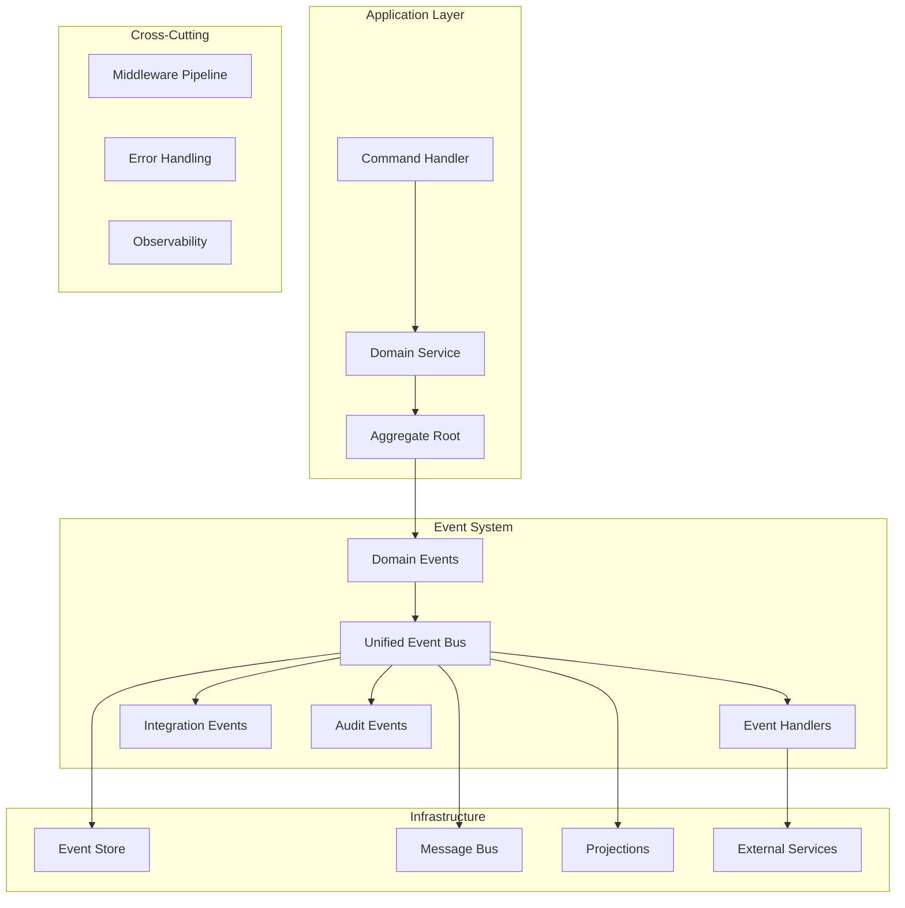

# @vytches-ddd/events

[](https://badge.fury.io/js/%40vytches-ddd%2Fevents)
[](https://www.typescriptlang.org/)
[](https://opensource.org/licenses/MIT)

> **Enterprise-grade event-driven architecture for Domain-Driven Design**

Complete event system implementation with unified event bus, domain events,
integration events, and audit events. Built for high-throughput scenarios with
transaction safety and optimistic concurrency control.

## 📋 Table of Contents

- [Installation](#installation)
- [Key Features](#key-features)
- [Core Concepts](#core-concepts)
- [Quick Start](#quick-start)
- [Architecture](#architecture)
- [API Reference](#api-reference)
- [Advanced Usage](#advanced-usage)
- [Integration Patterns](#integration-patterns)
- [Performance](#performance)
- [Testing](#testing)
- [Migration Guide](#migration-guide)
- [Contributing](#contributing)

## 🚀 Installation

```bash
# npm
npm install @vytches-ddd/events

# yarn
yarn add @vytches-ddd/events

# pnpm
pnpm add @vytches-ddd/events
```

### Peer Dependencies

```bash
# Required for full functionality
npm install @vytches-ddd/domain-primitives @vytches-ddd/utils
```

## ✨ Key Features

### Unified Event System

- **Single Event Bus**: Handles all event types (domain, integration, audit)
- **Context-Aware Routing**: Smart event filtering by contextId
- **Concurrent Publishing**: Optimized for high-throughput scenarios
- **Transaction Safety**: Event persistence with optimistic concurrency control

### Event Types

- **Domain Events**: Business events within bounded contexts
- **Integration Events**: Cross-bounded context communication
- **Audit Events**: System-wide audit trail and compliance
- **Custom Events**: Extensible event type system

### Enterprise Features

- **Repository Integration**: Automatic event publishing from aggregates
- **Middleware Pipeline**: Extensible event processing pipeline
- **Error Handling**: Comprehensive error recovery and dead letter queues
- **Observability**: Built-in metrics, logging, and distributed tracing

## 🎯 Core Concepts

### Event Hierarchy

```typescript
// Base event interface
interface IEvent {
  id: string;
  occurredAt: Date;
  version: number;
  correlationId?: string;
  causationId?: string;
  metadata?: Record<string, any>;
}

// Domain event for business logic
interface IDomainEvent extends IEvent {
  aggregateId: string;
  aggregateType: string;
  eventType: string;
  payload: any;
}

// Integration event for cross-context communication
interface IIntegrationEvent extends IEvent {
  eventType: string;
  source: string;
  destination?: string;
  payload: any;
}

// Audit event for compliance
interface IAuditEvent extends IEvent {
  userId?: string;
  action: string;
  resource: string;
  outcome: 'SUCCESS' | 'FAILURE';
  details?: Record<string, any>;
}
```

### Event Bus Architecture

```typescript
// Unified event bus handles all event types
class UnifiedEventBus {
  // Single event publishing
  async publish(event: IEvent): Promise<void>;

  // Batch event publishing
  async publishMany(events: IEvent[]): Promise<void>;

  // Context-aware subscription
  subscribe<T extends IEvent>(
    eventType: string,
    handler: IEventHandler<T>,
    options?: SubscriptionOptions
  ): void;

  // Aggregate event publishing
  async publishEventsForAggregate(
    aggregateId: string,
    events: IDomainEvent[]
  ): Promise<void>;
}
```

## 🚀 Quick Start

### 1. Basic Event Publishing

```typescript
import {
  UnifiedEventBus,
  DomainEvent,
  EventHandler,
} from '@vytches-ddd/events';

// Define domain event
class OrderCreatedEvent extends DomainEvent<{
  orderId: string;
  customerId: string;
  totalAmount: number;
  currency: string;
}> {
  constructor(payload: {
    orderId: string;
    customerId: string;
    totalAmount: number;
    currency: string;
  }) {
    super('OrderCreated', payload);
  }
}

// Create event bus
const eventBus = new UnifiedEventBus();

// Publish event
const event = new OrderCreatedEvent({
  orderId: 'order-123',
  customerId: 'customer-456',
  totalAmount: 99.99,
  currency: 'USD',
});

await eventBus.publish(event);
```

### 2. Event Handlers

```typescript
// Define event handler
@EventHandler(OrderCreatedEvent)
class OrderCreatedHandler {
  async handle(event: OrderCreatedEvent): Promise<void> {
    console.log('Order created:', event.payload);

    // Business logic here
    await this.inventoryService.reserveItems(event.payload.orderId);
    await this.notificationService.sendOrderConfirmation(
      event.payload.customerId
    );
  }
}

// Register handler
eventBus.subscribe('OrderCreated', new OrderCreatedHandler());
```

### 3. Repository Integration

```typescript
import { AggregateRoot } from '@vytches-ddd/aggregates';
import { IBaseRepository } from '@vytches-ddd/repositories';

class Order extends AggregateRoot {
  static create(customerId: string, items: OrderItem[]): Order {
    const order = new Order(EntityId.create(), customerId, items);

    // Add domain event
    order.addDomainEvent(
      new OrderCreatedEvent({
        orderId: order.id.value,
        customerId,
        totalAmount: order.calculateTotal(),
        currency: 'USD',
      })
    );

    return order;
  }
}

// Repository automatically publishes events
class OrderRepository implements IBaseRepository<Order> {
  async save(order: Order): Promise<void> {
    // 1. Persist aggregate
    await this.dataStore.save(order);

    // 2. Publish events (automatic)
    await this.eventBus.publishEventsForAggregate(
      order.id.value,
      order.getUncommittedEvents()
    );

    // 3. Mark events as committed
    order.markEventsAsCommitted();
  }
}
```

## 🏗️ Architecture



## 📚 API Reference

### UnifiedEventBus

**Core Methods:**

```typescript
class UnifiedEventBus {
  // Event publishing
  async publish(event: IEvent): Promise<void>;
  async publishMany(events: IEvent[]): Promise<void>;
  async publishEventsForAggregate(
    aggregateId: string,
    events: IDomainEvent[]
  ): Promise<void>;

  // Event subscription
  subscribe<T extends IEvent>(
    eventType: string,
    handler: IEventHandler<T>,
    options?: SubscriptionOptions
  ): void;

  // Context management
  createContext(contextId: string): EventContext;
  publishInContext(contextId: string, event: IEvent): Promise<void>;

  // Lifecycle
  start(): Promise<void>;
  stop(): Promise<void>;
}
```

**Configuration Options:**

```typescript
interface EventBusConfig {
  // Performance settings
  maxConcurrency: number; // Default: 10
  batchSize: number; // Default: 100
  retryPolicy: RetryPolicy; // Default: exponential backoff

  // Context settings
  defaultContext: string; // Default: 'default'
  contextIsolation: boolean; // Default: true

  // Middleware
  middleware: EventMiddleware[]; // Default: []

  // Error handling
  errorHandler: ErrorHandler; // Default: console.error
  deadLetterQueue: boolean; // Default: true
}
```

### Domain Events

**Base Domain Event:**

```typescript
abstract class DomainEvent<T = any> implements IDomainEvent {
  readonly id: string;
  readonly occurredAt: Date;
  readonly version: number;
  readonly eventType: string;
  readonly payload: T;

  constructor(eventType: string, payload: T) {
    this.id = EntityId.create().value;
    this.occurredAt = new Date();
    this.version = 1;
    this.eventType = eventType;
    this.payload = payload;
  }
}
```

**Example Implementation:**

```typescript
// Order domain events
class OrderCreatedEvent extends DomainEvent<{
  orderId: string;
  customerId: string;
  totalAmount: number;
  currency: string;
}> {
  constructor(payload: OrderCreatedData) {
    super('OrderCreated', payload);
  }
}

class OrderConfirmedEvent extends DomainEvent<{
  orderId: string;
  confirmedAt: Date;
  estimatedDelivery: Date;
}> {
  constructor(payload: OrderConfirmedData) {
    super('OrderConfirmed', payload);
  }
}

class OrderCancelledEvent extends DomainEvent<{
  orderId: string;
  reason: string;
  cancelledAt: Date;
}> {
  constructor(payload: OrderCancelledData) {
    super('OrderCancelled', payload);
  }
}
```

### Integration Events

**Cross-Context Communication:**

```typescript
class IntegrationEvent<T = any> implements IIntegrationEvent {
  readonly id: string;
  readonly occurredAt: Date;
  readonly version: number;
  readonly eventType: string;
  readonly source: string;
  readonly destination?: string;
  readonly payload: T;

  constructor(
    eventType: string,
    source: string,
    payload: T,
    destination?: string
  ) {
    this.id = EntityId.create().value;
    this.occurredAt = new Date();
    this.version = 1;
    this.eventType = eventType;
    this.source = source;
    this.destination = destination;
    this.payload = payload;
  }
}
```

**Example Usage:**

```typescript
// Order context -> Inventory context
class InventoryReservationRequested extends IntegrationEvent<{
  orderId: string;
  items: Array<{
    productId: string;
    quantity: number;
  }>;
}> {
  constructor(payload: InventoryReservationData) {
    super(
      'InventoryReservationRequested',
      'OrderManagement',
      payload,
      'Inventory'
    );
  }
}

// Inventory context -> Order context
class InventoryReserved extends IntegrationEvent<{
  orderId: string;
  reservationId: string;
  items: Array<{
    productId: string;
    quantity: number;
    reserved: boolean;
  }>;
}> {
  constructor(payload: InventoryReservedData) {
    super('InventoryReserved', 'Inventory', payload, 'OrderManagement');
  }
}
```

### Event Handlers

**Handler Registration:**

```typescript
// Decorator-based registration
@EventHandler(OrderCreatedEvent, {
  eventContext: 'order-management',
  retry: { maxAttempts: 3, backoff: 'exponential' },
  timeout: 30000,
})
class OrderCreatedHandler {
  async handle(event: OrderCreatedEvent): Promise<void> {
    // Handler logic
  }
}

// Manual registration
eventBus.subscribe('OrderCreated', new OrderCreatedHandler(), {
  eventContext: 'order-management',
  retry: { maxAttempts: 3, backoff: 'exponential' },
});
```

**Handler Options:**

```typescript
interface EventHandlerOptions {
  eventContext?: string | string[]; // Context filtering
  retry?: RetryOptions; // Retry configuration
  timeout?: number; // Handler timeout
  deadLetterQueue?: boolean; // Dead letter on failure
  middleware?: EventMiddleware[]; // Handler-specific middleware
}
```

### Audit Events

**System Audit Trail:**

```typescript
class AuditEvent implements IAuditEvent {
  readonly id: string;
  readonly occurredAt: Date;
  readonly version: number;
  readonly userId?: string;
  readonly action: string;
  readonly resource: string;
  readonly outcome: 'SUCCESS' | 'FAILURE';
  readonly details?: Record<string, any>;

  constructor(
    action: string,
    resource: string,
    outcome: 'SUCCESS' | 'FAILURE',
    userId?: string,
    details?: Record<string, any>
  ) {
    this.id = EntityId.create().value;
    this.occurredAt = new Date();
    this.version = 1;
    this.action = action;
    this.resource = resource;
    this.outcome = outcome;
    this.userId = userId;
    this.details = details;
  }
}
```

## 🔧 Advanced Usage

### Event Middleware

```typescript
// Custom middleware
class LoggingMiddleware implements EventMiddleware {
  async execute(
    event: IEvent,
    context: EventContext,
    next: NextFunction
  ): Promise<void> {
    console.log(`Processing event: ${event.eventType}`);

    const startTime = Date.now();
    await next();

    console.log(`Event processed in ${Date.now() - startTime}ms`);
  }
}

// Transaction middleware
class TransactionMiddleware implements EventMiddleware {
  async execute(
    event: IEvent,
    context: EventContext,
    next: NextFunction
  ): Promise<void> {
    const transaction = await this.db.beginTransaction();

    try {
      await next();
      await transaction.commit();
    } catch (error) {
      await transaction.rollback();
      throw error;
    }
  }
}

// Register middleware
eventBus.use(new LoggingMiddleware());
eventBus.use(new TransactionMiddleware());
```

### Context Isolation

```typescript
// Create isolated contexts
const orderContext = eventBus.createContext('order-management');
const inventoryContext = eventBus.createContext('inventory-management');

// Context-specific publishing
await orderContext.publish(new OrderCreatedEvent(data));
await inventoryContext.publish(new InventoryUpdatedEvent(data));

// Cross-context event routing
eventBus.subscribe('OrderCreated', inventoryHandler, {
  eventContext: ['order-management', 'inventory-management'],
});
```

### Error Handling

```typescript
// Global error handler
eventBus.onError((error, event, context) => {
  console.error('Event processing failed:', error);

  // Send to dead letter queue
  if (error.retryable) {
    return 'RETRY';
  }

  // Log and continue
  auditService.logEventFailure(event, error);
  return 'CONTINUE';
});

// Handler-specific error handling
@EventHandler(OrderCreatedEvent, {
  errorHandler: (error, event) => {
    if (error instanceof ValidationError) {
      // Send to validation error queue
      return 'DEAD_LETTER';
    }

    return 'RETRY';
  },
})
class OrderCreatedHandler {
  async handle(event: OrderCreatedEvent): Promise<void> {
    // Handler logic
  }
}
```

### Batch Processing

```typescript
// Batch event publishing
const events = [
  new OrderCreatedEvent(orderData1),
  new OrderCreatedEvent(orderData2),
  new OrderCreatedEvent(orderData3),
];

await eventBus.publishMany(events);

// Batch handler
@EventHandler(OrderCreatedEvent, {
  batchSize: 50,
  batchTimeout: 5000,
})
class BatchOrderHandler {
  async handleBatch(events: OrderCreatedEvent[]): Promise<void> {
    // Process events in batch
    const orderIds = events.map(e => e.payload.orderId);
    await this.inventoryService.reserveItemsForOrders(orderIds);
  }
}
```

## 🔗 Integration Patterns

### Repository Pattern

```typescript
// Base repository with event publishing
abstract class BaseRepository<T extends AggregateRoot> {
  constructor(
    private eventBus: UnifiedEventBus,
    private eventStore: IEventStore
  ) {}

  async save(aggregate: T): Promise<void> {
    const events = aggregate.getUncommittedEvents();

    // Transactional save
    await this.db.transaction(async trx => {
      // 1. Save aggregate state
      await this.persistAggregate(aggregate, trx);

      // 2. Save events
      await this.eventStore.append(aggregate.id.value, events, trx);

      // 3. Publish events
      await this.eventBus.publishEventsForAggregate(aggregate.id.value, events);
    });

    // 4. Mark events as committed
    aggregate.markEventsAsCommitted();
  }
}
```

### CQRS Integration

```typescript
// Command handler with event publishing
@CommandHandler(CreateOrderCommand)
class CreateOrderHandler {
  async execute(command: CreateOrderCommand): Promise<void> {
    // Create aggregate
    const order = Order.create(command.customerId, command.items);

    // Repository automatically publishes events
    await this.orderRepository.save(order);
  }
}

// Query handler with event subscription
@EventHandler(OrderCreatedEvent)
class OrderProjectionHandler {
  async handle(event: OrderCreatedEvent): Promise<void> {
    // Update read model
    await this.readModelRepository.createOrderProjection({
      orderId: event.payload.orderId,
      customerId: event.payload.customerId,
      status: 'PENDING',
      totalAmount: event.payload.totalAmount,
      createdAt: event.occurredAt,
    });
  }
}
```

### Saga Pattern

```typescript
// Saga orchestration with events
@EventHandler(OrderCreatedEvent)
class OrderProcessingSaga {
  async handle(event: OrderCreatedEvent): Promise<void> {
    // Step 1: Reserve inventory
    await this.eventBus.publish(
      new InventoryReservationRequested({
        orderId: event.payload.orderId,
        items: event.payload.items,
      })
    );
  }

  @EventHandler(InventoryReserved)
  async onInventoryReserved(event: InventoryReserved): Promise<void> {
    // Step 2: Process payment
    await this.eventBus.publish(
      new PaymentRequested({
        orderId: event.payload.orderId,
        amount: event.payload.totalAmount,
      })
    );
  }

  @EventHandler(PaymentFailed)
  async onPaymentFailed(event: PaymentFailed): Promise<void> {
    // Compensate: Release inventory
    await this.eventBus.publish(
      new InventoryReleaseRequested({
        orderId: event.payload.orderId,
        reservationId: event.payload.reservationId,
      })
    );
  }
}
```

## ⚡ Performance

### Benchmarks

```typescript
// Performance characteristics
const benchmarks = {
  // Single event publishing
  publishLatency: '< 1ms',
  publishThroughput: '10,000+ events/second',

  // Batch publishing
  batchLatency: '< 5ms for 100 events',
  batchThroughput: '50,000+ events/second',

  // Memory usage
  memoryPerEvent: '< 1KB',
  memoryPerSubscriber: '< 100KB',
};
```

### Optimization Tips

```typescript
// 1. Use batch publishing for multiple events
const events = orders.map(order => new OrderCreatedEvent(order));
await eventBus.publishMany(events);

// 2. Configure appropriate concurrency
const eventBus = new UnifiedEventBus({
  maxConcurrency: 20, // Adjust based on system resources
  batchSize: 100, // Optimize for your event size
});

// 3. Use context filtering to reduce handler overhead
@EventHandler(OrderCreatedEvent, {
  eventContext: 'order-management', // Only process relevant events
})
class OrderHandler {
  async handle(event: OrderCreatedEvent): Promise<void> {
    // Handler logic
  }
}

// 4. Implement efficient error handling
eventBus.onError((error, event) => {
  // Quick error assessment
  if (error.retryable && error.attempts < 3) {
    return 'RETRY';
  }

  // Fail fast for non-retryable errors
  return 'DEAD_LETTER';
});
```

## 🧪 Testing

### Unit Testing

```typescript
import { UnifiedEventBus, EventTestHarness } from '@vytches-ddd/events';
import { describe, it, expect } from 'vitest';

describe('OrderCreatedHandler', () => {
  let eventBus: UnifiedEventBus;
  let testHarness: EventTestHarness;
  let handler: OrderCreatedHandler;

  beforeEach(() => {
    eventBus = new UnifiedEventBus();
    testHarness = new EventTestHarness(eventBus);
    handler = new OrderCreatedHandler();
  });

  it('should handle order created event', async () => {
    // Arrange
    const event = new OrderCreatedEvent({
      orderId: 'order-123',
      customerId: 'customer-456',
      totalAmount: 99.99,
      currency: 'USD',
    });

    // Act
    await handler.handle(event);

    // Assert
    expect(testHarness.publishedEvents).toHaveLength(1);
    expect(testHarness.publishedEvents[0]).toBeInstanceOf(
      InventoryReservationRequested
    );
  });

  it('should publish events in correct order', async () => {
    // Arrange
    const order = Order.create('customer-123', [
      { productId: 'product-1', quantity: 2 },
    ]);

    // Act
    await this.orderRepository.save(order);

    // Assert
    expect(testHarness.publishedEvents).toEqual([
      expect.objectContaining({
        eventType: 'OrderCreated',
        payload: expect.objectContaining({
          orderId: order.id.value,
        }),
      }),
    ]);
  });
});
```

### Integration Testing

```typescript
import { EventIntegrationTestHarness } from '@vytches-ddd/events';

describe('Order Processing Integration', () => {
  let testHarness: EventIntegrationTestHarness;

  beforeEach(async () => {
    testHarness = new EventIntegrationTestHarness();
    await testHarness.start();
  });

  afterEach(async () => {
    await testHarness.stop();
  });

  it('should process order creation workflow', async () => {
    // Arrange
    const order = {
      customerId: 'customer-123',
      items: [{ productId: 'product-1', quantity: 2 }],
    };

    // Act
    await testHarness.publishEvent(new OrderCreatedEvent(order));

    // Assert - wait for event processing
    await testHarness.waitForEvent('InventoryReservationRequested');
    await testHarness.waitForEvent('PaymentRequested');

    expect(testHarness.handledEvents).toContainEqual(
      expect.objectContaining({
        eventType: 'OrderCreated',
      })
    );
  });
});
```

## 📈 Migration Guide

### From v1.x to v2.x

The events package underwent a major refactor in v2.x with the introduction of
the unified event system:

#### Breaking Changes

1. **Event Bus Consolidation**

   ```typescript
   // v1.x - Multiple event buses
   const domainEventBus = new DomainEventBus();
   const integrationEventBus = new IntegrationEventBus();

   // v2.x - Single unified event bus
   const eventBus = new UnifiedEventBus();
   ```

2. **Handler Registration**

   ```typescript
   // v1.x - Separate registration
   domainEventBus.subscribe('OrderCreated', handler);
   integrationEventBus.subscribe('OrderCreated', handler);

   // v2.x - Unified registration with context
   eventBus.subscribe('OrderCreated', handler, {
     eventContext: 'order-management',
   });
   ```

3. **Event Publishing**

   ```typescript
   // v1.x - Type-specific publishing
   await domainEventBus.publish(domainEvent);
   await integrationEventBus.publish(integrationEvent);

   // v2.x - Unified publishing
   await eventBus.publish(event);
   ```

#### Migration Steps

1. **Update Dependencies**

   ```bash
   npm install @vytches-ddd/events@^2.0.0
   ```

2. **Replace Event Bus Instances**

   ```typescript
   // Before
   const domainEventBus = new DomainEventBus();
   const integrationEventBus = new IntegrationEventBus();

   // After
   const eventBus = new UnifiedEventBus();
   ```

3. **Update Handler Registration**

   ```typescript
   // Before
   domainEventBus.subscribe('OrderCreated', orderHandler);

   // After
   eventBus.subscribe('OrderCreated', orderHandler, {
     eventContext: 'order-management',
   });
   ```

4. **Update Repository Integration**

   ```typescript
   // Before
   await this.domainEventBus.publishMany(aggregate.getUncommittedEvents());

   // After
   await this.eventBus.publishEventsForAggregate(
     aggregate.id.value,
     aggregate.getUncommittedEvents()
   );
   ```

### Migration Tools

```typescript
// Migration helper utility
import { EventBusMigrationHelper } from '@vytches-ddd/events/migration';

const migrationHelper = new EventBusMigrationHelper();

// Migrate existing handler registrations
migrationHelper.migrateHandlerRegistrations({
  domainEventBus: oldDomainEventBus,
  integrationEventBus: oldIntegrationEventBus,
  targetEventBus: newUnifiedEventBus,
});

// Validate migration
const validationResult = migrationHelper.validateMigration();
if (!validationResult.isValid) {
  console.error('Migration validation failed:', validationResult.errors);
}
```

## 🤝 Contributing

We welcome contributions! Please see our
[Contributing Guide](../../CONTRIBUTING.md) for details.

### Development Setup

```bash
# Clone repository
git clone https://github.com/PawelGozdz/vytches-ddd.git
cd vytches-ddd

# Install dependencies
pnpm install

# Build events package
pnpm build --filter=@vytches-ddd/events

# Run tests
pnpm test --filter=@vytches-ddd/events

# Run in development mode
pnpm dev --filter=@vytches-ddd/events
```

### Code Style

- Follow existing TypeScript patterns
- Add comprehensive tests for new features
- Update documentation for API changes
- Follow semantic versioning for releases

## 📄 License

This project is licensed under the MIT License - see the
[LICENSE](../../LICENSE) file for details.

---

**Part of the [@vytches-ddd](https://github.com/PawelGozdz/vytches-ddd)
ecosystem**

For more information, visit the [main documentation](../../README.md).
