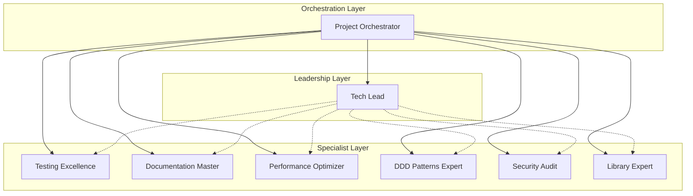

# VytchesDDD Project Orchestration System

## Overview

The Project Orchestration System is a comprehensive project management framework
that coordinates AI agents, manages tasks, captures lessons learned, and
maintains domain model alignment. It acts as the central nervous system for the
VytchesDDD library development, ensuring consistent quality, knowledge
preservation, and continuous improvement.

## 📁 System Structure

```
project-orchestration/
├── README.md                  # This file - orchestration overview
├── workflows.yaml             # Predefined development workflows
├── coordination-rules.md      # How agents collaborate
├── task-templates.yaml        # Reusable task patterns
├── release-process.md         # Release preparation guide
│
├── tasks/                     # Active and completed tasks
│   ├── TASK-TEMPLATE.md      # Template for new tasks
│   ├── YYYY-MM-DD-XXX-*.md  # Individual task files
│   └── active/               # Currently in-progress tasks
│
├── lessons-learned/          # Knowledge repository
│   ├── README.md            # Lessons overview
│   ├── architecture/        # Architecture insights
│   ├── implementation/      # Coding patterns
│   ├── testing/            # Test strategies
│   └── failures/           # What didn't work
│
└── domain-models/           # Domain documentation
    ├── README.md           # Domain overview
    ├── contexts/           # Bounded contexts
    ├── aggregates/         # Aggregate designs
    └── diagrams/           # Visual models
```

## System Architecture



## Quick Start

### 1. Triggering a Workflow

```bash
# Start a feature development workflow
orchestrate --workflow feature_development --feature "new-validation-system"

# Start a security audit
orchestrate --workflow security_audit --scope "all-packages"

# Create a new package
orchestrate --workflow package_creation --name "ddd-workflow"
```

### 2. Agent Delegation

```yaml
# Direct agent task
delegate:
  agent: testing-excellence
  task: improve_coverage
  target: '@vytches/ddd-events'
  goal: 90%
```

### 3. Multi-Agent Coordination

```yaml
# Parallel execution
coordinate:
  agents:
    - testing-excellence: run_tests
    - security-audit: scan_vulnerabilities
    - performance-optimizer: analyze_bundles
  merge_results: true
```

## Available Workflows

### Core Workflows

| Workflow              | Description                      | Trigger      | Duration  |
| --------------------- | -------------------------------- | ------------ | --------- |
| `feature_development` | Complete feature implementation  | Manual/PR    | 30-60 min |
| `package_creation`    | Create new package               | Manual       | 15-30 min |
| `bug_fix`             | Fix reported bugs                | Issue/Manual | 15-45 min |
| `release`             | Prepare release (publish manual) | Manual       | 30-45 min |

### Maintenance Workflows

| Workflow                   | Description                 | Trigger           | Duration  |
| -------------------------- | --------------------------- | ----------------- | --------- |
| `security_audit`           | Security vulnerability scan | Schedule/Manual   | 20-40 min |
| `performance_optimization` | Optimize bundle and runtime | Manual/Regression | 30-60 min |
| `test_improvement`         | Increase test coverage      | Manual            | 20-40 min |
| `documentation_update`     | Update docs and examples    | Manual            | 15-30 min |

## Agent Capabilities

### Specialized Agents

#### 🧠 **Tech Lead**

- Architecture decisions
- Code review
- Technical standards
- ADR management

#### 🧪 **Testing Excellence**

- Test coverage (>80%)
- safeRun pattern enforcement
- Performance benchmarks
- Test organization

#### 📚 **Documentation Master**

- JSDoc documentation
- README maintenance
- Example generation
- API documentation

#### 📝 **YAML Metadata Specialist**

- Enhanced Metadata System V2
- Hierarchical YAML structure
- Format-specific overrides
- JSDoc injection support

#### ⚡ **Performance Optimizer**

- Bundle size (99.2% reduction)
- Tree-shaking optimization
- Runtime performance
- Memory management

#### 🏛️ **DDD Patterns Expert**

- Aggregate design
- Event sourcing
- CQRS implementation
- Domain modeling

#### 🛡️ **Security Audit**

- Vulnerability scanning
- OWASP compliance
- Data protection
- Supply chain security

#### 💻 **Library Expert**

- Implementation
- API design
- Bug fixing
- Package creation

#### 🎭 **Project Orchestrator**

- Workflow coordination
- Task distribution
- Progress monitoring
- Quality gates

## Coordination Patterns

### Sequential Pattern

Tasks executed in order with dependencies:

```
Design → Implementation → Testing → Documentation → Review
```

### Parallel Pattern

Independent tasks executed simultaneously:

```
Testing ⟍
Security ⟋ → Consolidated Results
Performance ⟋
```

### Conditional Pattern

Workflow branches based on conditions:

```
if (complexity == 'high')
  → Architecture Review → Implementation
else
  → Direct Implementation
```

## Quality Gates

### Pre-Commit Checks

- ✅ All tests passing
- ✅ Coverage > 80%
- ✅ No security vulnerabilities
- ✅ Bundle size within limits
- ✅ JSDoc validation passed

### Release Preparation Criteria

- ✅ Full test suite passed
- ✅ Security audit clean
- ✅ Performance benchmarks met
- ✅ Documentation complete
- ✅ `pnpm prerelease` successful
- ✅ Tech Lead approval
- ⚠️ **Manual publish required by maintainer**

## Task Templates

### Using Templates

```yaml
# Use a predefined template
use_template:
  name: feature_implementation
  parameters:
    feature_name: 'enhanced-projections'
    complexity: high
    priority: normal
```

### Available Templates

- `feature_implementation` - New feature development
- `package_refactoring` - Refactor existing package
- `security_fix` - Fix security vulnerability
- `documentation_update` - Update documentation
- `performance_investigation` - Investigate performance issues
- `test_improvement` - Improve test coverage
- `api_design` - Design new API

## Emergency Protocols

### Critical Bug Response

1. **Immediate Triage** (5 min)
2. **Root Cause Analysis** (10 min)
3. **Fix Implementation** (15 min)
4. **Validation** (10 min)
5. **Emergency Release** (5 min)

### Security Incident

1. **Immediate Assessment** (5 min)
2. **Isolation** (2 min)
3. **Patch Development** (20 min)
4. **Security Validation** (10 min)
5. **Emergency Deployment** (5 min)

## Monitoring & Metrics

### Workflow Metrics

- Average completion time
- Success rate
- Agent utilization
- Quality gate pass rate

### Agent Performance

- Response time
- Task completion rate
- Error rate
- Collaboration efficiency

## Best Practices

### For Developers

1. Use appropriate workflow for task type
2. Provide clear requirements
3. Review agent outputs
4. Validate quality gates

### For Orchestration

1. Minimize coordination overhead
2. Parallelize when possible
3. Cache repeated analyses
4. Monitor performance

## Integration with CI/CD

### GitHub Actions Integration

```yaml
- name: Run Orchestration
  uses: ./.github/actions/orchestrate
  with:
    workflow: feature_development
    agents: all
    quality_gates: strict
```

### Pre-Commit Hooks

```bash
# .git/hooks/pre-commit
orchestrate --workflow pre_commit_checks --fast
```

## Troubleshooting

### Common Issues

| Issue                 | Solution                               |
| --------------------- | -------------------------------------- |
| Workflow timeout      | Check agent availability, reduce scope |
| Quality gate failure  | Review specific agent report           |
| Coordination conflict | Escalate to Tech Lead                  |
| Agent unavailable     | Use fallback agent or manual process   |

## Task Management System

### Creating New Tasks

The Project Orchestrator creates detailed task documentation for every
significant work item:

```bash
# Orchestrator creates task
@orchestrator: Create task for implementing GraphQL support

# Task file created
project-orchestration/tasks/2024-01-20-001-graphql-support.md
```

### Task Lifecycle

1. **Planning**: Requirements gathering, domain modeling
2. **Assignment**: Agent selection and delegation
3. **Execution**: Implementation with progress tracking
4. **Review**: Quality gates and validation
5. **Completion**: Lessons learned extraction
6. **Archive**: Knowledge preservation

### Task Components

Every task includes:

- **Domain Context**: Links to bounded contexts and aggregates
- **Business Value**: Clear justification and metrics
- **Technical Plan**: Phases, agents, deliverables
- **Progress Tracking**: Real-time status updates
- **Lessons Learned**: What worked, what didn't
- **Post-mortem**: Actual vs estimated analysis

### Domain Alignment

Tasks are always linked to domain models:

- Which bounded context does this affect?
- What aggregates are involved?
- What domain events will be generated?
- How does this support business goals?

## Lessons Learned System

### Continuous Improvement

After each task, the orchestrator:

1. Extracts key insights
2. Documents patterns (successful and failed)
3. Updates best practices
4. Links to domain models
5. Creates reusable templates

### Knowledge Categories

- **Architecture Patterns**: What designs work
- **Implementation Techniques**: Coding best practices
- **Testing Strategies**: Coverage and quality approaches
- **Process Improvements**: Workflow optimizations
- **Failures**: Anti-patterns to avoid

## Configuration

### Workflow Configuration

Edit `project-orchestration/workflows.yaml`

### Agent Configuration

Edit `.claude/agents/*.md`

### Coordination Rules

Edit `project-orchestration/coordination-rules.md`

### Task Templates

Edit `project-orchestration/task-templates.yaml`

## Support

For issues or improvements:

1. Check agent logs
2. Review coordination rules
3. Consult Tech Lead agent
4. Escalate to human developer if needed

---

## PM System (claude-patterns integration)

Added 2026-04-03. Uses the
[Project Management System pattern](https://github.com/anthropics/claude-patterns/blob/main/patterns/orchestration/project-management-system.md)
from claude-patterns.

### Key Files

| File               | Purpose                                 |
| ------------------ | --------------------------------------- |
| `TEAM-STATE.md`    | Shared brain — auto-updated by `/pulse` |
| `KANBAN.md`        | Task board — auto-generated by `/pulse` |
| `TECH-DEBT.md`     | Debt register — updated by @tech-lead   |
| `completed-tasks/` | Done tasks (immutable archive)          |
| `_archive/`        | Deferred/deprecated tasks               |

### Daily Workflow

```bash
# Quick status check (~$0, instant)
/pm-status

# Full team sync — runs @tech-lead + @product-owner (~$0.10)
/pulse

# Housekeeping — move done tasks, fix missing fields
/task-tidy

# Deep audit — broken deps, stale tasks
/task-health

# Sprint planning — both agents, interactive
/sprint

# Debt analysis
/tech-debt
```

### Task YAML Schema (required fields)

```yaml
---
id: VF-XXX
title: 'Task title'
status: planned|ready|in-progress|blocked|done|deferred
priority: P0|P1|P2|P3
story_points: 5
created_date: YYYY-MM-DD
updated_date: YYYY-MM-DD
assignee: '@agent-or-person'
labels: [area, type]
---
```

### Task Lifecycle

```
tasks/          → active (planned, ready, in-progress, blocked)
completed-tasks/ → done (immutable)
_archive/       → deferred
```
