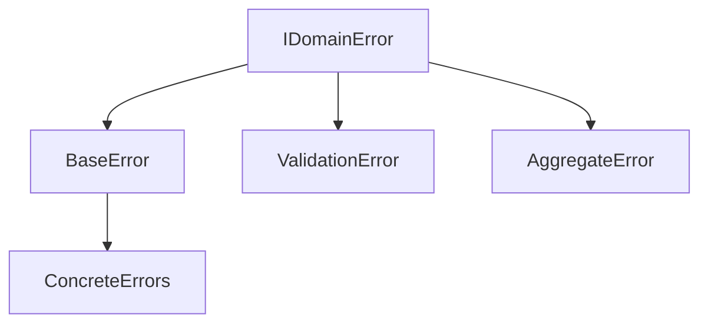

# Task: Enhance IDomainError Interface Flexibility

## Task Metadata

```yaml
task_id: 2025-01-19-VF-008
title: Enhance IDomainError interface to accept string codes
type: feature
priority: high
complexity: medium
estimated_time: 2-3h
created_by: human
created_at: 2025-01-19 10:30
status: completed
completed_at: 2025-01-19 10:51
```

## Domain Context

```yaml
bounded_context: ErrorManagement
aggregates: []
entities: []
value_objects:
  - ErrorCode
  - DomainError
domain_events: []
patterns:
  - Domain Error Handling
  - Value Object Pattern
```

## Business Context

### Why This Task Exists

Current `IDomainError` interface restricts error codes to predefined enums,
limiting flexibility for dynamic error scenarios. Users need ability to pass
custom string error codes for integration with external systems and
runtime-generated errors.

### Expected Business Value

- [ ] Increased flexibility for error code management
- [ ] Better integration with third-party validation libraries
- [ ] Support for dynamic error code generation
- [ ] Simplified error handling for custom domains

### Success Metrics

- All existing enum-based error codes continue working
- New string-based error codes are properly handled
- No breaking changes in dependent packages
- Error serialization maintains compatibility

## Technical Context

### Current State

```typescript
interface IDomainError<TCode extends string = string> {
  code: TCode;
  message: string;
  // ...
}
```

Error codes must be enum values, limiting runtime flexibility.

### Desired State

```typescript
interface IDomainError<TCode extends string | number = string> {
  code: TCode;
  message: string;
  // ...
}
```

Accept both string literals and enum values for error codes.

### Technical Constraints

- Backward compatibility is mandatory
- Type safety must be maintained
- Serialization must work for both types
- No performance degradation

## Requirements & Acceptance Criteria

### Functional Requirements

- [ ] IDomainError accepts string type for code
- [ ] IDomainError accepts enum type for code
- [ ] Error creation utilities support both types
- [ ] Error serialization handles both types correctly

### Non-Functional Requirements

- [ ] Performance: No measurable impact on error creation/handling
- [ ] Security: No injection vulnerabilities with string codes
- [ ] Documentation: Clear migration guide for users
- [ ] Testing: 100% backward compatibility test coverage

### Definition of Done

- [ ] Code implemented and reviewed
- [ ] Tests written and passing (>80% coverage)
- [ ] Documentation updated
- [ ] No security vulnerabilities
- [ ] Bundle size acceptable
- [ ] Performance benchmarks met
- [ ] All dependent packages tested

## Agent Assignments

```yaml
lead_agent: library-expert
supporting_agents:
  - agent: testing-excellence
    role: Test coverage and validation
    deliverables: Comprehensive test suite
collaboration_points:
  - Interface definition approval
  - Breaking change assessment
```

## Implementation Plan

### Phase 1: Interface Enhancement

- **Agent**: library-expert
- **Tasks**:
  - [ ] Modify IDomainError interface in contracts package
  - [ ] Update type constraints and generics
  - [ ] Add helper types for error codes
- **Output**: Updated interface definition

### Phase 2: Implementation Updates

- **Agent**: library-expert
- **Tasks**:
  - [ ] Update base error classes in domain-primitives
  - [ ] Modify error creation utilities
  - [ ] Ensure serialization compatibility
- **Output**: Working implementation with both code types

### Phase 3: Testing & Validation

- **Agent**: testing-excellence
- **Tasks**:
  - [ ] Create backward compatibility tests
  - [ ] Test string-based error codes
  - [ ] Validate serialization/deserialization
  - [ ] Test all dependent packages
- **Output**: Complete test coverage report

## Progress Tracking

### Current Status

```yaml
overall_progress: 100%
current_phase: completed
blockers: []
last_updated: 2025-01-19 10:51
```

### Activity Log

| Date       | Agent                | Action                 | Result                       |
| ---------- | -------------------- | ---------------------- | ---------------------------- |
| 2025-01-19 | project-orchestrator | Task created           | Task VF-008 initialized      |
| 2025-01-19 | library-expert       | Started implementation | Working on interface changes |

### Blockers & Issues

| Issue | Description | Owner | Resolution |
| ----- | ----------- | ----- | ---------- |
| None  |             |       |            |

## Code References

### Files to Modify

```yaml
packages:
  - package: '@vytches/ddd-contracts'
    files:
      - src/domain/errors.interface.ts
      - src/index.ts
  - package: '@vytches/ddd-domain-primitives'
    files:
      - src/errors/base-error.ts
      - src/errors/domain-error.ts
      - tests/errors/domain-error.test.ts
  - package: '@vytches/ddd-validation'
    files:
      - src/errors/validation-error.ts
```

### Related PRs/Commits

- None yet

## Risk Assessment

### Technical Risks

| Risk                          | Probability | Impact | Mitigation                   |
| ----------------------------- | ----------- | ------ | ---------------------------- |
| Breaking changes in packages  | Low         | High   | Comprehensive testing        |
| Type inference issues         | Medium      | Medium | Careful generic constraints  |
| Serialization incompatibility | Low         | High   | Test all serialization paths |

### Schedule Risks

- Dependent packages may require more updates than anticipated

## Testing Strategy

### Unit Tests

- [ ] Test string error codes
- [ ] Test enum error codes
- [ ] Test mixed code types
- [ ] Test type inference
- [ ] Test serialization

### Integration Tests

- [ ] Test with validation package
- [ ] Test with all error-using packages
- [ ] Test error propagation

### Performance Tests

- [ ] Error creation benchmark
- [ ] Serialization performance

## Documentation Updates

### Files to Update

- [ ] contracts/README.md
- [ ] domain-primitives/README.md
- [ ] Migration guide for error codes
- [ ] JSDoc comments on interfaces

### Examples to Create

- [ ] Basic string error code usage
- [ ] Enum error code usage
- [ ] Mixed error code patterns
- [ ] Migration from enum-only

## Lessons Learned

### What Worked Well

- To be completed after implementation

### What Didn't Work

- To be completed after implementation

### Improvements for Next Time

- To be completed after implementation

### Knowledge Gained

- To be completed after implementation

## Links & References

### Related Tasks

- Task VF-009: Make aggregate classes accept generic ID types (complementary
  flexibility enhancement)

### External Resources

- TypeScript handbook on generics
- Error handling best practices

### Domain Modeling Diagrams



## Post-Implementation Review

### Actual vs Estimated

- **Estimated Time**: 2-3h
- **Actual Time**: TBD
- **Difference Reason**: TBD

### Quality Metrics

- Test Coverage: TBD
- Bundle Size Impact: TBD
- Performance Impact: TBD
- Code Complexity: Medium

### Stakeholder Feedback

- TBD

## Final Notes

This enhancement improves library flexibility while maintaining backward
compatibility. The change allows users to use custom string error codes while
preserving existing enum-based patterns.

---

_Task managed by Project Orchestrator | Last AI Review: 2025-01-19_
