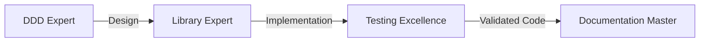
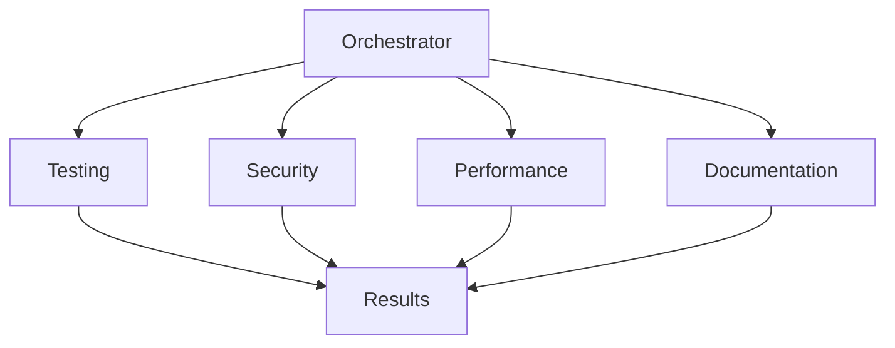
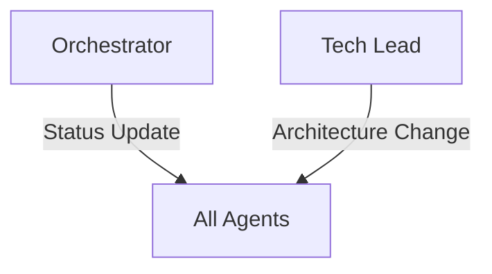

# VytchesDDD Agent Coordination Rules

## Agent Hierarchy and Responsibilities

### 1. Project Orchestrator (Master Coordinator)

- **Authority Level**: Highest
- **Can Delegate To**: All agents
- **Reports To**: Human developers
- **Primary Role**: Coordinate multi-agent workflows and ensure project cohesion

### 2. Tech Lead (Technical Authority)

- **Authority Level**: High
- **Can Delegate To**: All technical agents
- **Reports To**: Project Orchestrator
- **Primary Role**: Make architectural decisions and maintain technical
  standards

### 3. Specialized Agents (Domain Experts)

- **Authority Level**: Medium
- **Can Delegate To**: None (peer collaboration only)
- **Reports To**: Project Orchestrator, Tech Lead
- **Agents**:
  - Testing Excellence
  - Documentation Master
  - Performance Optimizer
  - DDD Patterns Expert
  - Security Audit
  - Library Expert

## Coordination Protocols

### 1. Task Assignment Protocol

```
1. Project Orchestrator receives request
2. Orchestrator analyzes task complexity
3. Orchestrator assigns primary agent(s)
4. Primary agent may request assistance from peers
5. Results reported back to Orchestrator
6. Orchestrator consolidates and presents results
```

### 2. Conflict Resolution Protocol

```
When agents disagree:
1. Attempt peer resolution first
2. Escalate to Tech Lead for technical conflicts
3. Escalate to Project Orchestrator for process conflicts
4. Document decision in ADR if architectural
```

### 3. Quality Gate Protocol

```
Before any merge/release:
1. Testing Excellence validates coverage
2. Security Audit checks vulnerabilities
3. Performance Optimizer verifies metrics
4. Documentation Master confirms docs
5. Tech Lead gives final approval
```

## Communication Patterns

### Sequential Communication

Used for dependent tasks where output of one agent feeds into another.



### Parallel Communication

Used for independent tasks that can be executed simultaneously.



### Broadcast Communication

Used for notifications and status updates.



## Collaboration Rules

### 1. Information Sharing

- All agents must document their findings
- Use standardized formats for reports
- Share context when requesting assistance
- Update project status regularly

### 2. Decision Making

- **Architectural**: Tech Lead has final say
- **Security**: Security Audit can veto unsafe code
- **Quality**: Testing Excellence can block on coverage
- **Performance**: Performance Optimizer can block on regressions
- **Documentation**: Documentation Master can block on missing docs

### 3. Escalation Path

```
Developer Issue
    ↓
Specialized Agent
    ↓
Tech Lead (technical) / Project Orchestrator (process)
    ↓
Human Developer
```

## Task Prioritization

### Priority Levels

1. **Critical**: Security vulnerabilities, production bugs
2. **High**: Feature development, performance issues
3. **Normal**: Documentation, refactoring
4. **Low**: Nice-to-have improvements

### Agent Availability

- Each agent can handle multiple tasks
- Critical tasks preempt normal tasks
- Parallel execution when possible
- Queue management by Orchestrator

## Workflow Triggers

### Automatic Triggers

- **Pull Request**: Triggers quality checks
- **Issue Created**: Triggers triage
- **Schedule**: Triggers audits
- **Performance Regression**: Triggers optimization

### Manual Triggers

- **Feature Request**: Requires orchestration
- **Release**: Requires full workflow
- **Architecture Change**: Requires Tech Lead

## Success Metrics

### Individual Agent Metrics

- **Response Time**: <5 minutes for critical
- **Task Completion**: >95% success rate
- **Quality**: Meet defined standards

### Orchestration Metrics

- **Workflow Efficiency**: <30 min average
- **Coordination Overhead**: <10% of total time
- **Conflict Resolution**: <5% escalation rate

## Best Practices

### For Agents

1. Always validate inputs before processing
2. Provide clear, actionable outputs
3. Document decisions and rationale
4. Request help when uncertain
5. Follow established patterns

### For Orchestration

1. Minimize coordination overhead
2. Parallelize when possible
3. Cache repeated analyses
4. Monitor agent performance
5. Optimize workflow paths

## Emergency Protocols

### Critical Bug Response

1. Orchestrator immediately notifies Tech Lead
2. Library Expert investigates
3. Testing Excellence creates regression test
4. Security Audit if security-related
5. Fast-track review and merge

### Security Incident

1. Security Audit takes lead
2. All other work paused
3. Immediate assessment
4. Patch development
5. Emergency release if needed

## Integration with Development Flow

### Pre-Commit

- Local checks by relevant agents
- Fast feedback loop
- Block on critical issues

### CI/CD Pipeline

- Automated agent checks
- Parallel execution
- Quality gates enforcement

### Post-Deployment

- Monitor for issues
- Performance tracking
- Documentation updates
