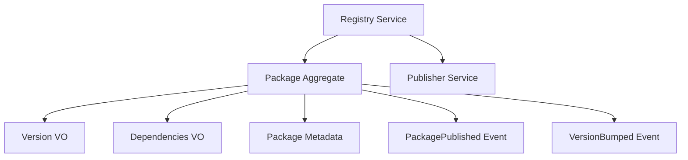
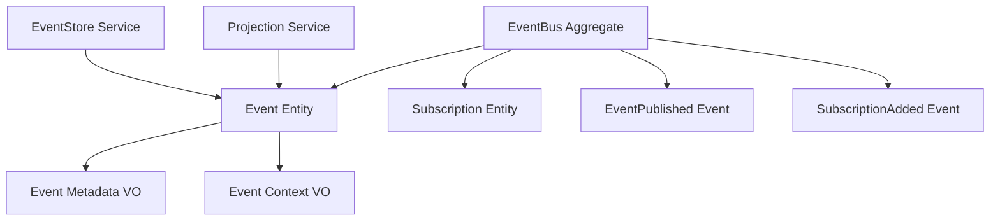
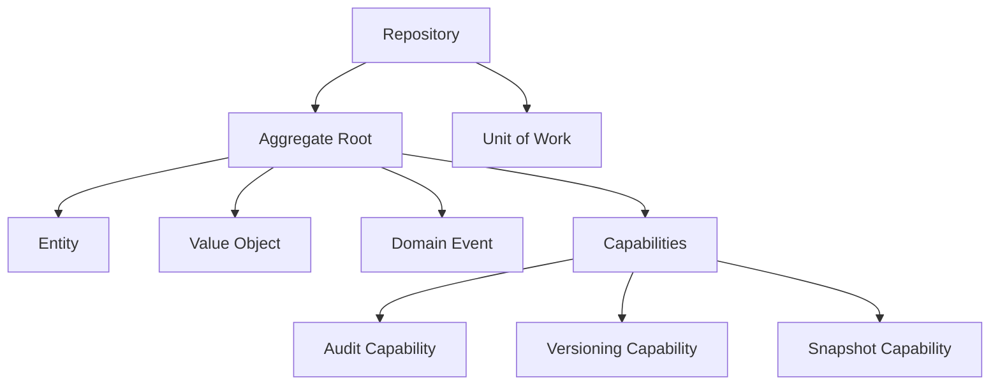
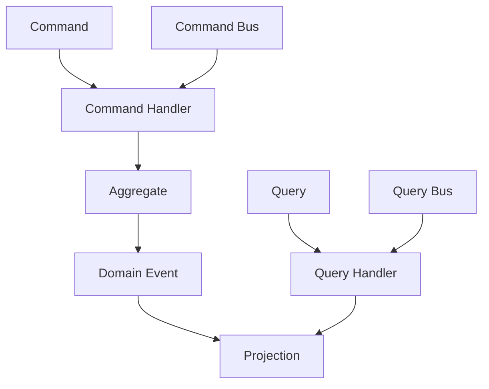

# Domain Models Documentation

## Overview

This directory contains domain modeling documentation for the VytchesDDD
library, linking technical implementation to business concepts and DDD patterns.

## Core Domain Models

### 📦 Package Management Domain



### 🎯 Event Management Domain



### 🏛️ Aggregate Pattern Domain



### 🔄 CQRS Domain



## Bounded Contexts

### 1. Core Building Blocks Context

**Purpose**: Foundation layer providing base DDD patterns

**Aggregates**:

- `BaseAggregate`: Root entity with event sourcing
- `BaseRepository`: Persistence abstraction
- `BaseValueObject`: Immutable value containers

**Services**:

- `ValidationService`: Business rule enforcement
- `SpecificationService`: Complex validation logic

**Events**:

- `AggregateCreated`
- `AggregateModified`
- `AggregateDeleted`

### 2. Event Management Context

**Purpose**: Handle all event-driven architecture

**Aggregates**:

- `UnifiedEventBus`: Central event distribution
- `EventStore`: Event persistence and retrieval
- `Saga`: Long-running process coordination

**Services**:

- `EventDispatcher`: Route events to handlers
- `ProjectionEngine`: Build read models

**Events**:

- `EventPublished`
- `EventHandled`
- `ProjectionUpdated`
- `SagaCompleted`

### 3. Command & Query Context

**Purpose**: Implement CQRS pattern

**Aggregates**:

- `CommandBus`: Command routing
- `QueryBus`: Query execution

**Services**:

- `HandlerRegistry`: Handler discovery
- `MiddlewarePipeline`: Cross-cutting concerns

**Events**:

- `CommandExecuted`
- `QueryExecuted`
- `HandlerRegistered`

### 4. Resilience Context

**Purpose**: Fault tolerance and reliability

**Aggregates**:

- `CircuitBreaker`: Failure protection
- `RetryPolicy`: Transient failure handling

**Services**:

- `ResilienceOrchestrator`: Pattern coordination
- `MetricsCollector`: Performance monitoring

**Events**:

- `CircuitOpened`
- `CircuitClosed`
- `RetryAttempted`
- `BulkheadRejected`

## Domain Rules & Invariants

### Package Domain Rules

1. **Version Immutability**: Published versions cannot be modified
2. **Dependency Consistency**: All dependencies must exist and be compatible
3. **Naming Convention**: Package names must follow @vytches/ddd-\* pattern
4. **Bundle Size Limits**: Core packages must stay under defined thresholds

### Event Domain Rules

1. **Event Immutability**: Published events cannot be changed
2. **Ordering Guarantee**: Events must maintain order within aggregates
3. **Context Isolation**: Events respect bounded context boundaries
4. **Idempotency**: Event handlers must be idempotent

### Aggregate Domain Rules

1. **Consistency Boundary**: Aggregates ensure internal consistency
2. **Event Generation**: State changes produce domain events
3. **Version Conflict**: Optimistic concurrency control required
4. **Identity**: Every aggregate has unique EntityId

## Ubiquitous Language

### Core Terms

- **Aggregate**: Consistency boundary for domain objects
- **Entity**: Object with identity and lifecycle
- **Value Object**: Immutable object defined by attributes
- **Domain Event**: Something that happened in the domain
- **Repository**: Abstraction for aggregate persistence
- **Specification**: Business rule encapsulation

### Event Terms

- **Event Bus**: Message broker for events
- **Event Store**: Append-only event log
- **Projection**: Read model built from events
- **Saga**: Long-running business process
- **Context**: Boundary for event propagation

### CQRS Terms

- **Command**: Intent to change state
- **Query**: Request for information
- **Handler**: Processes commands or queries
- **Middleware**: Cross-cutting concern processor
- **Bus**: Message router

## Integration Points

### Inter-Context Communication

```yaml
EventManagement -> CoreBuildingBlocks:
  - Uses: Aggregate, Repository, ValueObject
  - Events: AggregateCreated, AggregateModified

CommandQuery -> EventManagement:
  - Uses: EventBus, EventDispatcher
  - Events: CommandExecuted -> EventPublished

Resilience -> CommandQuery:
  - Wraps: CommandHandler, QueryHandler
  - Provides: Retry, CircuitBreaker, Timeout

All Contexts -> Logging:
  - Uses: StructuredLogger
  - Events: All events logged with context
```

### External System Integration

```yaml
ACL (Anti-Corruption Layer):
  Purpose: Translate between external and domain models

  Inbound:
    - HTTP/REST -> Commands
    - Webhooks -> Domain Events
    - GraphQL -> Queries

  Outbound:
    - Domain Events -> Webhooks
    - Integration Events -> Message Queue
    - Projections -> Read API
```

## Domain Model Evolution

### Version History

- **v1.0**: Basic DDD patterns (Aggregate, Entity, VO)
- **v1.5**: Event Sourcing support
- **v2.0**: CQRS implementation
- **v2.5**: Saga orchestration
- **v3.0**: Unified Event System (current)

### Planned Evolution

- **v3.5**: GraphQL integration
- **v4.0**: Distributed saga support
- **v4.5**: Multi-tenant isolation
- **v5.0**: Event streaming (Kafka/EventHub)

## Modeling Guidelines

### When to Create an Aggregate

1. Has its own lifecycle
2. Ensures business invariants
3. Has clear consistency boundary
4. Modified as a unit

### When to Use Value Object

1. No identity needed
2. Immutable by nature
3. Defined by attributes
4. Used for validation

### When to Emit Domain Events

1. State changes occur
2. Other contexts need notification
3. Audit trail required
4. Triggering workflows

## Domain Diagrams

### Task to Domain Mapping

Every task in `project-orchestration/tasks/` should link to relevant domain
models here. This ensures:

- Technical work aligns with domain
- Patterns are consistently applied
- Business value is clear
- Knowledge is preserved

### Example Mapping

```yaml
Task: Implement Caching for Aggregates
Domain Links:
  - Context: CoreBuildingBlocks
  - Aggregate: BaseAggregate
  - Capability: CachingCapability (new)
  - Pattern: Repository with Cache-Aside
  - Events: CacheHit, CacheMiss, CacheInvalidated
```

---

_Managed by Project Orchestrator | Living document - continuously updated_
