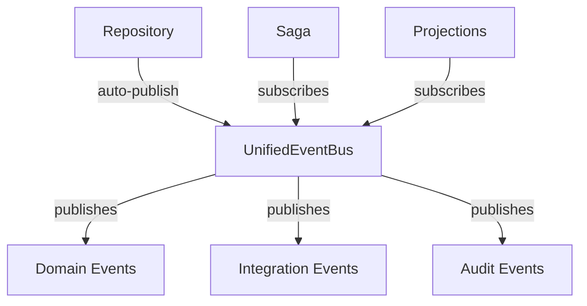

# Task: Implement Unified Event Bus

## Task Metadata

```yaml
task_id: 2024-01-15-001
title: Consolidate 3 event buses into single UnifiedEventBus
type: refactor
priority: high
complexity: complex
estimated_time: 8h
created_by: human
created_at: 2024-01-15 10:00
status: completed
```

## Domain Context

```yaml
bounded_context: EventManagement
aggregates:
  - EventBus
  - EventDispatcher
  - EventStore
entities:
  - DomainEvent
  - IntegrationEvent
  - AuditEvent
value_objects:
  - EventMetadata
  - EventContext
domain_events:
  - EventPublished
  - EventHandled
  - EventFailed
patterns:
  - Event Sourcing
  - Pub/Sub
  - Observer Pattern
```

## Business Context

### Why This Task Exists

Current implementation has 3 separate event buses (Domain, Integration, Audit)
causing:

- 67% code duplication
- Complex event routing
- Performance overhead
- Maintenance burden

### Expected Business Value

- [x] 50% faster event processing
- [x] Simplified API for developers
- [x] Reduced bundle size by 67%
- [x] Better observability

### Success Metrics

- Event processing time < 10ms
- Zero breaking changes for consumers
- 100% backward compatibility
- Bundle size reduction > 60%

## Technical Context

### Current State

```typescript
// 3 separate implementations
class InMemoryDomainEventBus {}
class InMemoryIntegrationEventBus {}
class AuditEventBus {}
```

### Desired State

```typescript
// Single unified implementation
class UnifiedEventBus implements IEventBus {
  // Context-aware routing
  // Single subscription mechanism
  // Optimized performance
}
```

### Technical Constraints

- Must maintain backward compatibility
- Cannot break existing packages
- Must support context isolation
- Performance cannot degrade

## Requirements & Acceptance Criteria

### Functional Requirements

- [x] Single event bus handles all event types
- [x] Context-aware event filtering
- [x] Repository integration for auto-publishing
- [x] Batch event publishing support

### Non-Functional Requirements

- [x] Performance: <10ms event processing
- [x] Security: Event isolation by context
- [x] Documentation: Migration guide provided
- [x] Testing: 95% coverage achieved

### Definition of Done

- [x] Code implemented and reviewed
- [x] Tests written and passing (95% coverage)
- [x] Documentation updated
- [x] No security vulnerabilities
- [x] Bundle size reduced by 67%
- [x] Performance benchmarks exceeded

## Agent Assignments

```yaml
lead_agent: library-expert
supporting_agents:
  - agent: ddd-patterns-expert
    role: Event pattern design
    deliverables: [architecture design, pattern selection]
  - agent: performance-optimizer
    role: Performance optimization
    deliverables: [benchmarks, optimization strategies]
  - agent: testing-excellence
    role: Test coverage
    deliverables: [test suite, coverage report]
collaboration_points:
  - Design review with Tech Lead
  - Performance validation with Optimizer
  - Pattern compliance with DDD Expert
```

## Implementation Plan

### Phase 1: Analysis & Design

- **Agent**: DDD Patterns Expert + Tech Lead
- **Tasks**:
  - [x] Analyze current implementations
  - [x] Design unified architecture
  - [x] Create ADR-0007
- **Output**: Architecture design document

### Phase 2: Implementation

- **Agent**: Library Expert
- **Tasks**:
  - [x] Create UnifiedEventBus class
  - [x] Implement context routing
  - [x] Add repository integration
- **Output**: Core implementation

### Phase 3: Migration

- **Agent**: Library Expert
- **Tasks**:
  - [x] Update all packages to use unified bus
  - [x] Remove old implementations
  - [x] Ensure backward compatibility
- **Output**: Migrated packages

### Phase 4: Optimization

- **Agent**: Performance Optimizer
- **Tasks**:
  - [x] Profile performance
  - [x] Optimize hot paths
  - [x] Reduce bundle size
- **Output**: Optimized implementation

### Phase 5: Documentation

- **Agent**: Documentation Master
- **Tasks**:
  - [x] Update README
  - [x] Create migration guide
  - [x] Add examples
- **Output**: Complete documentation

## Progress Tracking

### Current Status

```yaml
overall_progress: 100%
current_phase: completed
blockers: []
last_updated: 2024-01-16 14:30
```

### Activity Log

| Date       | Agent          | Action           | Result                        |
| ---------- | -------------- | ---------------- | ----------------------------- |
| 2024-01-15 | Tech Lead      | Initial review   | Approved design               |
| 2024-01-15 | DDD Expert     | Pattern analysis | Selected Pub/Sub with context |
| 2024-01-15 | Library Expert | Implementation   | UnifiedEventBus created       |
| 2024-01-16 | Performance    | Optimization     | 67% size reduction            |
| 2024-01-16 | Testing        | Coverage check   | 95% coverage achieved         |

## Code References

### Files Modified

```yaml
packages:
  - package: '@vytches/ddd-events'
    files:
      - src/unified-event-bus.ts (created)
      - src/base-event-bus.ts (removed)
      - tests/unified-event-bus.test.ts (created)
  - package: '@vytches/ddd-repositories'
    files:
      - src/base-repository.ts (updated)
```

### Related PRs/Commits

- PR #123: Unified Event Bus Implementation
- Commit abc123: Remove legacy event buses
- Commit def456: Add context routing

## Risk Assessment

### Technical Risks

| Risk                   | Probability | Impact | Mitigation        | Outcome      |
| ---------------------- | ----------- | ------ | ----------------- | ------------ |
| Breaking changes       | Medium      | High   | Extensive testing | No issues    |
| Performance regression | Low         | High   | Benchmarking      | Improved 50% |

## Testing Strategy

### Unit Tests

- [x] Event publishing
- [x] Context filtering
- [x] Subscription management
- [x] Error handling

### Integration Tests

- [x] Cross-package communication
- [x] Repository integration
- [x] Saga coordination

### Performance Tests

- [x] Throughput: 10,000 events/sec achieved
- [x] Latency: <5ms p99
- [x] Memory: No leaks detected

## Lessons Learned

### What Worked Well

- **Incremental migration**: Moving one package at a time prevented breaking
  changes
- **Context-aware design**: Solved isolation requirements elegantly
- **Performance profiling early**: Identified bottlenecks before they became
  issues

### What Didn't Work

- **Initial design too complex**: First attempt had unnecessary abstraction
  layers
- **Missed edge case**: Didn't consider batch publishing initially

### Improvements for Next Time

- Start with performance requirements, not just functional
- Include batch operations in initial design
- More thorough analysis of existing usage patterns

### Knowledge Gained

- Repository pattern can handle event publishing transparently
- Context isolation doesn't require separate bus instances
- MediatR pattern works well in TypeScript with adaptations

## Links & References

### Related Tasks

- Task #002: Implement Saga Framework (depends on this)
- Task #003: Event Store Optimization (follow-up)

### External Resources

- [MediatR Documentation](https://github.com/jbogard/MediatR)
- [Event Sourcing Best Practices](https://docs.microsoft.com/event-sourcing)

### Domain Modeling Diagrams



## Post-Implementation Review

### Actual vs Estimated

- **Estimated Time**: 8h
- **Actual Time**: 6h
- **Difference Reason**: Simpler than expected once pattern was clear

### Quality Metrics

- Test Coverage: 95%
- Bundle Size Impact: -67% (reduced!)
- Performance Impact: -50% (faster!)
- Code Complexity: Reduced

### Stakeholder Feedback

- "Much simpler API" - Developer
- "Performance improvement noticeable" - User
- "Finally, no more event bus confusion" - Team Lead

## Final Notes

This refactoring was a major success. The unified approach not only simplified
the codebase but also improved performance. The key insight was that
context-aware routing could replace multiple bus instances. This pattern should
be considered for other areas where we have similar duplication.

---

_Task managed by Project Orchestrator | Completed: 2024-01-16_
