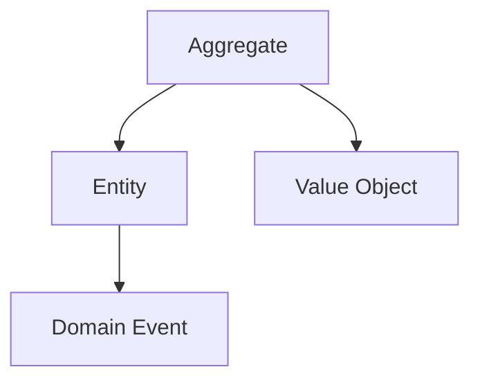

# Task: [Brief Title]

## Task Metadata

```yaml
task_id: YYYY-MM-DD-XXX
title: [Full descriptive title]
type: [feature|bug|research|refactor|optimization|documentation]
priority: [critical|high|normal|low]
complexity: [simple|medium|complex|expert]
estimated_time: [Xh]
created_by: [human|agent]
created_at: YYYY-MM-DD HH:MM
status: [planned|in_progress|blocked|review|completed|cancelled]
```

## Domain Context

```yaml
bounded_context: [e.g., EventManagement, CommandHandling]
aggregates:
  - [Related aggregate names]
entities:
  - [Related entities]
value_objects:
  - [Related value objects]
domain_events:
  - [Events that will be affected/created]
patterns:
  - [DDD patterns being used/affected]
```

## Business Context

### Why This Task Exists

[Business justification, user story, or technical debt reason]

### Expected Business Value

- [ ] [Specific value point 1]
- [ ] [Specific value point 2]

### Success Metrics

- [How we measure success]
- [KPIs or benchmarks]

## Technical Context

### Current State

[Description of current implementation or problem]

### Desired State

[What we want to achieve technically]

### Technical Constraints

- [Performance requirements]
- [Backward compatibility needs]
- [Security considerations]

## Requirements & Acceptance Criteria

### Functional Requirements

- [ ] [Specific requirement 1]
- [ ] [Specific requirement 2]
- [ ] [Specific requirement 3]

### Non-Functional Requirements

- [ ] Performance: [metrics]
- [ ] Security: [requirements]
- [ ] Documentation: [what needs documenting]
- [ ] Testing: [coverage requirements]

### Definition of Done

- [ ] Code implemented and reviewed
- [ ] Tests written and passing (>80% coverage)
- [ ] Documentation updated
- [ ] No security vulnerabilities
- [ ] Bundle size acceptable
- [ ] Performance benchmarks met

## Agent Assignments

```yaml
lead_agent: [primary responsible agent]
supporting_agents:
  - agent: [agent_name]
    role: [what they'll do]
    deliverables: [what they'll produce]
collaboration_points:
  - [Where agents need to sync]
```

## Implementation Plan

### Phase 1: [Phase Name]

- **Agent**: [assigned agent]
- **Tasks**:
  - [ ] [Specific task]
  - [ ] [Specific task]
- **Output**: [deliverables]

### Phase 2: [Phase Name]

- **Agent**: [assigned agent]
- **Tasks**:
  - [ ] [Specific task]
- **Output**: [deliverables]

## Progress Tracking

### Current Status

```yaml
overall_progress: 0%
current_phase: planning
blockers: []
last_updated: YYYY-MM-DD HH:MM
```

### Activity Log

| Date       | Agent     | Action         | Result                      |
| ---------- | --------- | -------------- | --------------------------- |
| YYYY-MM-DD | Tech Lead | Initial review | Approved with modifications |
|            |           |                |                             |

### Blockers & Issues

| Issue | Description | Owner | Resolution |
| ----- | ----------- | ----- | ---------- |
|       |             |       |            |

## Code References

### Files to Modify

```yaml
packages:
  - package: '@vytches/ddd-[package]'
    files:
      - src/[file].ts
      - tests/[file].test.ts
```

### Related PRs/Commits

- PR #XXX: [Description]
- Commit XXXXX: [Description]

## Risk Assessment

### Technical Risks

| Risk             | Probability  | Impact       | Mitigation |
| ---------------- | ------------ | ------------ | ---------- |
| Breaking changes | Low/Med/High | Low/Med/High | [Strategy] |

### Schedule Risks

- [Risk and mitigation]

## Testing Strategy

### Unit Tests

- [ ] [What to test]
- [ ] [Edge cases]

### Integration Tests

- [ ] [Cross-package tests]

### Performance Tests

- [ ] [Benchmarks needed]

## Documentation Updates

### Files to Update

- [ ] README.md
- [ ] API.md
- [ ] CHANGELOG.md
- [ ] JSDoc comments

### Examples to Create

- [ ] Basic usage
- [ ] Advanced patterns
- [ ] Framework integration

## Lessons Learned

### What Worked Well

- [Positive finding that should be repeated]

### What Didn't Work

- [Problem encountered and why]

### Improvements for Next Time

- [Specific actionable improvement]

### Knowledge Gained

- [Technical insight]
- [Process improvement]
- [Pattern discovery]

## Links & References

### Related Tasks

- Task #XXX: [How it relates]
- Task #YYY: [Dependency or follow-up]

### External Resources

- [Documentation links]
- [Blog posts]
- [Similar implementations]

### Domain Modeling Diagrams



## Post-Implementation Review

### Actual vs Estimated

- **Estimated Time**: Xh
- **Actual Time**: Yh
- **Difference Reason**: [Why it took more/less time]

### Quality Metrics

- Test Coverage: XX%
- Bundle Size Impact: +XXkb
- Performance Impact: XX ms
- Code Complexity: [Low/Med/High]

### Stakeholder Feedback

- [Feedback from users/team]

## Final Notes

[Any additional context, decisions made during implementation, or important
observations]

---

_Task managed by Project Orchestrator | Last AI Review: YYYY-MM-DD_
