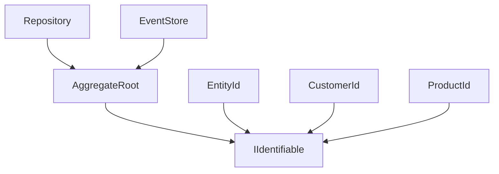

# Task: Make Aggregate Classes Accept Generic ID Types

## Task Metadata

```yaml
task_id: 2025-01-19-VF-009
title: Enable aggregates to accept generic ID types instead of only EntityId
type: feature
priority: high
complexity: complex
estimated_time: 3-4h
created_by: human
created_at: 2025-01-19 10:30
status: planned
```

## Domain Context

```yaml
bounded_context: AggregateManagement
aggregates:
  - AggregateRoot
  - BaseAggregate
entities:
  - EntityId
value_objects:
  - CustomerId
  - ProductId
  - OrderId
domain_events:
  - AggregateCreated
  - AggregateUpdated
patterns:
  - Aggregate Pattern
  - Value Object Pattern
  - Generic Programming
```

## Business Context

### Why This Task Exists

Current aggregate classes are tightly coupled to `EntityId`, preventing
developers from using domain-specific ID value objects or alternative ID
implementations. This limits flexibility when integrating with existing systems
or implementing custom domain models.

### Expected Business Value

- [ ] Support for domain-specific ID types (CustomerId, ProductId, etc.)
- [ ] Easier migration from existing systems
- [ ] Better type safety with specific ID types
- [ ] Improved domain modeling flexibility

### Success Metrics

- All existing code using EntityId continues working
- Custom ID types can be used with aggregates
- Type safety is maintained or improved
- No performance degradation

## Technical Context

### Current State

```typescript
export class AggregateRoot<TState extends object = object> {
  constructor(params: IAggregateConstructorParams<EntityId>) {
    // EntityId is hardcoded
  }
}
```

Aggregates can only use EntityId, limiting domain modeling options.

### Desired State

```typescript
export class AggregateRoot<
  TId extends { toString(): string } = EntityId,
  TState extends object = object,
> {
  constructor(params: IAggregateConstructorParams<TId>) {
    // Generic ID type with EntityId as default
  }
}
```

Support any ID type that meets minimum interface requirements.

### Technical Constraints

- EntityId must remain the default for backward compatibility
- ID types must support toString() for serialization
- equals() method preferred for comparison
- Repository patterns must support generic IDs
- Event sourcing must handle different ID types

## Requirements & Acceptance Criteria

### Functional Requirements

- [ ] AggregateRoot accepts generic ID type parameter
- [ ] EntityId works as default type
- [ ] Custom value objects can be used as IDs
- [ ] Repository patterns support generic aggregate IDs
- [ ] Event sourcing works with different ID types
- [ ] Builder patterns support generic IDs

### Non-Functional Requirements

- [ ] Performance: No impact on aggregate operations
- [ ] Security: ID validation remains intact
- [ ] Documentation: Clear examples of custom ID usage
- [ ] Testing: Coverage for multiple ID types

### Definition of Done

- [ ] Code implemented and reviewed
- [ ] Tests written and passing (>80% coverage)
- [ ] Documentation updated
- [ ] No security vulnerabilities
- [ ] Bundle size acceptable
- [ ] Performance benchmarks met
- [ ] All dependent packages tested
- [ ] Migration guide created

## Agent Assignments

```yaml
lead_agent: library-expert
supporting_agents:
  - agent: testing-excellence
    role: Test coverage for generic types
    deliverables: Type safety test suite
  - agent: architecture-guardian
    role: Module boundary validation
    deliverables: Architecture compliance report
collaboration_points:
  - Generic type constraint definition
  - Repository pattern updates
  - Event sourcing compatibility
```

## Implementation Plan

### Phase 1: Interface & Type Updates

- **Agent**: library-expert
- **Tasks**:
  - [ ] Define IIdentifiable interface for ID constraints
  - [ ] Update IAggregateRoot interface with generic ID
  - [ ] Modify aggregate interfaces in contracts package
- **Output**: Updated interface definitions

### Phase 2: Core Implementation

- **Agent**: library-expert
- **Tasks**:
  - [ ] Update AggregateRoot class with generic ID
  - [ ] Modify aggregate builder for generic IDs
  - [ ] Update capability system compatibility
  - [ ] Ensure EntityId as default type works
- **Output**: Working generic aggregate implementation

### Phase 3: Package Integration

- **Agent**: library-expert
- **Tasks**:
  - [ ] Update repository patterns for generic IDs
  - [ ] Modify event store for different ID types
  - [ ] Update CQRS integration points
  - [ ] Fix any circular dependency issues
- **Output**: Full package compatibility

### Phase 4: Testing & Validation

- **Agent**: testing-excellence
- **Tasks**:
  - [ ] Test with EntityId (backward compatibility)
  - [ ] Test with custom value objects
  - [ ] Test with simple string IDs
  - [ ] Test repository operations
  - [ ] Test event sourcing
- **Output**: Comprehensive test coverage

## Progress Tracking

### Current Status

```yaml
overall_progress: 0%
current_phase: planning
blockers: []
last_updated: 2025-01-19 10:30
```

### Activity Log

| Date       | Agent                | Action          | Result                  |
| ---------- | -------------------- | --------------- | ----------------------- |
| 2025-01-19 | project-orchestrator | Task created    | Task VF-009 initialized |
| 2025-01-19 | library-expert       | Queued for work | Waiting for VF-008      |

### Blockers & Issues

| Issue | Description | Owner | Resolution |
| ----- | ----------- | ----- | ---------- |
| None  |             |       |            |

## Code References

### Files to Modify

```yaml
packages:
  - package: '@vytches/ddd-contracts'
    files:
      - src/aggregates/aggregate.interface.ts
      - src/aggregates/aggregate-root.interface.ts
  - package: '@vytches/ddd-aggregates'
    files:
      - src/core/aggregate-root.ts
      - src/core/aggregate-root.builder.ts
      - src/capabilities/*.ts
      - tests/aggregate-root.test.ts
  - package: '@vytches/ddd-repositories'
    files:
      - src/base-repository.ts
      - src/interfaces/repository.interface.ts
  - package: '@vytches/ddd-events'
    files:
      - src/event-store/event-store.ts
  - package: '@vytches/ddd-cqrs'
    files:
      - src/handlers/command-handler.ts
```

### Related PRs/Commits

- Related to contracts package refactoring
- Builds on EntityId extraction to contracts

## Risk Assessment

### Technical Risks

| Risk                      | Probability | Impact | Mitigation                          |
| ------------------------- | ----------- | ------ | ----------------------------------- |
| Breaking API changes      | Medium      | High   | Default type parameter for EntityId |
| Type inference complexity | High        | Medium | Clear documentation and examples    |
| Circular dependencies     | Low         | High   | Careful package boundary management |
| Repository compatibility  | Medium      | Medium | Comprehensive integration testing   |

### Schedule Risks

- Complex generic type constraints may require iteration
- Repository pattern updates might reveal hidden dependencies

## Testing Strategy

### Unit Tests

- [ ] Test AggregateRoot with EntityId (default)
- [ ] Test with custom value object IDs
- [ ] Test with string-based IDs
- [ ] Test ID comparison operations
- [ ] Test serialization with different ID types

### Integration Tests

- [ ] Repository save/load with generic IDs
- [ ] Event sourcing with custom IDs
- [ ] CQRS command handling with generic aggregates
- [ ] Cross-package compatibility

### Performance Tests

- [ ] Aggregate creation benchmark
- [ ] ID comparison performance
- [ ] Repository operation performance

## Documentation Updates

### Files to Update

- [ ] aggregates/README.md
- [ ] repositories/README.md
- [ ] Migration guide for generic IDs
- [ ] JSDoc comments on classes
- [ ] Example code in docs/

### Examples to Create

- [ ] Basic EntityId usage (default)
- [ ] Custom value object as ID
- [ ] Domain-specific ID types
- [ ] Repository with generic aggregates
- [ ] Migration from EntityId-only code

## Lessons Learned

### What Worked Well

- To be completed after implementation

### What Didn't Work

- To be completed after implementation

### Improvements for Next Time

- To be completed after implementation

### Knowledge Gained

- To be completed after implementation

## Links & References

### Related Tasks

- Task VF-008: Enhance IDomainError interface flexibility (complementary
  flexibility enhancement)

### External Resources

- TypeScript generics documentation
- DDD aggregate patterns
- Value object as identity patterns

### Domain Modeling Diagrams



## Post-Implementation Review

### Actual vs Estimated

- **Estimated Time**: 3-4h
- **Actual Time**: TBD
- **Difference Reason**: TBD

### Quality Metrics

- Test Coverage: TBD
- Bundle Size Impact: TBD
- Performance Impact: TBD
- Code Complexity: High

### Stakeholder Feedback

- TBD

## Final Notes

This enhancement significantly improves domain modeling flexibility by allowing
custom ID types while maintaining full backward compatibility through default
type parameters. The change enables better type safety and domain expression
without breaking existing code.

---

_Task managed by Project Orchestrator | Last AI Review: 2025-01-19_
