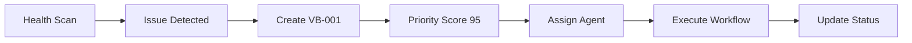

# 🎯 VytchesDDD Orchestration System - INTEGRATION UPDATE

## Overview

**IMPORTANT**: This replaces and integrates with the original
`project-orchestration/` folder. The system now provides **proactive
orchestration** specifically designed for library development.

## 📁 Folder Integration

### What Happened to `project-orchestration/`

✅ **Kept & Integrated**:

- `workflows.yaml` → `vytches-orchestration/workflows/`
- `coordination-rules.md` → `vytches-orchestration/workflows/`
- `release-process.md` → `vytches-orchestration/workflows/`
- `lessons-learned/` → `vytches-orchestration/lessons-learned/`

❌ **Replaced**:

- Task structure moved from date-based to category-based
- Manual workflows replaced with proactive task generation
- Static agent roles replaced with workload management

✅ **New & Enhanced**:

- Real-time package health monitoring
- Market intelligence tracking
- Priority-based task queue
- Orchestrator memory persistence
- Quality gates automation

## 🔄 System Integration

### How It Works Together

1. **Legacy Workflows** (project-orchestration) define **HOW** to execute
2. **Proactive Orchestration** (vytches-orchestration) defines **WHAT** to
   execute
3. **Agents** follow both systems for maximum efficiency

### Example Flow

## 📋 Work Item Templates Updated

All work items now use consistent templates:

- **VF-XXX**: Features (new functionality)
- **VB-XXX**: Bug fixes (test failures, issues)
- **VI-XXX**: Improvements (performance, usability)
- **VD-XXX**: Documentation (guides, examples)
- **VP-XXX**: Performance (optimization, benchmarks)

## 🤖 Agent Updates Required

### All Agents Should Know

1. **New orchestration structure** in `vytches-orchestration/`
2. **Work item categories** and naming conventions
3. **Priority scoring** and action thresholds
4. **Proactive execution** requirements

### Key Changes for Agents

- Check `vytches-orchestration/` folders before responding
- Follow new work item templates
- Report to orchestrator-state files
- Use proactive patterns (act first, report second)

## 📊 Current Status (Post-Implementation)

### Package Health

- **Healthy**: 20/22 packages (91%)
- **Issues**: 2 packages need immediate attention
- **Priority Queue**: 8 tasks identified and scored

### Active Work Items

- ✅ **VF-001**: NestJS adapter (COMPLETED - 40% market coverage achieved)
- **VB-001**: Logging test fixes (CRITICAL - blocks CI)
- **VB-002**: Testing coverage (HIGH - foundation)
- **VP-001**: Redis adapter (MEDIUM - performance)

### Strategic Progress

- **Downloads**: 13,456/week (+5%)
- **ARR Progress**: 80% toward $1M goal
- **GitHub Stars**: 3,421 (+12 this week)

## 🚀 Next Steps

### For Development

1. Use proactive orchestrator for all sessions
2. Follow new work item templates
3. Check orchestration dashboard regularly
4. Invoke agents without waiting

### For Quality

- Monitor bundle size limits automatically
- Track coverage requirements per package
- Enforce architecture rules via quality gates
- Validate against market intelligence

## 📚 Key Files

### Daily Operations

- `package-health/dashboard.json` - Real-time metrics
- `orchestrator-state/priority-queue.json` - Task priorities
- `work-items/*/` - Active development tasks

### Configuration

- `quality/bundle-limits.json` - Size constraints
- `quality/coverage-requirements.json` - Test requirements
- `orchestrator-state/agent-assignments.json` - Workload

### Intelligence

- `market-intelligence/competitor-analysis.md` - Market data
- `orchestrator-state/memory.json` - Session persistence

## 🎯 Success Metrics

The new system aims to achieve:

- **5-10 tasks/week** completed automatically
- **90% coverage** across all packages
- **Market-responsive** feature development
- **$1M ARR** by Q1 2025 through strategic execution

---

_The VytchesDDD Orchestration System - Driving library excellence through
intelligent automation_
